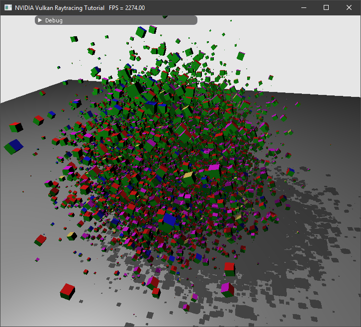

# NVIDIA Vulkan Ray Tracing Tutorials

The focus of this repository and the provided code is to showcase a basic integration of
[`ray tracing`](https://www.khronos.org/registry/vulkan/specs/1.2-extensions/html/vkspec.html#ray-tracing) and [`ray traversal`](https://www.khronos.org/registry/vulkan/specs/1.2-extensions/html/vkspec.html#ray-traversal) within an existing Vulkan sample, using the
[`VK_KHR_acceleration_structure`](https://www.khronos.org/registry/vulkan/specs/1.2-extensions/html/vkspec.html#VK_KHR_acceleration_structure), [`VK_KHR_ray_tracing_pipeline`](https://www.khronos.org/registry/vulkan/specs/1.2-extensions/html/vkspec.html#VK_KHR_ray_tracing_pipeline) and [`VK_KHR_ray_query`](https://www.khronos.org/registry/vulkan/specs/1.2-extensions/html/vkspec.html#VK_KHR_ray_query) extensions.

## Setup

To be able to compile and run those examples, please follow the [setup](docs/setup.md) instructions. Find more over nvpro-samples setup at: https://github.com/nvpro-samples/build_all.

## Tutorials 

The [first tutorial](https://nvpro-samples.github.io/vk_raytracing_tutorial_KHR/) starts from a very simple Vulkan application. It loads a OBJ file and uses the rasterizer to render it. The tutorial then adds, **step-by-step**, all that is needed to be able to ray trace the scene.

-------
### Ray Tracing Tutorial: :arrow_forward: **[Start Here](https://nvpro-samples.github.io/vk_raytracing_tutorial_KHR/)** :arrow_backward:

-------

## Extra Tutorials

All other tutorials start from the end of the _first_ ray tracing tutorial and also provide step-by-step instructions to modify and add methods and functions for that extra section.

Tutorial | Details
---------|--------
 | [Any Hit Shader](ray_tracing_anyhit) Implements transparent materials by adding a new shader to the Hit group and using the material information to discard hits over time. Adds an anyhit (.ahit) shader to the ray tracing pipeline. Creates simple transparency by randomly letting the ray hit or not.
 | [Jitter Camera](ray_tracing_jitter_cam)   Anti-aliases the image by accumulating small variations of rays over time. Generates random ray directions. Read/write/accumulates the final image.
 | [Thousands of Objects](ray_tracing_instances)   The current example allocates memory for each object, each of which has several buffers. This shows how to get around Vulkan's limits on the total number of memory allocations by using a memory allocator. Extends the limit of 4096 memory allocations. Uses these memory allocators: DMA, VMA.
 | [Reflections](ray_tracing_reflections)   Reflections can be implemented by shooting new rays from the closest hit shader, or by iteratively shooting them from the raygen shader. This example shows the limitations and differences of these implementations. Calls traceRayEXT() from the closest hit shader (recursive). Adds more data to the ray payload to continue the ray from the raygen shader.
 | [Multiple Closest Hits Shader and Shader Records](ray_tracing_manyhits)   Explains how to add more closest hit shaders, choose which instance uses which shader, add data per SBT that can be retrieved in the shader, and more. One closest hit shader per object. Sharing closest hit shaders for some objects. Passing a shader record to the closest hit shader.
 | [Animation](ray_tracing_animation)   This tutorial shows how animating the transformation matrices of the instances (TLAS) and animating the vertices of an object (BLAS) in a compute shader could be done. Refitting top level acceleration structures. Refitting bottom level acceleration structures.
 | [Intersection Shader](ray_tracing_intersection)   Adds thousands of implicit primitives and uses an intersection shader to render spheres and cubes. Explains what is needed to get procedural hit group working. Intersection Shaders. Sphere intersection. Axis aligned bounding box intersection.
 | [Callable Shader](ray_tracing_callable)   Replacing if/else by callable shaders. The code to execute the lighting is done in separate callable shaders instead of being part of the main code. Adding multiple callable shaders. Calling ExecuteCallableEXT from the closest hit shader.
 | [Ray Query](ray_tracing_rayquery)   Invokes ray intersection queries directly from the fragment shader to cast shadow rays. Ray tracing directly from the fragment shader.
 | [glTF Scene](ray_tracing_gltf)   Instead of loading separate OBJ objects, the example was modified to load glTF scene files containing multiple objects. This example is not about shading, but using more complex data than OBJ. However, it also shows a basic path tracer implementation.
 | [Advance](ray_tracing__advance)   An example combining most of the above samples in a single application.
