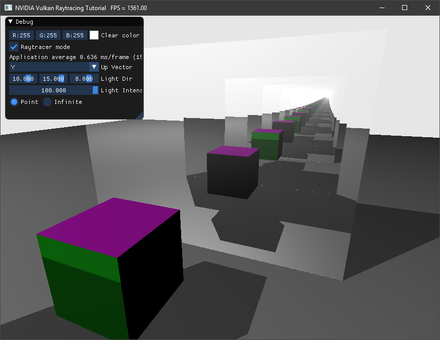
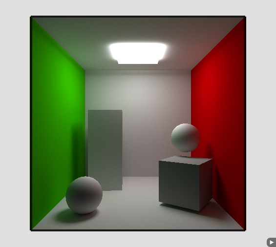

# NVIDIA Vulkan Ray Tracing Tutorials

The focus of this repository and the provided code is to showcase a basic integration of
ray tracing within an existing Vulkan sample, using the
[`VK_KHR_ray_tracing`](https://www.khronos.org/registry/vulkan/specs/1.2-extensions/html/vkspec.html#VK_KHR_ray_tracing) extension.

## Setup

To be able to compile and run those examples, please follow the [setup](docs/setup.md) instructions. Find more over [nvpro-samples](https://github.com/nvpro-samples/build_all)

## Tutorials 

The [first tutorial](https://nvpro-samples.github.io/vk_raytracing_tutorial_KHR/) starts from a very simple Vulkan application. It loads a OBJ file and use the rasterizer to render it. The tutorial is adding, **step-by-step**, all what is needed to be able to ray traced the scene.

-------
### Ray Tracing Tutorial: :arrow_forward: **[Start Here](https://nvpro-samples.github.io/vk_raytracing_tutorial_KHR/)** :arrow_backward:

-------

## Extra Tutotrials

All other tutorials starts from the end of the _first_ ray tracing tutorial and provides also step-by-step instructions to modify, add methods and functions for that
extra section. 

Tutorial | Details
---------|--------
 | [Any Hit Shader](ray_tracing_anyhit) Implements transparent materials by adding a new shader to the Hit group and using the material information to discard hits over time. Adding anyhit (.ahit) to the ray tracing pipeline. Randomly letting the ray hit or not which is making simple transparency.
 | [Jitter Camera](ray_tracing_jitter_cam)   Anti-aliases the image by accumulating small variations of rays over time. Random ray direction generation. Read/write/accumulate final image
 | [Thousands of Objects](ray_tracing_instances)   The current example allocates memory for each object, each of which has several buffers. This shows how to get around Vulkan's limits on the total number of memory allocations by using a memory allocator. Extend the limit of 4096 memory allocations. Using memory allocators: DMA, VMA
 | [Reflections](ray_tracing_reflections)   Reflections can be implemented by shooting new rays from the closest hit shader, or by iteratively shooting them from the raygen shader. This example shows the limitations and differences of these implementations. Calling traceRayEXT() from the closest hit shader (recursive). Adding more data to the ray payload to continue the ray from the raygen shader.
 | [Multiple Closest Hits Shader and Shader Records](ray_tracing_manyhits)   Multiple Closest Hits Shader and Shader Records. Explains how to add more closest hit shaders, choose which instance uses which shader, and add data per SBT that can be retrieved in the shader, and more. One closest hit shader per object. Sharing closest hit shaders for some object.Passing shader record to closest hit shader.
 | [Animation](ray_tracing_animation)   This tutorial shows how animating the transformation matrices of the instances (TLAS) and animating the vertices of an object (BLAS) in a compute shader, could be done. Refit of top level acceleration structure. Refit of bottom level acceleration structure.
 | [Intersectiom Shader](ray_tracing_intersection)   Adding thousands of implicit primitives and using an intersection shader to render spheres and cubes. The tutorial explains what is needed to get procedural hit group working. Intersection Shader. Sphere intersection. Axis aligned bounding box intersection.
 | [Callable Shader](ray_tracing_callable)   Replacing if/else by callable shaders. The code to execute the lighting is done in separate callable shaders instead of been part of the code. Adding multiple callable shaders. Calling ExecuteCallableEXT from the closest hit shader.
 | [Ray Query](ray_tracing_rayquery)   Invoking ray intersection queries directly from the fragment shader to cast shadow rays. Ray tracing directly from the fragment shader.
 | [glTF Scene](ray_tracing_gltf)   Instead of loading separated OBJ objects, the example was modified to load glTF scene files containing multiple objects. This example is not about shading, but using more complex data than OBJ.
 | [Advance](ray_tracing__advance)   An example combining most of the above samples in a single application.
