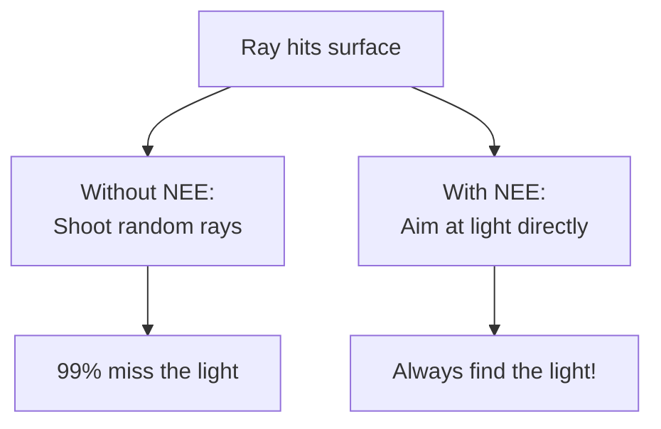
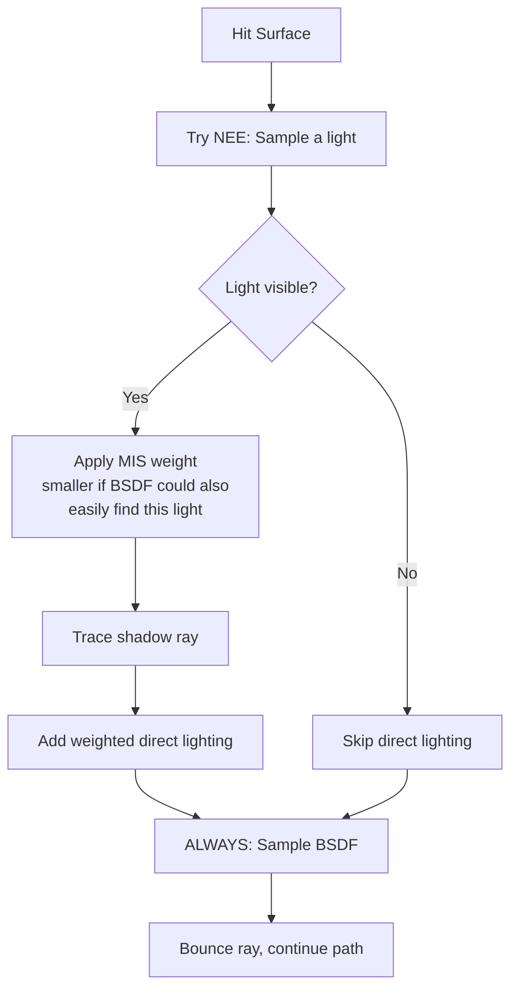
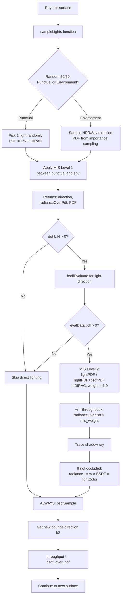
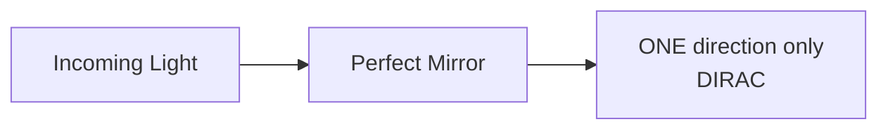
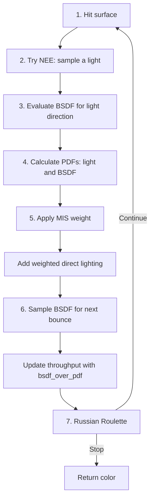

# Ray Tracing Concepts 101: A Beginner's Guide

This guide is intended for those who are new to ray tracing and want to understand acronyms such as BRDF, BSDF, PDF, NEE, and MIS. 

**Who is this for?** If you're learning about ray tracing and need simple explanations before getting into the technical details, you're in the right place. This is like your first chapter in a textbook.

**How this guide works:** Each idea is explained in simple terms and compared to something from the real world. If you want more details about the math, look for the "Technical Implementation Details" sections and "For Mathematicians" links.

---

## Table of Contents

- [The Basics](#the-basics)
  - [BRDF](#brdf) - How light bounces off solid surfaces
  - [BSDF](#bsdf) - How light bounces AND passes through surfaces
  - [PDF](#pdf) - Measuring the "likelihood" of picking a direction
- [Advanced Techniques](#advanced-techniques)
  - [NEE](#nee) - Aiming at lights instead of hoping to hit them
  - [MIS](#mis) - Combining multiple strategies smartly
  - [DIRAC](#dirac) - When light goes in exactly one direction
- [How Monte Carlo Works](#how-monte-carlo-works)
  - [Monte Carlo Integration](#monte-carlo-integration) - Using random samples to estimate results
  - [Importance Sampling](#importance-sampling) - Focusing samples where they matter most
  - [Russian Roulette](#russian-roulette) - Stopping weak rays early
- [Putting It All Together](#putting-it-all-together)
- [How Concepts Relate](#how-concepts-relate)
- [Using These Concepts in the Tutorial](#using-these-concepts-in-the-tutorial)
- [Further Reading](#further-reading)

---

## The Basics

Before we talk about advanced rendering techniques, let's understand the basic parts. These are the three main ideas you'll see a lot in ray tracing.

---

### BRDF

**BRDF** stands for **Bidirectional Reflectance Distribution Function**.

**More simply:** A BRDF describes how light bounces off solid, opaque surfaces (like wood, metal, or plastic).

**Here's an everyday analogy:** Imagine a wooden table. When a lamp shines on it, some of the light bounces back toward your eyes. The BRDF is like an instruction manual that says:
- "When light arrives from **this angle**..."
- "...this much light bounces toward **that angle**."

Different materials have different "instruction manuals":
- **Matte surfaces** (like chalk): Light scatters in all directions equally
- **Glossy surfaces** (like polished wood): Light scatters mostly near the perfect reflection angle
- **Shiny surfaces** (like chrome): Light reflects in one main direction

Here's what these different BRDFs look like visually:

|Diffuse (Matte)|Glossy (Semi-shiny)|Mirror (Perfect reflection)|
|---|---|---|
||| |
|Light scatters everywhere|Light prefers certain directions|Light reflects in one direction|

**What does a BRDF give you?**
- An **RGB color**
- This color tells you how much light bounces from one direction to another
- Example: A red ball reflects more red light than blue or green light

**Real-world connection:**  
The materials you see in 3D software (like "metallic" and "roughness" sliders) are based on BRDFs. When you adjust "roughness," you're changing how the BRDF scatters light.

**In glTF materials:** The standard metallic-roughness model uses a BRDF. It only handles opaque objects—no glass or transparent materials yet (that's where BSDF comes in).

**For more depth:** [Wikipedia: BRDF](https://en.wikipedia.org/wiki/Bidirectional_reflectance_distribution_function)

---

### BSDF

**BSDF** stands for **Bidirectional Scattering Distribution Function**.

**To put it concretely:** A BSDF is just like a BRDF, but it also handles light passing **through** surfaces (transmission), not just bouncing off them (reflection).

**To illustrate this:** Imagine a glass window:
- Some light **bounces off** the glass surface (you can see your reflection) ← BRDF behavior
- Some light **passes through** the glass (you can see what's on the other side) ← transmission
- A BSDF describes **both** behaviors at once

Here's a visual of how BSDF works:

|Bidirectional Scattering Distribution Function|
|---|
||
|Light can bounce off (reflect) OR pass through (transmit)|

**What does a BSDF give you?**
- Just like BRDF, it gives you an **RGB color**
- But now it handles both reflection and transmission
- Higher color values = more light goes that way

**Key difference from BRDF:**
- **BRDF** = opaque materials only (wood, metal, concrete)
- **BSDF** = can handle transparent materials (glass, water, plastic film)

**Real-world connection:**  
When you make a material transparent in 3D software (like glass or water), you're using a BSDF instead of a simple BRDF.

**In glTF materials:** Materials with the [KHR_materials_transmission extension](https://github.com/KhronosGroup/glTF/blob/main/extensions/2.0/Khronos/KHR_materials_transmission/README.md) use a BSDF to handle both reflection and transmission.

**For more depth:** [Wikipedia: BSDF](https://en.wikipedia.org/wiki/Bidirectional_scattering_distribution_function)

---

### PDF

**PDF** stands for **Probability Density Function**.

**More simply:** A PDF is a number that measures "how likely" you were to pick a particular direction when sampling randomly.

| Probability Density Function | Probability Density Function |
|---|---|
|||


In this hemisphere, warmer colors mean higher PDF values (directions chosen more often), while cooler colors mean lower PDF values (directions chosen less often).

**Why do we need this?** With ray tracing, we shoot rays in random directions. The PDF shows how "common" or "rare" each direction is in your sampling strategy.

**Consider this analogy:** Imagine throwing darts at a dartboard with a heat map overlay:
- The heat map shows where darts **usually** land
- Bright/hot spots = high PDF = "I pick this direction often"
- Dark/cold spots = low PDF = "I rarely pick this direction"
- When you throw a dart, the PDF is the "temperature" at that exact spot

**Another analogy:** Think of a biased coin:
- Normal coin: heads = 50% chance, tails = 50% chance
- Biased coin: heads = 80% chance, tails = 20% chance
- The PDF is like these percentages—it measures the "bias" in your random choices

**Quick example:** For a glossy surface, the PDF is highest near the mirror direction, lower at the edges of the reflection lobe, and zero outside the lobe. The heatmap above illustrates that falloff.

**What do you actually do with the PDF?**

This is the important part! The PDF is used to "correct" your ray contributions so the math works out right.

**The core principle:**  
When you sample a direction **more often** (high PDF), each sample must contribute **less** (divide by a bigger number). This keeps the statistical average correct.

**Here's a concrete example with numbers:**

Let's say you're rendering a pixel and you shoot a ray that hits a surface:

1. You randomly pick a direction to sample
2. Your sampling strategy says: **PDF = 0.25** (this means "fairly likely direction")
3. Light coming from that direction has brightness: **2.0**
4. The BSDF says: **0.5** of that light bounces toward the camera
5. **Theoretical calculation:** `2.0 * 0.5 / 0.25 = 4.0` ← this is your ray's contribution

**In actual code (optimized):**  
The function `bsdfSample()` already does the division for you:
- It returns `bsdf_over_pdf = 0.5 / 0.25 = 2.0`
- You just multiply: `2.0 * 2.0 = 4.0` (same answer, more efficient!)

**Why divide by PDF?**  
If you sample a direction frequently (high PDF), it will get picked many times. Dividing by PDF compensates for this repetition. Think of it as "de-biasing" your random samples.

**How is PDF computed?**

It comes from the BSDF sampling/evaluation function you use. For example, a Lambert diffuse BRDF uses cosine-weighted sampling, so its PDF is:
`pdf = cos(theta) / pi` (where `theta` is the angle between the surface normal and the sampled direction).

You'll encounter PDF in two main situations:

1. **When picking a direction randomly:**  
   You sample from the material's distribution (diffuse, glossy, etc.), and the sampling function returns both the direction and its PDF.

2. **When checking a specific direction:**  
   You evaluate the BSDF for a given direction (like aiming at a light), and the evaluation function computes the PDF that would apply if that direction had been sampled.

This same pattern applies to other models too: GGX/Phong-like lobes use their own distribution-derived PDFs, and delta distributions (perfect mirrors or point lights) are handled as special cases.

**Different surface types have different PDF patterns:**

- **Rough/matte surfaces** (like concrete): Light scatters in many directions, so most directions have some positive PDF value
- **Glossy surfaces** (like polished metal): Light mostly reflects in a cone around the mirror angle. Inside cone = positive PDF. Outside cone = PDF is zero
- **Perfect mirrors**: All light reflects in exactly ONE direction. This is a special "[Dirac](#dirac)" case handled differently

**Important rule:** If PDF = 0 for a direction, that ray contributes zero to the final image (because you'd be dividing by zero).

#### Technical Implementation Details

<details>
<summary><b>Click to expand: How PDF works in the tutorial code</b></summary>

The two situations described above map to two specific functions in `common/shaders/pbr.h.slang`:

**1. `bsdfSampleSimple()` - For indirect lighting (bouncing rays)**
- Use this when: You want to pick a random ray direction based on the material
- What it returns:
  - `data.k2`: The new direction (where the ray bounces next)
  - `data.pdf`: How likely this direction was to be chosen
  - `data.bsdf_over_pdf`: The BSDF value **already divided by PDF** (ready to multiply with throughput)
- Implementation detail: Computes BSDF, then divides by PDF internally: `bsdf_over_pdf = bsdf_total / data.pdf`

**2. `bsdfEvaluateSimple()` - For direct lighting (checking specific directions, like lights)**
- Use this when: You have BOTH directions already (incoming and outgoing) and want to evaluate the BSDF
- What it returns:
  - `data.pdf`: How likely this direction pair is (used for MIS weight calculation)
  - `data.bsdf_diffuse` and `data.bsdf_glossy`: BSDF components **multiplied by their PDFs** (pre-scaled for efficiency)
- Implementation detail: Pre-scales BSDF by PDF:
  - `bsdf_diffuse = baseColor * fDiffuse * diffusePdf`
  - `bsdf_glossy = fGlossy * G2 * specularPdf`

> **Important note:** The returned BSDF values from `bsdfEvaluateSimple()` are already pre-scaled (multiplied by PDF), which is why the NEE code doesn't divide by PDF again. For **delta lights** (point/spot/directional), the MIS weight is 1.0, so the code simply uses `w * evalData.bsdf_diffuse + w * evalData.bsdf_glossy` directly.

**See it in the actual code:**  
In `raytrace_tutorial/16_ray_query/shaders/ray_query.slang`:
- `throughput *= sampleData.bsdf_over_pdf;` ← indirect lighting: multiply by pre-divided BSDF/PDF
- `contrib += w * evalData.bsdf_diffuse; contrib += w * evalData.bsdf_glossy;` ← NEE: use pre-scaled values
- Comment explains that `evalData.pdf` is computed for potential MIS, but unused for delta lights (where `w=1.0`)

</details>

**For more depth:** [PBR Book: Monte Carlo Basics](https://pbr-book.org/4ed/Monte_Carlo_Integration/Monte_Carlo_Basics)

---

## Advanced Techniques

Now that we covered the basics (BRDF, BSDF, PDF), let's look at advanced techniques that make ray tracers fast and realistic.

---

### NEE

**NEE** stands for **Next Event Estimation**.

**The core idea:** Instead of hoping a random ray hits a light by pure luck, you aim directly at the light on purpose.

**Why do we need this?** Imagine you're in a dark warehouse with ONE tiny lightbulb (LED). If you throw random darts (shoot random rays), you'll almost never hit the bulb. You could be shooting rays forever!

**NEE says:** "Don't wait for luck—aim at the bulb every time."

**Here's how it works step-by-step:**

1. A ray hits a surface (like a wall)
2. Instead of shooting random rays everywhere, you aim ONE ray directly at the light source
3. If the light is visible (not blocked by anything), you add its lighting contribution to your pixel
4. Then you ALSO sample the BSDF for the next bounce (explained in [MIS](#mis) section)



**What does NEE give you?**
- A **color** (RGB) representing how much light reaches your surface from that light source
- This color gets added to your final pixel color

**The result:** Your rendered image converges MUCH faster (fewer noisy pixels, cleaner image with same number of rays).

#### Technical Implementation Details

<details>
<summary><b>Click to expand: NEE in practice</b></summary>

**Q: What if there are 100 lights in the scene?**  
You can't afford to check all 100 lights for every single pixel—that's too expensive!

**Solution: Random light selection**
- Pick ONE light randomly out of the 100
- Multiply its contribution by 100 to compensate
- Over many samples (many rays per pixel), this averages out correctly
- Result: You only check one light per ray, but eventually all lights contribute their fair share

**Q: What about environment maps (HDR background images)?**  
Environment maps are tricky because they're like one giant spherical light wrapping around your entire scene.

**Solution: Importance sampling the environment**
- Treat the environment like one giant "light source"
- Use NEE to pick a direction from the environment map
- Brighter areas in the HDR image are chosen more often (importance sampling)
- The result is still a color you add to your pixel
- You'll typically use **MIS** (explained below) to blend NEE with BSDF sampling for best results

</details>

**For more depth:** [PBR Book: Path Tracing, Section 13.2.3](https://pbr-book.org/4ed/Light_Transport_I_Surface_Reflection/Path_Tracing)

---

### MIS

**MIS** stands for **Multiple Importance Sampling**.

**More simply:** Use multiple smart strategies to sample light, then automatically weight them so each contributes where it's strongest.

**Why do we need it?** Different sampling strategies are good at different things:
- **Light sampling** (NEE) is excellent at finding small, bright lights
- **BSDF sampling** is excellent at capturing sharp glossy reflections
- If you use ONLY one strategy, you'll get noise in certain situations

**The problem:** If you use BOTH strategies naively, you might double-count light (count the same light twice).

**The solution (MIS):** Weight each strategy's contribution based on how "good" it is for that particular direction. This prevents double-counting and reduces noise.

**The big picture:**

At each surface hit, TWO things happen:

1. **Try NEE:** Sample a light directly (adds direct lighting if light is visible)
2. **Sample BSDF:** Choose where the ray bounces next (determines the path's continuation)

MIS weights the NEE contribution intelligently to prevent double-counting when both strategies might hit the same light.



**Concrete example: Glossy floor with ceiling light**

Imagine a ray hits a glossy floor. There's a bright ceiling light directly above.

**What happens (step-by-step):**

1. **Sample the light (NEE):** Get direction pointing up toward the ceiling light
2. **Check visibility:** Yes! The light is above the floor (not behind it)
3. **Evaluate BSDF for this light direction:**
   - The glossy floor CAN reflect light from this upward direction
   - Calculate two PDFs:
     - **Light PDF = 0.3** (moderate—based on the light's solid angle)
     - **BSDF PDF = 0.9** (high! The glossy floor naturally reflects upward light well)
4. **Calculate MIS weight:**
   ```
   mis_weight = lightPDF / (lightPDF + bsdfPDF)
              = 0.3 / (0.3 + 0.9)
              = 0.25
   ```
   Only 25% weight because BSDF sampling would also easily find this light!
5. **Add direct lighting:** Light contribution × 0.25
6. **Sample BSDF for next bounce:** Get reflection direction, continue tracing

**The key insight:**
- NEE gets low weight (25%) because BSDF sampling would also likely hit this light
- On another sample where BSDF randomly samples upward, it might hit the light → that contributes the other 75%
- Over many samples, the light is represented correctly without being counted twice!

**Special case: Point lights (infinitely small lights)**

With a point light:
- BSDF has ZERO chance of randomly hitting the exact point (it's infinitely small!)
- Therefore: `bsdfPDF = 0`
- Therefore: `mis_weight = lightPDF / (lightPDF + 0) = 1.0`
- Result: NEE gets full credit (100% weight)
- This makes sense—only NEE can reliably find point lights!

---

**For more depth:** [PBR Book: Multiple Importance Sampling](https://pbr-book.org/4ed/Monte_Carlo_Integration/Improving_Efficiency#MultipleImportanceSampling)

#### Technical Implementation Details

<details>
<summary><b>Click to expand: MIS Level 1 - Choosing Between Light Types</b></summary>

Based on the reference implementation in [`gltf_pathtrace.slang`](https://github.com/nvpro-samples/vk_gltf_renderer/blob/master/shaders/gltf_pathtrace.slang), here's the detailed flow. There are actually TWO levels of MIS:

**MIS Level 1: Choosing between light types (inside `sampleLights()` function)**

If your scene has both punctual lights (point/spot/directional) AND environment lighting (HDR background), you need to choose which one to sample:

```cpp
// Random 50/50 choice: Sample punctual lights OR environment
bool sampleLight = (rand(seed) < lightWeight);

if (sampleLight) {
    // Pick 1 light randomly from N punctual lights
    // PDF = (1/N) × LightPDF
    // For point lights, LightPDF = DIRAC (special value)
} else {
    // Importance sample a direction from the environment map
    // PDF comes from HDR importance sampling
}

// Apply MIS weight between punctual and environment
float pdfSum = lightWeight × directLight.pdf + envWeight × envPdf;
misWeight = (sampleLight ? lightWeight × directLight.pdf : envWeight × envPdf) / pdfSum;
radiance *= misWeight;

// Return: directLight.radianceOverPdf (already weighted and divided by PDF)
```

This prevents double-counting between punctual lights and environment lighting.

</details>

#### Advanced Implementation

<details>
<summary><b>Click to expand: MIS Level 2 - NEE vs BSDF Sampling</b></summary>

This section continues the flow once a light has been selected.

**MIS Level 2: NEE vs BSDF sampling (preventing double-counting of lights)**

Once you've picked a light, you need to weight its contribution against BSDF sampling:

```cpp
// Check if light is above the surface (not behind it)
if (dot(directLight.direction, hit.nrm) > 0.0f) {
    
    // Evaluate BSDF for this specific light direction
    bsdfEvaluate(evalData, pbrMat);
    
    // Check if BSDF PDF is non-zero (i.e., BSDF could sample this direction)
    if (evalData.pdf > 0.0) {
        
        // Calculate MIS weight (balance between light and BSDF sampling)
        const float mis_weight = (directLight.pdf == DIRAC) ? 
                                 1.0F :  // Delta light → full credit to NEE
                                 directLight.pdf / (directLight.pdf + evalData.pdf);
        
        // Calculate final weight combining everything
        const float3 w = throughput × directLight.radianceOverPdf × mis_weight;
        
        // Calculate contribution
        contribution = w × (evalData.bsdf_diffuse + evalData.bsdf_glossy);
        
        // Trace shadow ray and add contribution if light isn't occluded
        if (!inShadow) {
            radiance += contribution × lightColor;
        }
    }
}

// ALWAYS sample BSDF for next bounce (this is separate from NEE)
bsdfSample(sampleData, pbrMat);
throughput *= sampleData.bsdf_over_pdf;
ray.Direction = sampleData.k2;  // Continue tracing
```

**Understanding the variables:**

- `radianceOverPdf`: Light radiance already divided by selection PDF (from `sampleLights()`)
- `throughput`: Accumulated path weight from all previous bounces (starts at `(1,1,1)`)
- `mis_weight`: Balance factor between light sampling and BSDF sampling
- `w = throughput × radianceOverPdf × mis_weight`: Final weight combining everything

**Detailed flow diagram:**



**Code references:**
- Full implementation: [`gltf_pathtrace.slang`](https://github.com/nvpro-samples/vk_gltf_renderer/blob/master/shaders/gltf_pathtrace.slang) (see `sampleLights()` function and MIS weight calculation)
- Simplified version (delta lights only): `raytrace_tutorial/16_ray_query/shaders/ray_query.slang` (search for NEE and MIS comments)

</details>

---

### DIRAC

**DIRAC** refers to the **Dirac delta** concept, named after physicist Paul Dirac.

**The core idea:** When something has probability concentrated at EXACTLY one point/direction, with zero probability everywhere else, we call it a "Dirac delta" or "delta distribution."

**Two common cases in ray tracing:**

**1. Perfect mirror reflections**

Think of a perfect bathroom mirror. When a laser beam hits it:
- The reflection goes in EXACTLY one direction (the mirror angle)
- Zero light goes in any other direction
- This is a Dirac-style bounce



In reality, even the best mirrors have tiny imperfections, so perfect Dirac reflections are an idealization. In code, we handle this as a special case.

**2. Delta lights (point lights, directional lights)**

More commonly, you'll encounter "delta lights":

- **Point lights:** Emit from a single point (infinitely small) → all light comes from ONE location
- **Directional lights:** (like the sun) Come from a single direction → all light rays are parallel
- **Spot lights:** Emit from a single point in a cone

These are called "delta lights" because they're Dirac-like: all energy comes from one exact location/direction.

**Why does this matter for MIS?**

When a light is "delta" (point/spot/directional):
- BSDF sampling has ZERO probability of randomly hitting that exact point
- Therefore, `bsdfPDF = 0`
- Therefore, `mis_weight = lightPDF / (lightPDF + 0) = 1.0`
- Result: NEE gets full credit (100%)

This is mathematically correct—only NEE can find delta lights reliably!

**In the tutorial code:**  
The code in `common/shaders/pbr.h.slang` mentions that it doesn't return a true DIRAC PDF for perfect mirrors (see comment in the `bsdfSampleSimple()` function header). Instead, it uses a very high PDF value as an approximation.

**For more depth:** [PBR Book: Specular Reflection and Transmission](https://pbr-book.org/4ed/Reflection_Models/Specular_Reflection_and_Transmission)

---

## How Monte Carlo Works

You may have heard of "Monte Carlo rendering" or "Monte Carlo path tracing." What does that mean? This section explains the main idea behind Monte Carlo techniques used in ray tracing.

---

### Monte Carlo Integration

**More simply:** Monte Carlo integration means using random sampling to estimate things that are too complicated to calculate exactly.

**The classic example: Estimating Pi**

How do you estimate π (pi) without using formulas?

1. Draw a circle inside a square (both centered, circle touches square edges)
2. Throw random darts at the square
3. Count: how many land inside the circle vs. outside?
4. The ratio gives you an approximation of π!

More darts = more accurate estimate. It converges slowly, but it works!

**In ray tracing:**

Rendering an image is similar:
- Each ray is like throwing one dart
- The more rays you trace, the better your image looks
- That's why path tracers start noisy and get cleaner over time

**Why is noise such a problem?**

The convergence rate of Monte Carlo integration is proportional to **√N** (square root of the number of samples):
- To reduce noise by half, you need **4× more samples**
- To reduce noise by 75%, you need **16× more samples**
- This gets worse in **hard lighting conditions**:
  - Small light sources (hard to hit randomly)
  - Strong glossy reflections (narrow reflection cone)
  - Indirect lighting through small openings (like light through a window)

This is why techniques like **NEE** (aim at lights) and **importance sampling** (sample where it matters) are so critical—they dramatically reduce the number of samples needed for a clean image.

The pixel color is an **integral** (a sum over all possible light paths). We can't calculate it exactly, so we estimate it by shooting random rays (Monte Carlo sampling). The challenge is making this estimation converge quickly.

**For more depth:** [PBR Book: Monte Carlo Basics](https://pbr-book.org/4ed/Monte_Carlo_Integration/Monte_Carlo_Basics)

---

### Importance Sampling

**The most important rule**: Don't spend time on directions that are not important. Focus your samples where the interesting stuff happens.

**The problem with uniform sampling:**

If you shoot rays in completely random directions:
- Most rays hit dark areas or miss lights entirely
- Only a few rays happen to hit the bright, important areas
- Result: LOTS of noise, slow convergence

**Importance sampling says:** "Shoot more rays toward the bright/important areas, fewer rays toward dark areas."

**Example comparison:**

**Scenario:** Rendering a glossy metal ball with one bright light above it.

- **Uniform sampling:** Shoot 1000 rays in random directions. Only 50 happen to catch the bright reflection.
- **Importance sampling:** Shoot 1000 rays, but aim more of them toward the reflection direction. Now 800 capture the reflection.

Same number of rays, but WAY less noise in the final image!

**How does this connect to PDF?**

The PDF is the tool that makes importance sampling work:
- High PDF = "I sample this direction often" (important areas)
- Low PDF = "I rarely sample this direction" (unimportant areas)
- Dividing by PDF corrects for the bias this introduces

**For more depth:** [PBR Book: Importance Sampling](https://pbr-book.org/4ed/Monte_Carlo_Integration/Improving_Efficiency#ImportanceSampling)

---

### Russian Roulette

**More simply:** Randomly terminate weak rays early to save computation, but do it in a way that keeps the math correct.

**The problem:** Rays bounce many times. After 10 bounces, most rays carry very little energy (they're dim). Tracing them further is expensive but adds almost nothing to the image.

**The solution:** Randomly terminate weak rays, but boost the survivors to compensate.

**Example with numbers:**

Imagine a ray has bounced 8 times and is now very dim (only 2% of its original energy left):

1. Generate a random number between 0 and 1
2. If random number > 0.2, terminate the ray (80% chance) ← saves computation!
3. If random number ≤ 0.2, keep tracing (20% chance)
4. Boost the surviving ray by 5× to compensate (because only 1/5 rays survive)
5. **On average,** everything balances out correctly!

**Why does this work?**

- 80% of rays contribute 0 (terminated)
- 20% of rays contribute 5× their value (boosted survivors)
- Average: `0.8 × 0 + 0.2 × 5× = 1×` ← mathematically unbiased!

You save 80% of the computation without changing the average result—a remarkably elegant mathematical trick!

**In the tutorial:**  
In `raytrace_tutorial/16_ray_query/shaders/ray_query.slang`, look for the "RUSSIAN ROULETTE" comment section. The code checks `max(throughput)` and randomly terminates paths with low contribution.

**For more depth:** [PBR Book: Russian Roulette](https://pbr-book.org/4ed/Monte_Carlo_Integration/Improving_Efficiency#RussianRoulette)

---

## Putting It All Together

Now let's see how all these concepts work together in a typical path tracing loop.

**Scenario:** Your ray hits a floor, and there's a light on the ceiling. Here's the full flow:

1. **Ray hits the surface.**
2. **Try NEE (Next Event Estimation):** Aim a shadow ray at the light and add its contribution if visible.
3. **Evaluate the BSDF:** Determine how the surface reflects light from that direction.
4. **Calculate PDFs:** Compare the light PDF and BSDF PDF for MIS weighting.
5. **Apply MIS:** Weight the direct light to avoid double-counting.
6. **Sample the BSDF:** Pick the next bounce direction and update throughput with `bsdf_over_pdf`.
7. **Russian Roulette:** Terminate low-energy paths; continue otherwise.
8. **Repeat** with the new ray direction.

**Flow diagram:**



This entire process repeats many times (often 5-50 bounces per ray), and you trace hundreds of rays per pixel. The average of all these rays gives you the final pixel color!

---

#### Technical Implementation Details

<details>
<summary><b>Click to expand: Detailed math example (one bounce)</b></summary>

Let's walk through ONE bounce with actual numbers to see how all the pieces fit together.

**Setup:**
- Throughput starts at `(1.0, 1.0, 1.0)` (no energy lost yet, white light)
- We hit a surface
- There's a lamp nearby with radiance `(5.0, 5.0, 5.0)` (bright white light)
- The surface is reddish: BSDF = `(0.4, 0.2, 0.1)` (reflects 40% red, 20% green, 10% blue)

**Step 1: NEE (Direct lighting from the lamp)**

**Important:** Remember from the PDF section that `bsdfEvaluateSimple()` returns values that are **already pre-scaled** (multiplied by PDF), not divided!

1. Sample the light source → get direction toward lamp
2. Light has: `color = (1, 1, 1)` (white) and `intensity = 5.0` → effective radiance = `(5, 5, 5)`
3. Evaluate BSDF for this direction:
   ```
   bsdfEvaluateSimple() returns:
   - evalData.bsdf_diffuse = baseColor × fDiffuse × diffusePdf
                           = (0.8, 0.4, 0.2) × 0.5 × 0.8  (example: reddish diffuse with PDF)
                           = (0.32, 0.16, 0.08)
   
   - evalData.bsdf_glossy = fGlossy × G2 × specularPdf  
                          = (0.1, 0.1, 0.1) × 0.6 × 0.2  (example: weak glossy with PDF)
                          = (0.012, 0.012, 0.012)
   
   - evalData.pdf = 0.6  (for potential MIS calculation)
   ```

4. **For delta light (point/directional/spot):** MIS weight = 1.0 (simplified in tutorial)
   ```
   contrib = 1.0 × (evalData.bsdf_diffuse + evalData.bsdf_glossy) × throughput
           = (0.32, 0.16, 0.08) + (0.012, 0.012, 0.012) × (1, 1, 1)
           = (0.332, 0.172, 0.092)
   ```

5. Apply light radiance (happens after shadow test):
   ```
   radiance += contrib × light.color × light.intensity
            = (0.332, 0.172, 0.092) × (1, 1, 1) × 5.0
            = (1.66, 0.86, 0.46)
   ```
   This reddish contribution gets added to the pixel!

**Step 2: BSDF sampling (Next bounce)**

1. Sample BSDF → get new direction `k2`
2. `bsdfSampleSimple()` returns:
   ```
   sampleData.bsdf_over_pdf = (bsdf_diffuse + bsdf_glossy) / pdf
                            = (0.8, 0.4, 0.2)  (example: pre-divided result)
   ```

3. Update throughput:
   ```
   throughput = (1, 1, 1) × (0.8, 0.4, 0.2)
              = (0.8, 0.4, 0.2)
   ```
   This throughput carries forward to the next bounce.

**Notice how the ray is getting redder?**  
The throughput is now `(0.8, 0.4, 0.2)` → more red, less green, even less blue. This is how surfaces tint the light along the path!

**Key insight:** The values from `bsdfEvaluateSimple()` are **pre-scaled by PDF** (multiplied, not divided), which is why we don't divide by PDF in the NEE calculation. For delta lights, MIS weight = 1.0 is mathematically correct.

</details>

---

---

## Using These Concepts in the Tutorial

**Where to find these concepts implemented in code:**

- **BSDF/BRDF functions:**  
  `common/shaders/pbr.h.slang`  
  Look for `bsdfSampleSimple()` and `bsdfEvaluateSimple()`

- **NEE/MIS/PDF implementation:**  
  `raytrace_tutorial/16_ray_query/shaders/ray_query.slang`  
  The main path tracing loop with all techniques combined

- **Full path tracing explanation:**  
  `raytrace_tutorial/16_ray_query/README.md`  
  Detailed explanation of the ray query tutorial

- **Material shading walkthrough:**  
  Phase 7 and Phase 8 in `docs/index.md`  
  Step-by-step tutorial phases that build up to path tracing

**Recommended reading order:**

1. Read this document first (you're here!)
2. Read `raytrace_tutorial/16_ray_query/README.md` for implementation details
3. Look at the shader code in `ray_query.slang` to see it in action
4. Experiment: Change parameters and see how it affects the rendered image

---

## Further Reading

**Want to dive deeper into the mathematics?** Here are excellent resources:

**📘 Physically Based Rendering (PBR Book) - FREE ONLINE**  
https://pbr-book.org/4ed

This is THE industry-standard reference book for physically-based rendering. It's comprehensive and mathematically rigorous, but very well-written. Start with these chapters:

- **Chapter 13: Path Tracing** - Complete path tracing algorithms
- **Chapter 5: Monte Carlo Integration** - The mathematical foundations
- **Chapter 9: Reflection Models** - BRDF/BSDF mathematics
- **Section 13.2.3: Next Event Estimation** - NEE explained formally
- **Section 9.1.4: Multiple Importance Sampling** - MIS theory and practice

**💻 Reference Implementation (Code)**  
https://github.com/nvpro-samples/vk_gltf_renderer

A production-quality Vulkan path tracer with full MIS, NEE, and BSDF implementation. Great for seeing how everything works in real code.

**🌐 Wikipedia Entries**

Good for quick reference, but can be mathematically dense:

- **BRDF:** https://en.wikipedia.org/wiki/Bidirectional_reflectance_distribution_function
- **BSDF:** https://en.wikipedia.org/wiki/Bidirectional_scattering_distribution_function
- **Monte Carlo Integration:** https://en.wikipedia.org/wiki/Monte_Carlo_integration
- **Importance Sampling:** https://en.wikipedia.org/wiki/Importance_sampling

---

