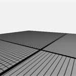
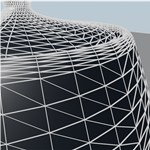

# Samples

A collection of focused Vulkan ray tracing samples that build progressively from the rasterization foundation to advanced features. Each sample lives in [`raytrace_tutorial/`](https://github.com/nvpro-samples/vk_raytracing_tutorial_KHR/tree/v2/raytrace_tutorial) and is rendered here from its in-tree `README.md`.

| Tutorial | Features |
|----------|----------|
| [01 Foundation](01-foundation.md) |**Rasterization-Only Foundation** - Sets up a modern Vulkan 1.4 rasterization pipeline (no ray tracing yet)  - Loads and displays glTF objects using vertex and fragment shaders - Demonstrates use of Shader Objects and Push Descriptors for flexible resource binding - Establishes the application and rendering framework that all ray tracing samples will build upon - Provides a clean, minimal starting point for transitioning to ray tracing in later steps |
| [02 Basic (Direct Vulkan)](02-basic.md) |**Basic Ray Tracing (Direct Vulkan)**  - Transitions from rasterization to a minimal ray tracing pipeline using Vulkan 1.4. - Sets up acceleration structures (BLAS/TLAS) for the loaded glTF scene. - Implements a ray generation shader, closest hit shader, and miss shader. - Renders the scene using ray tracing: primary rays are cast from the camera, and the closest intersection is shaded. - Introduces a simple material system for basic surface color and lighting. - Demonstrates how to bind acceleration structures and shader tables. - **Uses direct Vulkan calls** for educational purposes - shows complete implementation without helper libraries. - Provides a clear, minimal foundation for all subsequent ray tracing features.|
| [02 Basic (nvvk helpers)](02-basic-nvvk.md) |**Basic Ray Tracing (Helper Libraries)**  - **Same functionality as 02_basic** but uses nvpro-core2 helper libraries for simplified development. - Uses `nvvk::AccelerationStructureHelper` for automatic scratch buffer management and batch building. - Uses `nvvk::SBTGenerator` for automatic shader binding table creation and alignment handling. - **Production-ready approach** with reduced code complexity and better performance. - **Used as foundation** for all subsequent tutorials in the series (03_any_hit, 04_jitter_camera, etc.). - Demonstrates the recommended approach for real-world ray tracing applications.|
| [03 Any Hit](03-any-hit.md)  | **Any-Hit Shaders and Transparency** - Introduces the **any-hit shader** stage to the ray tracing pipeline. - Demonstrates how any-hit shaders can be used for:   - **Transparency**: Ignoring intersections to create cutouts or alpha-tested materials.   - **Alpha Testing**: Discarding hits based on texture alpha values.   - **Custom Intersection Logic**: Procedural cutouts and complex intersection behavior. - Implements a circular cutout in a plane using the any-hit shader and a user-adjustable radius. - Adds a UI slider to control the cutout radius in real time. - Shows how to attach the any-hit shader to the hit group in the pipeline. - Explains the use of `IgnoreHit()` in HLSL to skip intersections. |
| [04 Jitter Camera](04-jitter-camera.md) |**Camera Jitter and Anti-Aliasing**  - Introduces **camera jitter** to implement temporal anti-aliasing (TAA) in ray tracing. - Offsets the camera's projection matrix each frame using a sub-pixel jitter pattern (e.g., Halton sequence). - Demonstrates how jittered camera rays reduce aliasing and improve image quality over multiple frames. - Accumulates frames in a history buffer to blend results and achieve smooth anti-aliased output. - Adds a UI toggle to enable/disable jitter and control the accumulation reset. - Explains how to update the camera and accumulation logic in both the application and shaders. |
| [05 Shadow Miss](05-shadow-miss.md)   | **Shadow Miss Shader and Efficient Shadow Rays**  - Introduces a **dedicated miss shader** for shadow rays, separate from the main miss shader. - Demonstrates why using the same miss shader for both primary and shadow rays is inefficient:  - Shadow rays only need to know if they hit something (occlusion), not full color/lighting.   - The main miss shader may perform expensive sky/lighting calculations unnecessary for shadows. - Implements a **minimal payload** (`ShadowPayload`) for shadow rays, reducing memory and register usage. - Shows how to set up the ray tracing pipeline with multiple miss shader groups:   - **Group 0**: Main miss shader for primary rays.   - **Group 1**: Lightweight miss shader for shadow rays. - Updates the shadow tracing code to use the new miss shader group and minimal payload. - Results in improved performance, especially in scenes with many shadow rays. |
| [06 Reflection](06-reflection.md)    | **Reflections with Ray Tracing**  - Introduces **reflection rays** to simulate mirror-like surfaces using ray tracing. - Demonstrates how to trace secondary rays from hit points to compute reflections. - Adds a new closest hit shader that spawns reflection rays and blends their results with the surface color. - Shows how to limit reflection recursion depth for performance and to avoid infinite loops. - Implements a simple material system to control reflectivity per object. - Updates the shader binding table and descriptor sets to support reflection rays. - Explains how to accumulate and denoise reflections for improved visual quality. |
| [07 Multi Closest Hit](07-multi-closest-hit.md) | **Multiple Closest Hit Shaders**   - Introduces **multiple closest hit shaders** to the ray tracing pipeline. - Demonstrates how different objects can use different closest hit shaders:   - **Default shader**: Standard PBR lighting for the plane.   - **Second shader**: First wuson instance with shader record data for color.   - **Third shader**: Second wuson instance with shader record data for color. - Implements **shader record data** to pass instance-specific information through the Shader Binding Table (SBT). - Shows how to set up multiple hit groups in the ray tracing pipeline. - Adds a UI to dynamically change the colors of the wuson instances in real-time. - Explains the benefits of using multiple closest hit shaders for performance and flexibility. |
| [08 Intersection](08-intersection.md)  |**Intersection Shaders for Implicit Primitives**  - Demonstrates the use of **intersection shaders** to render implicit primitives (spheres and cubes) alongside traditional triangle geometry. - Shows how to define custom geometry (spheres/cubes) in the shader and intersect rays with them at runtime. - Implements a buffer of 2,000,000 implicit objects, alternating between spheres and cubes, each with different materials. - Explains how to:   - Define implicit object structures and types in the shader interface.   - Build and upload buffers for implicit objects and their AABBs.   - Register custom intersection shaders in the ray tracing pipeline.   - Use a single closest hit shader for all implicit objects, with logic to distinguish between spheres and cubes.   - Alternate materials and colors procedurally for visual variety. - Illustrates how to combine triangle and procedural geometry in the same acceleration structure and render pass. |
| [09 Motion Blur](09-motion-blur.md)    |**Advanced Motion Blur with Ray Tracing**   - Demonstrates **three types of motion blur** using the `VK_NV_ray_tracing_motion_blur` extension:   - **Matrix Motion**: Object transformation interpolation (translation/rotation) using motion matrices.   - **SRT Motion**: Scale-Rotate-Translate transformation with separate motion data structures.   - **Vertex Motion**: Morphing geometry where vertex positions interpolate between T0 and T1 states. - Implements **temporal ray tracing** with varying ray time parameters for smooth motion blur effects. - Features **multi-sample accumulation** with user-controllable sample count for motion blur quality. - Uses **low-level acceleration structure building** with motion-enabled BLAS and TLAS construction. - Includes **random time generation** in shaders for consistent temporal sampling across primary and shadow rays. - Demonstrates **advanced pipeline setup** with motion blur flags and specialized instance data structures. |
| [10 Position Fetch](10-position-fetch.md)  | **Position fetch extension**   Demonstrates the use of `VK_KHR_ray_tracing_position_fetch` extension to retrieve vertex positions directly from the acceleration structure during ray traversal. This reduces memory usage by eliminating the need for additional vertex buffers during rendering. **Key Features:** - Direct position access using `HitTriangleVertexPosition()` - Memory-efficient rendering without separate vertex buffers   - Geometric normal calculation from fetched positions - BLAS configuration with `VK_BUILD_ACCELERATION_STRUCTURE_ALLOW_DATA_ACCESS_KHR` **Extension Requirements:** - `VK_KHR_ray_tracing_position_fetch` - Hardware support (RTX 20 series and newer)|
| [11 Shader Execution Reorder](11-shader-execution-reorder.md)    | **Shader Execution Reorder (SER) for Performance Optimization** - Introduces **Shader Execution Reorder (SER)** using the `VK_NV_ray_tracing_invocation_reorder` extension to reduce execution divergence in ray tracing shaders. - Implements **path tracing** (first in the series) with multiple bounces, Russian roulette, and physically-based lighting. - Uses **specialization constants** (first in the series) for runtime toggling of SER without pipeline recreation. - Features a **hollow box of spheres** scene with **real-time heatmap visualization** showing execution divergence. - Demonstrates SER benefits through artificial divergence and performance comparison controls. |
| [12 Infinite Plane](12-infinite-plane.md)    | **Infinite Ground Plane with Interactive Toggle** - Shows how to add an infinite plane to your ray tracing scene using a custom intersection function. - Implements a UI toggle to enable/disable the infinite plane in real time. - Demonstrates proper hit state management and how to distinguish plane hits from scene geometry. - Explains the importance of checking the plane intersection *after* `TraceRay()` for correct compositing. - Includes adjustable plane color, height, and material parameters via the UI. - Serves as a foundation for procedural environment effects and further extensions (multiple planes, procedural textures, etc.). |
| [13 Callable Shader](13-callable-shader.md)    | **Callable Shaders for Modular Material Systems** - Introduces **callable shaders** to create modular, reusable shader functions that can be invoked from other ray tracing shaders. - Demonstrates a **material system** with four different materials (diffuse, plastic, glass, constant) implemented as separate callable shaders. - Implements **procedural textures** (noise, checker, voronoi) as callable shaders with different payload structures. - Shows how to **avoid expensive branching** by using `instanceCustomIndex` in the TLAS for material selection. - Features **dynamic material assignment** with UI controls that trigger TLAS recreation when materials change. - Explains the **performance trade-offs**: material changes require TLAS rebuild, texture changes use push constants. - Demonstrates **payload flexibility** with different structures for materials vs. textures. - Includes **animation support** for procedural textures with time-based effects. |
| [14 Animation](14-animation.md)   | **Real-Time Animation in Ray Tracing** - Demonstrates **two types of animation** in ray tracing environments:   - **Instance Animation**: Multiple Wuson models rotating in a circle using transformation matrix updates   - **Geometry Animation**: Sphere deformation using compute shaders with radial wave effects - Implements **acceleration structure updates** with `VK_BUILD_ACCELERATION_STRUCTURE_ALLOW_UPDATE_BIT_KHR`:   - **TLAS updates** for instance animation (transformation changes)    - **BLAS updates** for geometry animation (vertex modifications) - Features **compute shader vertex animation** that modifies vertex positions and normals in-place on the GPU - Uses **sine wave mathematics** for realistic wave deformation with proper normal recalculation - Includes **real-time UI controls** for toggling animations and adjusting speed - Demonstrates **proper synchronization** between compute operations and ray tracing with memory barriers - Shows **efficient update strategies** using `cmdUpdateAccelerationStructure` instead of full rebuilds |
| [15 Micro-Maps Opacity](15-micro-maps-opacity.md)    | **Opacity Micro-Maps in Ray Tracing** - Demonstrates **Opacity Micro-Maps** implementation in Vulkan for efficient ray tracing - Implements **selective AnyHit shader invocation** based on opacity state - Features **radius-based opacity testing** with real-time UI controls - Uses **VkMicromapEXT** structures for triangle subdivision and opacity encoding - Supports **2-state and 4-state micro-map formats** with dynamic switching - Includes **6x6 triangle plane** geometry for micro-maps demonstration - Provides **real-time radius adjustment** without acceleration structure rebuilds - Shows **hardware-accelerated opacity testing** with dedicated micro-map support |
| [16 Ray Query](16-ray-query.md)  | **Ray Queries - Inline Ray Tracing in Compute Shaders** - Demonstrates Vulkan's `VK_KHR_ray_query` extension for inline ray tracing directly in compute shaders - Replaces the traditional ray tracing pipeline with a compute shader using `RayQuery<>` objects - All ray intersection and shading logic is handled procedurally in a single shader - Supports **Monte Carlo path tracing**, temporal accumulation, and physically-based materials|
| [17 Ray Query Screenspace](17-ray-query-screenspace.md)  | **Screen-Space Ray Queries** - Uses compute shader ray queries for effects like **ambient occlusion** - Integrates ray tracing with rasterization via G-buffer - Real-time, single-ray effects with adjustable **AO** - Efficient: processes only visible pixels |
| [18 Swept Spheres](18-swept-spheres.md)  | **Linear Swept Spheres and Sphere Primitives (NVIDIA ONLY)** - Demonstrates the `VK_NV_ray_tracing_linear_swept_spheres` extension for efficient strand-based geometry - Introduces **two new geometric primitives**: Linear Swept Spheres (LSS) and Spheres - Implements **three rendering modes**:   - **Grass field**: Dense grass using LIST indexing mode (independent strands)   - **Standalone spheres**: Decorative spheres with varying radii   - **Multi-segment chains**: Connected chains using SUCCESSIVE indexing mode - Perfect for rendering grass, hair, fur, and other thin cylindrical objects |
| [19 Ray Differentials](19-ray-differentials.md)  | **Texture LOD via Ray Cones** - Replaces missing rasterizer `ddx`/`ddy` in ray tracing by carrying a per-ray cone footprint (`width`, `spreadAngle`) in the payload - Computes proper trilinear LOD at every hit with **surface-slant correction** (1/\|N&middot;V\|), eliminating moire on grazing surfaces - Walks through three small helpers: pixel angle, world footprint, triangle texel density - Covers the required Vulkan setup: full mip chain via `nvvk::cmdGenerateMipmaps`,  and sampler `maxLod = VK_LOD_CLAMP_NONE` - Bounce-ready: the cone state propagates through secondary rays with a single assignment (see *Going Further* in the README) |
| [20 Wireframe](20-wireframe.md)  | **Wireframe via Ray Differentials** - Renders anti-aliased wireframes in a single ray-tracing pass using helpers in `shaders/wireframe_helpers.h.slang` - Reuses some of the ray-differentials concept from sample 19 - Combines `computeDifferentials` + `computeDerivative` + `processWireframe` in the closest hit; the wireframe is blended over the PBR-shaded surface. |

## Coming Soon

- `xx_ray_indirect`
- `xx_partition_tlas`
- `xx_clusters`
- `xx_particles_large_accel`
- `xx_volumetric_rendering`

