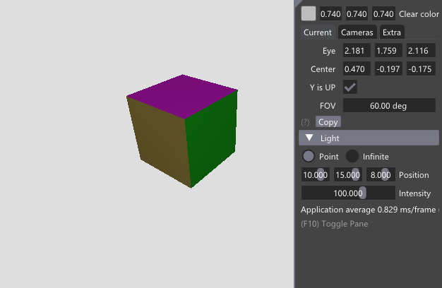
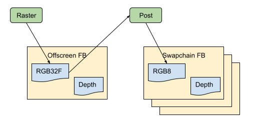

# NVIDIA Vulkan Ray Tracing Tutorial

This sample is a simple OBJ viewer in Vulkan, without any ray tracing functionality.
It is the starting point of the [ray tracing tutorial](https://nvpro-samples.github.io/vk_raytracing_tutorial_KHR/vkrt_tutorial.md.html),
the source of the application where ray tracing will be added.

Before starting the tutorial and adding what is necessary to enable ray tracing, here is a brief description of how this basic example was created.
## Structure

* main.cpp : creates a Vulkan context, call for loading OBJ files, drawing loop
* hello_vulkan.[cpp|h]: example class that loads and store OBJ in Vulkan buffers, load textures, creates pipelines and render the scene
* [nvvk](https://github.com/nvpro-samples/nvpro_core/tree/master/nvvk): library of independent Vulkan helpers.

## Overview

The following describes the function calls in main(). The helpers will not be described here, but following the link should give more details on how they work.

### Window and Vulkan Setup

* Creates a window using [GLFW](https://www.glfw.org/).
* Creates a Vulkan context using the [`nvvk::Context`](https://github.com/nvpro-samples/nvpro_core/tree/master/nvvk#context_vkhpp)
  helper. The result is a `VkInstance`, `VkDevice`, `VkPhisicalDevice`, the queues and the extensions initialized.
  * The window was created, but not the surface to draw in this window. This is done using the information from `VkInstance` and `GLFWwindow`. The
    `VkSurfaceKHR` will be used to find the proper queue.

### Sample Setup

* Hello vulkan setup:
  * [base] Keep a copy of `VkInstance`, `VkDevice`, `VkPhysicalDevice` and graphics Queue Index.
  * [base] Create a command pool
  * Initialize the [Vulkan resource allocator](https://github.com/nvpro-samples/nvpro_core/tree/master/nvvk#resourceallocator_vkhpp) (nvvk::alloc).
* Create Swapchain [base]:
  * Using the base class method and the help of [`nvvk::Swapchain`](https://github.com/nvpro-samples/nvpro_core/tree/master/nvvk#swapchain_vkhpp),
    initialize the swapchain for rendering onto the surface.
  * Finds the surface color and depth format.
  * Create *n* `VkFence` for synchronization.
* Create depth buffer [base]: depth buffer image with the format query in the swapchain
* Create render pass [base]:
  * Simple render pass, with two attachments: color and depth
  * Using swapchain color and depth format.
* Create frame buffers [base]:
  * Create *n images* of the number returned by the swapchain
  * Create as many frame buffers and attach the images
* Initialize GUI [base]: we are using [Dear ImGui](https://github.com/ocornut/imgui) and
  this is doing the initialization for Vulkan.
* Loading [Wavefront .obj file](https://en.wikipedia.org/wiki/Wavefront_.obj_file):
  * This is a very simple format, but it allows us to make manual modifications in the file, to load several .obj files and to combine them to obtain a more complex scene. We can also easily create several instances of the loaded objects.
  * Loading the .obj is done through the [ObjLoader](https://github.com/nvpro-samples/vk_raytracing_tutorial_KHR/blob/3e399adf0a3e991795fbdf91e0e6c23b9f492bb8/common/obj_loader.cpp#L26) which is using [tinyobjloader](https://github.com/tinyobjloader/tinyobjloader).
  * All vertices are in the form of: position, normal, color, texture coordinates
  * Every 3 vertex indices are creating a triangle.
  * Every triangle has an index of the material it is using.
  * There are M materials and T textures.
  * We allocate buffers and staging the transfer to the GPU using our resource allocator.
  * We create an instance of the loaded model.
  * :warning: We keep the addresses of the created buffers and append this to a vector of `ObjDesc`, which allows easy access to the model information from a shader.

### Offscreen image & Graphic Pipeline

We have a swapchain and window frame buffers, but we will not render the scene directly to them. Instead, we will render to an RGBA32F image, and then render that image to a full screen triangle using a tone mapper. We could have rendered directly to one of the swapchain framebuffers and applied a tone mapper, but this separation will be very useful for rendering G-Buffers and doing something similar with ray tracing.

* Create offscreen render:
  * Create a color and depth image, format are VK_FORMAT_R32G32B32A32_SFLOAT and best depth for the physical device using [`nvvk::findDepthFormat`](https://github.com/nvpro-samples/nvpro_core/tree/master/nvvk#renderpasses_vkhpp).
  * Create a render pass to render using those images [`nvvk::createRenderPass`](https://github.com/nvpro-samples/nvpro_core/tree/master/nvvk#renderpasses_vkhpp).
  * Create a frame buffer, to use as a target when rendering offline.
* Create descriptor set layout:
  * Using the [`nvvk::DescriptorSetBindings`](https://github.com/nvpro-samples/nvpro_core/tree/master/nvvk#class-nvvkdescriptorsetbindings), describing the resources that will be used in the vertex and fragment shader.
* Create graphic pipeline:
  * Using [`nvvk::GraphicsPipelineGeneratorCombined`](https://github.com/nvpro-samples/nvpro_core/tree/master/nvvk#class-nvvkgraphicspipelinegeneratorcombined)
  * Load both vertex and fragment SpirV shaders
  * Describe the vertex attributes: pos, nrm, color, uv
* Create uniform buffer:
  * The uniform buffer is holding global scene information and is updated at each frame.
  * The information in this sample consist of camera matrices and will be
    updated in the drawing loop using `updateUniformBuffer()`.
* Create Obj description buffer:
  * When loading .obj, we stored the addresses of the OBJ buffers.
  * If we have loaded many .obj, the array will be as large as the number of obj loaded.
  * Each instance has the index of the OBJ, therefore the information of the model will be easily retrievable in the shader.
  * This function creates the buffer holding the vector of `ObjDesc`.
* Update descriptor set:
  * The descriptor set has been created, but here we are writing the information, meaning all the buffers and textures we have created.

At this point, the OBJs are loaded and their information is uploaded to the GPU. The graphic pipeline and the information describing the resources are also created.

### Post Pipeline

We need to create a "post pipeline". This is specific to the raster of this sample. As mentioned before, we render in a full screen triangle, the result of the raster and apply a tonemapper. This step will be rendered directly into the framebuffer of the swapchain.

* Create post descriptor:
  * Adding the image input (result of rendering)
* Create post pipeline:
  * Passtrough vertex shader (full screen triangle)
  * Fragment tone-mapper shader
* Update post descriptor:
  * Writing the image (RGB32F) address

At this point we are ready to start the rendering loop.

* Setup Glfw callback:
  * Our base class has many functions to react on Glfw, such as change of window size, mouse and keyboard inputs.
  * All callback functions are virtual, which allow to override the base functionality, but for most there isn't anything to do.
  * Except for `onResize`, since we render to an intermediate image (RGB32F), this image will need to be re-created with the new size and the post pipeline will need the address of this image. Therefore, there is an overload of this function.

### Rendering Loop

* Render indefinitely until Glfw receive a close action
* Glfw pulling events
* Imgui new frame and rendering (not drawing)
* Prepare Frame
  * This is part of the swapchain, we can have a double or triple buffer and
    this call will be waiting (fence) to make sure that one swapchain frame buffer
    is available.
* Get current frame
  * Depending if we have a double or triple buffer, it will return: 0 or 1, or 0, 1 or 2.
  * Resources in the base class exist in that amount: color images, frame buffer, command buffer, fence
* Get the command buffer for the current frame (better to re-use command buffers than creating new ones)
* Update the uniform buffer:
  * Push the current camera matrices

#### Offscreen

* Start offscreen rendering pass
  * We will be rendering (raster) in the RGBA32F image using the offscreen render pass and frame buffer.
* Rasterize
  * This is rasterizing the entire scene, all instances of each object.

#### Final

Start another rendering, this time in the swapchain frame buffer

* Use the base class render pass
* Use the swapchain frame buffer
* Render a full-screen triangle with the raster image and tone-mapping it.
* Actually rendering Imgui in Vulkan
* Submit the frame for execution and display

### Clean up

The rest is clean up all allocations
