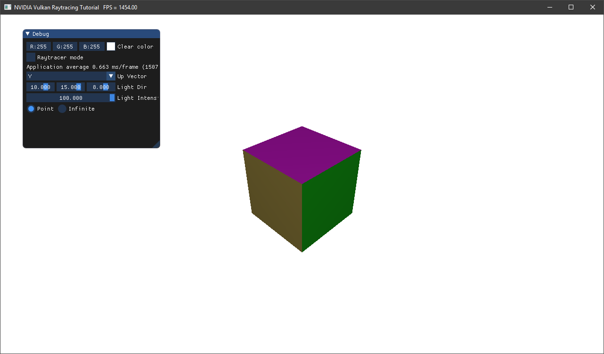

# NVIDIA Vulkan Ray Tracing Tutorial

This example is a simple OBJ viewer in Vulkan, without any ray tracing functionality.
It is the starting point of the ray tracing tutorial, the source of the application in which ray tracing will be added.

## [**Start Ray Tracing Tutorial**](https://nvpro-samples.github.io/vk_raytracing_tutorial/)

