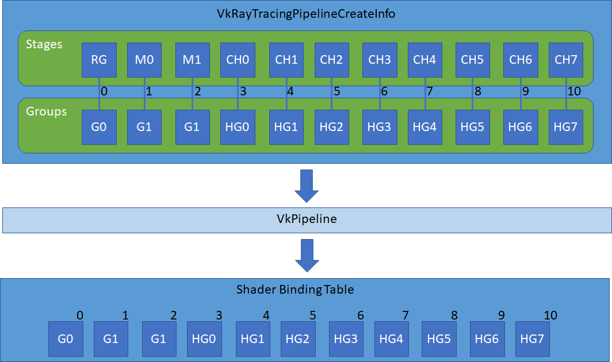
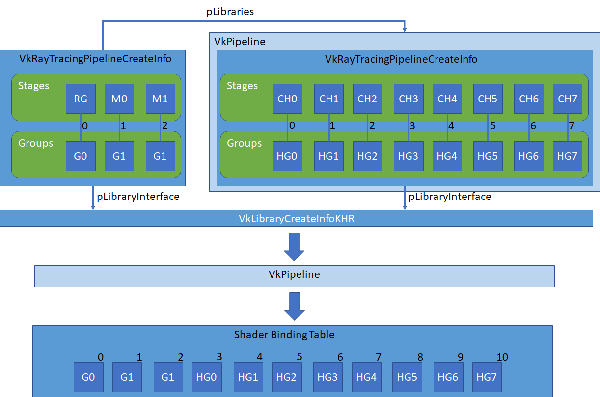
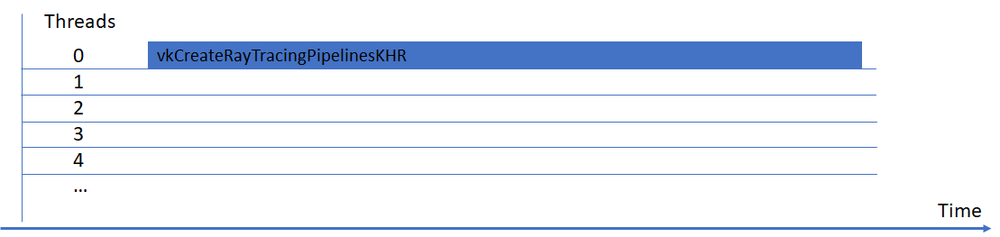
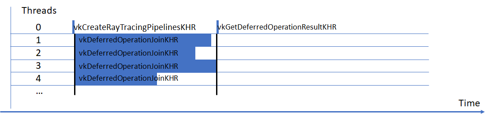
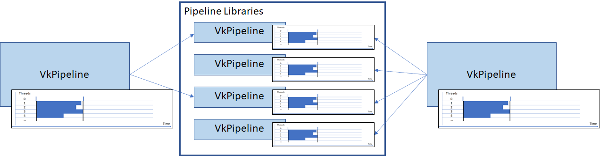

# Advanced Compilation

The simplest way of defining ray tracing pipelines is by using monolithic `VkRayTracingPipelineCreateInfoKHR` structures specifying the pipeline stages and shader groups. Even if pipelines share some stages, they are compiled separately. Furthermore, by default `vkCreateRayTracingPipelinesKHR` blocks the current thread until completion:

 However, when using multiple pipelines, some of them may have some shader stages in common. Large pipelines may also take a long time to compile on a single thread.

This sample introduces the [VK_KHR_pipeline_library](https://www.khronos.org/registry/vulkan/specs/1.2-extensions/man/html/VK_KHR_pipeline_library.html) extension to create shader libraries that can be separately compiled and reused in ray tracing pipelines. The compilation of the final pipeline is carried out on multiple threads using the [VK_KHR_deferred_host_operations](https://www.khronos.org/registry/vulkan/specs/1.2-extensions/man/html/VK_KHR_deferred_host_operations.html) extension.

The code below is based on the [`ray_tracing_specialization`](../ray_tracing_specialization) sample, which introduces compile-time variations of a hit shader.

## Pipeline Library

Using monolithic pipeline definitions all stages are compiled for each pipeline, regardless of potential reuse. The shader groups are then referenced in the Shader Binding Table using their indices:

Pipeline libraries are `VkPipeline` objects that cannot be bound directly. Instead, they can be compiled once and linked into as many pipelines as necessary. The Shader Binding Table of the resulting pipeline references the shader groups of the library as if they had been appended to the groups and stages in the main `VkRayTracingPipelineCreateInfo`

We start by adding the device extension in main()

~~~~ C
  contextInfo.addDeviceExtension(VK_KHR_PIPELINE_LIBRARY_EXTENSION_NAME);
~~~~

Following by adding a new member in the `HelloVulkan` class:

~~~~ C
  // Ray tracing shader library
  VkPipeline                                        m_rtShaderLibrary;
~~~~

In `HelloVulkan::createRtPipeline()` the `StageIndices` enumeration describes the indices of the stages defined in the pipeline creation structure. The hit groups will be moved to our library, hence we remove them from the enumeration:

~~~~ C
  enum StageIndices
  {
    eRaygen,
    eMiss,
    eMiss2,
    eShaderGroupCount
  };
~~~~

The shader modules will be referenced partly in the main pipeline, and partly in the pipeline library. To ensure proper deletion of the modules after use, we will store their handles in

~~~~ C
  // Store the created modules for later cleanup
  std::vector<VkShaderModule>                                    modules;
~~~~

Then, after each call to `nvvk::createShaderModule` we store the resulting module:

~~~~ C
  modules.push_back(stage.module);
~~~~

The specialization constants sample creates one shader module per specialization. Instead, we load that module once and reuse it for each specialization. Those specializations are then stored in the stages of the pipeline library:

~~~~ C
  // Hit Group - Closest Hit
  // Create many variation of the closest hit
  stage.module = nvvk::createShaderModule(
    m_device, nvh::loadFile("spv/raytrace.rchit.spv", true, defaultSearchPaths, true));

  modules.push_back(stage.module);
  // Store the hit groups for compilation in a separate pipeline library object
  std::vector<VkPipelineShaderStageCreateInfo> libraryStages{};
  for(uint32_t s = 0; s < (uint32_t)specializations.size(); s++)
  {
    stage.stage               = VK_SHADER_STAGE_CLOSEST_HIT_BIT_KHR;
    stage.pSpecializationInfo = specializations[s].getSpecialization();
    libraryStages.push_back(stage);
  }
~~~~

Similarly, the hit groups will be stored in the library by replacing the storage of the hit groups in `m_rtShaderGroups` by:

~~~~ C
  // Shader groups for the pipeline library containing the closest hit shaders
  std::vector<VkRayTracingShaderGroupCreateInfoKHR> libraryShaderGroups;

  VkRayTracingShaderGroupCreateInfoKHR libraryGroup{VK_STRUCTURE_TYPE_RAY_TRACING_SHADER_GROUP_CREATE_INFO_KHR};
  libraryGroup.anyHitShader       = VK_SHADER_UNUSED_KHR;
  libraryGroup.closestHitShader   = VK_SHADER_UNUSED_KHR;
  libraryGroup.generalShader      = VK_SHADER_UNUSED_KHR;
  libraryGroup.intersectionShader = VK_SHADER_UNUSED_KHR;
  libraryGroup.type               = VK_RAY_TRACING_SHADER_GROUP_TYPE_TRIANGLES_HIT_GROUP_KHR;

  // Hit Group - Closest Hit + AnyHit
  // Creating many Hit groups, one for each specialization
  for(uint32_t s = 0; s < (uint32_t)specializations.size(); s++)
  {
    // The indices of the stages are local to the pipeline library
    libraryGroup.closestHitShader = s;  // Using variation of the closest hit
    libraryShaderGroups.push_back(libraryGroup);
  }
~~~~

It is important to note that the stage indices are local to the pipeline library, regardless of where they will be used in the final pipeline. Those indices will be later offset depending on the contents of the pipeline.

Once the groups and stages are defined we can create the pipeline library. After the creation of the ray tracing pipeline layout, we define the base of the library creation information:

~~~~ C
  // Creation of the pipeline library object
  VkRayTracingPipelineCreateInfoKHR pipelineLibraryInfo{VK_STRUCTURE_TYPE_RAY_TRACING_PIPELINE_CREATE_INFO_KHR};
  // Flag the object as a pipeline library, which is a specific object that cannot be used directly.
  pipelineLibraryInfo.flags = VK_PIPELINE_CREATE_LIBRARY_BIT_KHR;
  // Use the same layout as the target pipeline
  pipelineLibraryInfo.layout = m_rtPipelineLayout;
  // As for the interface the maximum recursion depth must also be consistent across the pipeline
  pipelineLibraryInfo.maxPipelineRayRecursionDepth = 2;
~~~~

Pipeline libraries are technically independent from the pipeline they will be linked into. However, linking can only be achieved by enforcing strong consistency constraints, such as having the same pipeline layout and maximum recursion depth. If the recursion depth differs the compilation of the final pipeline will fail.

In addition, the pipeline libraries need to have the same pipeline interface. This interface defines the maximum amount of data passed across stages:

~~~~ C
  // Pipeline libraries need to define an interface, defined by the maximum hit attribute size (typically 2 for
  // the built-in triangle intersector) and the maximum payload size (3 floating-point values in this sample).
  // Pipeline libraries can be linked into a final pipeline only if their interface matches
  VkRayTracingPipelineInterfaceCreateInfoKHR pipelineInterface{VK_STRUCTURE_TYPE_RAY_TRACING_PIPELINE_INTERFACE_CREATE_INFO_KHR};
  pipelineInterface.maxPipelineRayHitAttributeSize = sizeof(glm::vec2);
  pipelineInterface.maxPipelineRayPayloadSize      = sizeof(glm::vec3);
  pipelineLibraryInfo.pLibraryInterface            = &pipelineInterface;
~~~~

Finally we provide the stage and shader groups information to the library creation information, and create the pipeline library in the same way as any other pipeline:

~~~~ C
  // Shader groups and stages for the library
  pipelineLibraryInfo.groupCount = static_cast<uint32_t>(libraryShaderGroups.size());
  pipelineLibraryInfo.pGroups    = libraryShaderGroups.data();
  pipelineLibraryInfo.stageCount = static_cast<uint32_t>(libraryStages.size());
  pipelineLibraryInfo.pStages    = libraryStages.data();

  // Creation of the pipeline library
  vkCreateRayTracingPipelinesKHR(m_device, {}, {}, 1, &pipelineLibraryInfo, nullptr, &m_rtShaderLibrary);
~~~~

The pipeline library is now created, but the application cannot run yet: we still need to indicate that the final pipeline will link with our library. Before calling `vkCreateRayTracingPipelinesKHR` for the final pipeline, we insert the reference to the library:

~~~~ C
  // The library will be linked into the final pipeline by specifying its handle and shared interface
  VkPipelineLibraryCreateInfoKHR inputLibrary{VK_STRUCTURE_TYPE_PIPELINE_LIBRARY_CREATE_INFO_KHR};
  inputLibrary.libraryCount         = 1;
  inputLibrary.pLibraries           = &m_rtShaderLibrary;
  rayPipelineInfo.pLibraryInfo      = &inputLibrary;
  rayPipelineInfo.pLibraryInterface = &pipelineInterface;
~~~~

The pipeline is now built from the specified shader groups and stages as well as the library containing the hit groups. The groups and stages are linked together using indices, and indices are local to each library. To avoid collisions the pipeline creation will consider the stages of the libraries as if they had been appended to the stage list of the original `VkRayTracingPipelineCreateInfoKHR`, in the order in which the libraries are defined in `pLibraries`.

Therefore, the Shader Binding Table needs to be updated accordingly, by making the wrapper aware of the contents of the library:

~~~~ C
  // The Shader Binding Table is built accounting for the entire pipeline, including the
  // stages contained in the library. Passing the library information allows the wrapper
  // to shift the shader group indices accordingly
  m_sbtWrapper.create(m_rtPipeline, rayPipelineInfo, {pipelineLibraryInfo});
~~~~

At the end of the function we destroy the shader modules using our vector of modules instead of iterating over the stages of the main pipeline:

~~~~ C
  // Destroy all the created modules, for both libraries and main pipeline
  for(auto& m : modules)
    vkDestroyShaderModule(m_device, m, nullptr);
~~~~

The pipeline library has the same lifetime as the pipeline that uses it. The final step of this Section is the destruction of the library in the `HelloVulkan::destroy()` method:

~~~~ C
  // Pipeline libraries have the same lifetime as the pipelines that uses them
  vkDestroyPipeline(m_device, m_rtShaderLibrary, nullptr);
~~~~

As an exercise, it is possible to create another library containing the other shader stages, and link those libraries together into the pipeline.

## Parallel Compilation Using Deferred Host Operations

By default pipelines compilations are blocking the calling thread until completion:
 

Ray tracing pipelines are often complex, and can benefit from multithreaded compilation.  This can drastically reduce the compilation times of complex pipelines. The deferred host operations extension allows the work involved in `vkCreateRayTracingPipelinesKHR` to be split into multiple threads provided by the application:
 

We start by including the support of C++ threading using `std::async` at the beginning of the source file:

~~~~ C
#include <future>
~~~~

In this sample we will distribute the compilation of the final ray tracing pipeline using a `VkDeferredOperation`, created just before calling `vkCreateRayTracingPipelinesKHR`:

~~~~ C
  // Deferred operations allow the driver to parallelize the pipeline compilation on several threads
  // Create a deferred operation
  VkDeferredOperationKHR deferredOperation;
  VkResult               result = vkCreateDeferredOperationKHR(m_device, nullptr, &deferredOperation);
  assert(result == VK_SUCCESS);
~~~~

Then we modify the pipeline creation to indicate we defer the operation:

~~~~ C
  // The pipeline creation is called with the deferred operation. Instead of blocking until
  // the compilation is done, the call returns immediately
  vkCreateRayTracingPipelinesKHR(m_device, deferredOperation, {}, 1, &rayPipelineInfo, nullptr, &m_rtPipeline);
~~~~

Instead of immediately launching the compilation and blocking execution until completion, this call will return immediately with value `VK_OPERATION_DEFERRED_KHR` if deferred operations are supported by the system.

Threading control is left to the application. Therefore, our application will allocate a number of threads for compilation:

~~~~ C
  // The compilation will be split into a maximum of 8 threads, or the maximum supported by the
  // driver for that operation
  uint32_t maxThreads{8};
  uint32_t threadCount = std::min(vkGetDeferredOperationMaxConcurrencyKHR(m_device, deferredOperation), maxThreads);
~~~~

We then launch those threads using `std::async`:

~~~~ C
  std::vector<std::future<void>> joins;
  for(uint32_t i = 0; i < threadCount; i++)
  {
    VkDevice device{m_device};
    joins.emplace_back(std::async(std::launch::async, [device, deferredOperation]() {
      // Wait until the thread has finished its work
      VkResult result = vkDeferredOperationJoinKHR(device, deferredOperation);
      // A return value of SUCCESS means the pipeline compilation is done.
      // THREAD_DONE indicates that thread has no work to do for this task
      // (e.g. the operation could not be split into that many threads)
      // THREAD_IDLE indicates the thread has finished its task, but the overall pipeline
      // compilation is not finished.
      // In the last two cases, more work could be performed by the thread, such as waiting
      // for another deferred operation
      assert(result == VK_SUCCESS || result == VK_THREAD_DONE_KHR || result == VK_THREAD_IDLE_KHR);
    }));
  }
~~~~

Each thread executes a blocking function taking care of a subset of the compilation. When a thread has finished its task, the pipeline compilation may be complete (`VK_SUCCESS`) or there may be no more work for this thread. In this case one could consider executing more work using those threads, such as compiling another pipeline.

Since there is only one pipeline to compile, we wait for all threads to finish and check whether the pipeline compilation succeeded:

~~~~ C
  // Wait for all threads to finish
  for(auto& f : joins)
  {
    f.get();
  }
  // Once the deferred operation is complete, check for compilation success
  result = vkGetDeferredOperationResultKHR(m_device, deferredOperation);
  assert(result == VK_SUCCESS);
~~~~

Once the compilation is finished we can destroy the deferred operation:

~~~~ C
  // Destroy the deferred operation
  vkDestroyDeferredOperationKHR(m_device, deferredOperation, nullptr);
~~~~

Congratulations! The ray tracing pipeline is now built using explicit stages and a pipeline library, and the final compilation is executed on multiple threads. As an exercise, the pipeline library described at the beginning of this tutorial can also be compiled in parallel.
This approach can be extended to compile multiple pipelines sharing some components using multiple threads:

## References

* [VK_KHR_pipeline_library](https://www.khronos.org/registry/vulkan/specs/1.2-extensions/man/html/VK_KHR_pipeline_library.html)
* [VK_KHR_deferred_host_operations](https://www.khronos.org/registry/vulkan/specs/1.2-extensions/man/html/VK_KHR_deferred_host_operations.html)
