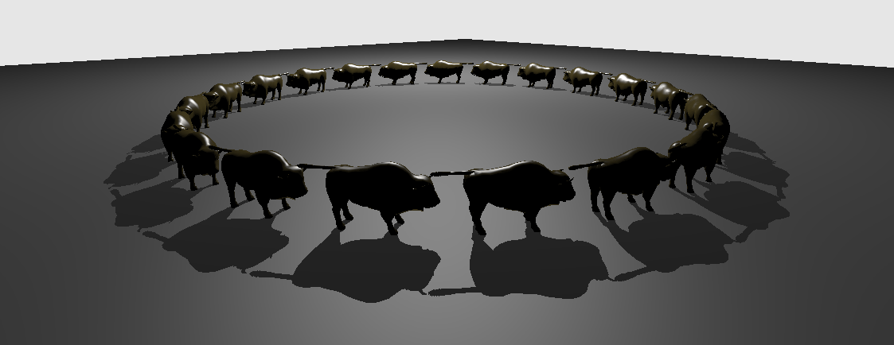

# Ray Tracing Animation - Tutorial

## Tutorial ([Setup](../docs/setup.md))

This is an extension of the Vulkan ray tracing [tutorial](https://nvpro-samples.github.io/vk_raytracing_tutorial_KHR).

We will implement two animation methods: only the transformation matrices, and animating the geometry itself.

## Animating the Matrices
This first example shows how we can update the matrices used for instances in the TLAS.

### Creating a Scene

In main.cpp we can create a new scene with a ground plane and 21 instances of the Wuson model, by replacing the
`helloVk.loadModel` calls in `main()`. The code below creates all of the instances
at the same position, but we will displace them later in the animation function. If you run the example,
you will find that the rendering is considerably slow, because the geometries are exactly at the same position
and the acceleration structure does not deal with this well.

~~~~ C++
  helloVk.loadModel(nvh::findFile("media/scenes/plane.obj", defaultSearchPaths),
                    nvmath::scale_mat4(nvmath::vec3f(2.f, 1.f, 2.f)));
  helloVk.loadModel(nvh::findFile("media/scenes/wuson.obj", defaultSearchPaths));
  HelloVulkan::ObjInstance inst = helloVk.m_objInstance.back();
  for(int i = 0; i < 20; i++)
    helloVk.m_objInstance.push_back(inst);
~~~~ 

### Animation Function
We want to have all of the Wuson models running in a circle, and we will first modify the rasterizer to handle this.
Animating the transformation matrices will be done entirely on the CPU, and we will copy the computed transformation to the GPU.
In the next example, the animation will be done on the GPU using a compute shader.

Add the declaration of the animation to the `HelloVulkan` class.
~~~~ C++ 
void animationInstances(float time);
~~~~ 

The first part computes the transformations for all of the Wuson models, placing each one behind another.
~~~~ C++
void HelloVulkan::animationInstances(float time)
{
  const int32_t nbWuson     = static_cast<int32_t>(m_objInstance.size() - 1);
  const float   deltaAngle  = 6.28318530718f / static_cast<float>(nbWuson);
  const float   wusonLength = 3.f;
  const float   radius      = wusonLength / (2.f * sin(deltaAngle / 2.0f));
  const float   offset      = time * 0.5f;

  for(int i = 0; i < nbWuson; i++)
  {
    int          wusonIdx = i + 1;
    ObjInstance& inst     = m_objInstance[wusonIdx];
    inst.transform        = nvmath::rotation_mat4_y(i * deltaAngle + offset)
                     * nvmath::translation_mat4(radius, 0.f, 0.f);
    inst.transformIT = nvmath::transpose(nvmath::invert(inst.transform));
  }
~~~~ 

Next, we update the buffer that describes the scene, which is used by the rasterizer to set each object's position, and also by the ray tracer to compute shading normals.
~~~~ C++
  // Update the buffer
  vk::DeviceSize bufferSize = m_objInstance.size() * sizeof(ObjInstance);
  nvvkBuffer stagingBuffer = m_alloc.createBuffer(bufferSize, vk::BufferUsageFlagBits::eTransferSrc,
                                                  vk::MemoryPropertyFlagBits::eHostVisible);
  // Copy data to staging buffer
  auto* gInst = m_alloc.map(stagingBuffer);
  memcpy(gInst, m_objInstance.data(), bufferSize);
  m_alloc.unmap(stagingBuffer);
  // Copy staging buffer to the Scene Description buffer
  nvvk::CommandPool genCmdBuf(m_device, m_graphicsQueueIndex);
  vk::CommandBuffer cmdBuf = genCmdBuf.createCommandBuffer();
  cmdBuf.copyBuffer(stagingBuffer.buffer, m_sceneDesc.buffer, vk::BufferCopy(0, 0, bufferSize));
  m_debug.endLabel(cmdBuf);
  genCmdBuf.submitAndWait(cmdBuf);
  m_alloc.destroy(stagingBuffer);
}
~~~~

 **Note:**
    We could have used `cmdBuf.updateBuffer<ObjInstance>(m_sceneDesc.buffer, 0, m_objInstance)` to 
    update the buffer, but this function only works for buffers with less than 65,536 bytes. If we had 2000 Wuson models, this 
    call wouldn't work.

### Loop Animation
In `main()`, just before the main loop, add a variable to hold the start time.
We will use this time in our animation function.

~~~~ C++
  auto start = std::chrono::system_clock::now();
~~~~ 

Inside the `while` loop, just before calling `appBase.prepareFrame()`, invoke the animation function.

~~~~ C++
    std::chrono::duration<float> diff = std::chrono::system_clock::now() - start;
    helloVk.animationInstances(diff.count());
~~~~ 

If you run the application, the Wuson models will be running in a circle when using the rasterizer, but
they will still be at their original positions in the ray traced version. We will need to update the TLAS for this.

## Update TLAS

Since we want to update the transformation matrices in the TLAS, we need to keep some of the objects used to create it.

First, move the vector of `nvvk::RaytracingBuilder::Instance` objects from `HelloVulkan::createTopLevelAS()` to the 
`HelloVulkan` class. 
~~~~ C++
std::vector<nvvk::RaytracingBuilder::Instance> m_tlas;
~~~~ 

Make sure to rename it to `m_tlas`, instead of `tlas`. 

One important point is that we need to set the TLAS build flags to allow updates, by adding the`vk::BuildAccelerationStructureFlagBitsKHR::eAllowUpdate` flag. 
This is absolutely needed, since otherwise the TLAS cannot be updated.

~~~~ C++
void HelloVulkan::createTopLevelAS()
{
  m_tlas.reserve(m_objInstance.size());
  for(int i = 0; i < static_cast<int>(m_objInstance.size()); i++)
  {
    nvvk::RaytracingBuilder::Instance rayInst;
    rayInst.transform  = m_objInstance[i].transform;  // Position of the instance
    rayInst.instanceId = i;                           // gl_InstanceID
    rayInst.blasId     = m_objInstance[i].objIndex;
    rayInst.hitGroupId = m_objInstance[i].hitgroup;
    rayInst.flags      = VK_GEOMETRY_INSTANCE_TRIANGLE_CULL_DISABLE_BIT_NV;
    m_tlas.emplace_back(rayInst);
  }
  m_rtBuilder.buildTlas(m_tlas, vk::BuildAccelerationStructureFlagBitsKHR::ePreferFastTrace
                                    | vk::BuildAccelerationStructureFlagBitsKHR::eAllowUpdate);
}
~~~~ 

Back in `HelloVulkan::animationInstances()`, we need to copy the new computed transformation 
matrices to the vector of `nvvk::RaytracingBuilder::Instance` objects.

In the `for` loop, add at the end

~~~~ C++
   nvvk::RaytracingBuilder::Instance& tinst = m_tlas[wusonIdx];
   tinst.transform                            = inst.transform;
~~~~

The last point is to call the update at the end of the function.

~~~~ C++
  m_rtBuilder.buildTlas(m_tlas, m_rtFlags, true);
~~~~

### nvvk::RaytracingBuilder::buildTlas (Implementation)

We are using `nvvk::RaytracingBuilder` to update the matrices for convenience. There
is only a small variation with constructing the matrices and updating them. The main
differences are:

* The `VkAccelerationStructureBuildGeometryInfoKHR` mode will be set to `VK_BUILD_ACCELERATION_STRUCTURE_MODE_UPDATE_KHR`
* We will **not** create the acceleration structure, but reuse it.
* The source and destination of `VkAccelerationStructureCreateInfoKHR` will both use the previously created acceleration structure. 

What is happening is the buffer containing all matrices will be updated and the `vkCmdBuildAccelerationStructuresKHR` will update the acceleration in place. 

## BLAS Animation

In the previous chapter, we updated the transformation matrices. In this one we will modify vertices in a compute shader.

### Adding a Sphere

In this chapter, we will animate a sphere. In `main.cpp`, set up the scene like this:

~~~~ C++
  helloVk.loadModel(nvh::findFile("media/scenes/plane.obj", defaultSearchPaths),
                    nvmath::scale_mat4(nvmath::vec3f(2.f, 1.f, 2.f)));
  helloVk.loadModel(nvh::findFile("media/scenes/wuson.obj", defaultSearchPaths));
  HelloVulkan::ObjInstance inst = helloVk.m_objInstance.back();
  for(int i = 0; i < 5; i++)
    helloVk.m_objInstance.push_back(inst);
  helloVk.loadModel(nvh::findFile("media/scenes/sphere.obj", defaultSearchPaths));
~~~~

Because we now have a new instance, we have to adjust the calculation of the number of Wuson models in `HelloVulkan::animationInstances()`.

~~~~ C++
  const int32_t nbWuson     = static_cast<int32_t>(m_objInstance.size() - 2);
~~~~

### Compute Shader

The compute shader will update the vertices in-place.

Add all of the following members to the `HelloVulkan` class:

~~~~ C++
  void createCompDescriptors();
  void updateCompDescriptors(nvvkBuffer& vertex);
  void createCompPipelines();

  nvvk::DescriptorSetBindings m_compDescSetLayoutBind;
  vk::DescriptorPool          m_compDescPool;
  vk::DescriptorSetLayout     m_compDescSetLayout;
  vk::DescriptorSet           m_compDescSet;
  vk::Pipeline                m_compPipeline;
  vk::PipelineLayout          m_compPipelineLayout;
~~~~

The compute shader will work on a single `VertexObj` buffer.

~~~~ C++
void HelloVulkan::createCompDescriptors()
{
  m_compDescSetLayoutBind.addBinding(vk::DescriptorSetLayoutBinding(
      0, vk::DescriptorType::eStorageBuffer, 1, vk::ShaderStageFlagBits::eCompute));

  m_compDescSetLayout = m_compDescSetLayoutBind.createLayout(m_device);
  m_compDescPool      = m_compDescSetLayoutBind.createPool(m_device, 1);
  m_compDescSet       = nvvk::allocateDescriptorSet(m_device, m_compDescPool, m_compDescSetLayout);
}
~~~~

`updateCompDescriptors` will set the set the descriptor to the buffer of `VertexObj` objects to which the animation will be applied.

~~~~ C++
void HelloVulkan::updateCompDescriptors(nvvkBuffer& vertex)
{
  std::vector<vk::WriteDescriptorSet> writes;
  vk::DescriptorBufferInfo            dbiUnif{vertex.buffer, 0, VK_WHOLE_SIZE};
  writes.emplace_back(m_compDescSetLayoutBind.makeWrite(m_compDescSet, 0, dbiUnif));
  m_device.updateDescriptorSets(static_cast<uint32_t>(writes.size()), writes.data(), 0, nullptr);
}
~~~~

The compute pipeline will consist of a simple shader and a push constant, which will be used
to set the animation time.

~~~~ C++
void HelloVulkan::createCompPipelines()
{
  // pushing time
  vk::PushConstantRange push_constants = {vk::ShaderStageFlagBits::eCompute, 0, sizeof(float)};
  vk::PipelineLayoutCreateInfo layout_info{{}, 1, &m_compDescSetLayout, 1, &push_constants};
  m_compPipelineLayout = m_device.createPipelineLayout(layout_info);
  vk::ComputePipelineCreateInfo computePipelineCreateInfo{{}, {}, m_compPipelineLayout};

  computePipelineCreateInfo.stage =
      nvvk::createShaderStageInfo(m_device,
                                  nvh::loadFile("shaders/anim.comp.spv", true, defaultSearchPaths),
                                  VK_SHADER_STAGE_COMPUTE_BIT);
  m_compPipeline = m_device.createComputePipeline({}, computePipelineCreateInfo, nullptr);
  m_device.destroy(computePipelineCreateInfo.stage.module);
}
~~~~

Finally, destroy the resources in `HelloVulkan::destroyResources()`:

~~~~ C++
  m_device.destroy(m_compDescPool);
  m_device.destroy(m_compDescSetLayout);
  m_device.destroy(m_compPipeline);
  m_device.destroy(m_compPipelineLayout);
~~~~

### `anim.comp` 

The compute shader will be simple. We need to add a new shader file, `anim.comp`, to the `shaders` filter in the solution.

This will move each vertex up and down over time.

~~~~ C++
#version 460
#extension GL_ARB_separate_shader_objects : enable
#extension GL_EXT_scalar_block_layout : enable
#extension GL_GOOGLE_include_directive : enable
#include "wavefront.glsl"

layout(binding = 0, scalar) buffer Vertices
{
  Vertex v[];
}
vertices;

layout(push_constant) uniform shaderInformation
{
  float iTime;
}
pushc;

void main()
{
  Vertex v0 = vertices.v[gl_GlobalInvocationID.x];

  // Compute vertex position
  const float PI       = 3.14159265;
  const float signY    = (v0.pos.y >= 0 ? 1 : -1);
  const float radius   = length(v0.pos.xz);
  const float argument = pushc.iTime * 4 + radius * PI;
  const float s        = sin(argument);
  v0.pos.y             = signY * abs(s) * 0.5;

  // Compute normal
  if(radius == 0.0f)
  {
    v0.nrm = vec3(0.0f, signY, 0.0f);
  }
  else
  {
    const float c        = cos(argument);
    const float xzFactor = -PI * s * c;
    const float yFactor  = 2.0f * signY * radius * abs(s);
    v0.nrm               = normalize(vec3(v0.pos.x * xzFactor, yFactor, v0.pos.z * xzFactor));
  }

  vertices.v[gl_GlobalInvocationID.x] = v0;
}
~~~~

### Animating the Object

First add the declaration of the animation function in `HelloVulkan`:

~~~~ C++
void animationObject(float time);
~~~~

The implementation only pushes the current time and calls the compute shader (`dispatch`).

~~~~ C++
void HelloVulkan::animationObject(float time)
{
  ObjModel& model = m_objModel[2];

  updateCompDescriptors(model.vertexBuffer);

  nvvk::CommandPool genCmdBuf(m_device, m_graphicsQueueIndex);
  vk::CommandBuffer cmdBuf = genCmdBuf.createCommandBuffer();

  cmdBuf.bindPipeline(vk::PipelineBindPoint::eCompute, m_compPipeline);
  cmdBuf.bindDescriptorSets(vk::PipelineBindPoint::eCompute, m_compPipelineLayout, 0,
                            {m_compDescSet}, {});
  cmdBuf.pushConstants(m_compPipelineLayout, vk::ShaderStageFlagBits::eCompute, 0, sizeof(float),
                       &time);
  cmdBuf.dispatch(model.nbVertices, 1, 1);
  genCmdBuf.submitAndWait(cmdBuf);
}
~~~~

### Invoking Animation

In `main.cpp`, after the other resource creation functions, add the creation functions for the compute shader.

~~~~ C++
  helloVk.createCompDescriptors();
  helloVk.createCompPipelines();
~~~~

In the rendering loop, **before** the call to `animationInstances`, call the object animation function.

~~~~ C++
  helloVk.animationObject(diff.count());
~~~~

**Note:** Always update the TLAS when BLAS are modified. This will make sure that the TLAS knows about the new bounding box sizes.

**Note:**  At this point, the object should be animated when using the rasterizer, but should still be immobile when using the ray tracer.

## Update BLAS

In `nvvk::RaytracingBuilder` in `raytrace_vkpp.hpp`, we can add a function to update a BLAS whose vertex buffer was previously updated. This function is very similar to the one used for instances, but in this case, there is no buffer transfer to do.

~~~~ C++
  //--------------------------------------------------------------------------------------------------
  // Refit the BLAS from updated buffers
  //
  void updateBlas(uint32_t blasIdx)
  {
    Blas& blas = m_blas[blasIdx];

    // Compute the amount of scratch memory required by the AS builder to update    the BLAS
    VkAccelerationStructureMemoryRequirementsInfoKHR memoryRequirementsInfo{
        VK_STRUCTURE_TYPE_ACCELERATION_STRUCTURE_MEMORY_REQUIREMENTS_INFO_KHR};
    memoryRequirementsInfo.type = VK_ACCELERATION_STRUCTURE_MEMORY_REQUIREMENTS_TYPE_UPDATE_SCRATCH_KHR;
    memoryRequirementsInfo.accelerationStructure = blas.as.accel;
    memoryRequirementsInfo.buildType             = VK_ACCELERATION_STRUCTURE_BUILD_TYPE_DEVICE_KHR;

    VkMemoryRequirements2 reqMem{VK_STRUCTURE_TYPE_MEMORY_REQUIREMENTS_2};
    vkGetAccelerationStructureMemoryRequirementsKHR(m_device, &memoryRequirementsInfo, &reqMem);
    VkDeviceSize scratchSize = reqMem.memoryRequirements.size;

    // Allocate the scratch buffer
    nvvkBuffer scratchBuffer =
        m_alloc.createBuffer(scratchSize, VK_BUFFER_USAGE_RAY_TRACING_BIT_KHR | VK_BUFFER_USAGE_SHADER_DEVICE_ADDRESS_BIT);
    VkBufferDeviceAddressInfo bufferInfo{VK_STRUCTURE_TYPE_BUFFER_DEVICE_ADDRESS_INFO};
    bufferInfo.buffer              = scratchBuffer.buffer;
    VkDeviceAddress scratchAddress = vkGetBufferDeviceAddress(m_device, &bufferInfo);

    const VkAccelerationStructureGeometryKHR*   pGeometry = blas.asGeometry.data();
    VkAccelerationStructureBuildGeometryInfoKHR asInfo{VK_STRUCTURE_TYPE_ACCELERATION_STRUCTURE_BUILD_GEOMETRY_INFO_KHR};
    asInfo.type                      = VK_ACCELERATION_STRUCTURE_TYPE_BOTTOM_LEVEL_KHR;
    asInfo.flags                     = blas.flags;
    asInfo.update                    = VK_TRUE;
    asInfo.srcAccelerationStructure  = blas.as.accel;
    asInfo.dstAccelerationStructure  = blas.as.accel;
    asInfo.geometryArrayOfPointers   = VK_FALSE;
    asInfo.geometryCount             = (uint32_t)blas.asGeometry.size();
    asInfo.ppGeometries              = &pGeometry;
    asInfo.scratchData.deviceAddress = scratchAddress;

    std::vector<const VkAccelerationStructureBuildOffsetInfoKHR*> pBuildOffset(blas.asBuildOffsetInfo.size());
    for(size_t i = 0; i < blas.asBuildOffsetInfo.size(); i++)
      pBuildOffset[i] = &blas.asBuildOffsetInfo[i];

    // Update the instance buffer on the device side and build the TLAS
    nvvk::CommandPool genCmdBuf(m_device, m_queueIndex);
    VkCommandBuffer   cmdBuf = genCmdBuf.createCommandBuffer();

    // Update the acceleration structure. Note the VK_TRUE parameter to trigger the update,
    // and the existing BLAS being passed and updated in place
    vkCmdBuildAccelerationStructureKHR(cmdBuf, 1, &asInfo, pBuildOffset.data());

    genCmdBuf.submitAndWait(cmdBuf);
    m_alloc.destroy(scratchBuffer);
  }
~~~~

The previous function (`updateBlas`) uses geometry information stored in `m_blas`. 
To be able to re-use this information, we need to keep the structure of `nvvk::RaytracingBuilderKHR::Blas` objects
used for its creation.

Move the `nvvk::RaytracingBuilderKHR::Blas` vector from `HelloVulkan::createBottomLevelAS()` to the `HelloVulkan` class, renaming it to `m_blas`.

~~~~ C++
  std::vector<nvvk::RaytracingBuilderKHR::Blas>         m_blas;
~~~~

As with the TLAS, the BLAS needs to allow updates. We will also enable the 
`VK_BUILD_ACCELERATION_STRUCTURE_PREFER_FAST_BUILD_BIT_KHR` flag, which indicates that the given 
acceleration structure build should prioritize build time over trace performance.

~~~~ C++
void HelloVulkan::createBottomLevelAS()
{
  // BLAS - Storing each primitive in a geometry
  m_blas.reserve(m_objModel.size());
  for(const auto & obj : m_objModel)
  {
    auto blas = objectToVkGeometryKHR(obj);

    // We could add more geometry in each BLAS, but we add only one for now
    m_blas.push_back(blas);
  }
  m_rtBuilder.buildBlas(m_blas, vk::BuildAccelerationStructureFlagBitsKHR::eAllowUpdate
                                    | vk::BuildAccelerationStructureFlagBitsKHR::ePreferFastBuild);
}
~~~~

Finally, we can add a line at the end of `HelloVulkan::animationObject()` to update the BLAS.

~~~~ C++
m_rtBuilder.updateBlas(2);
~~~~

