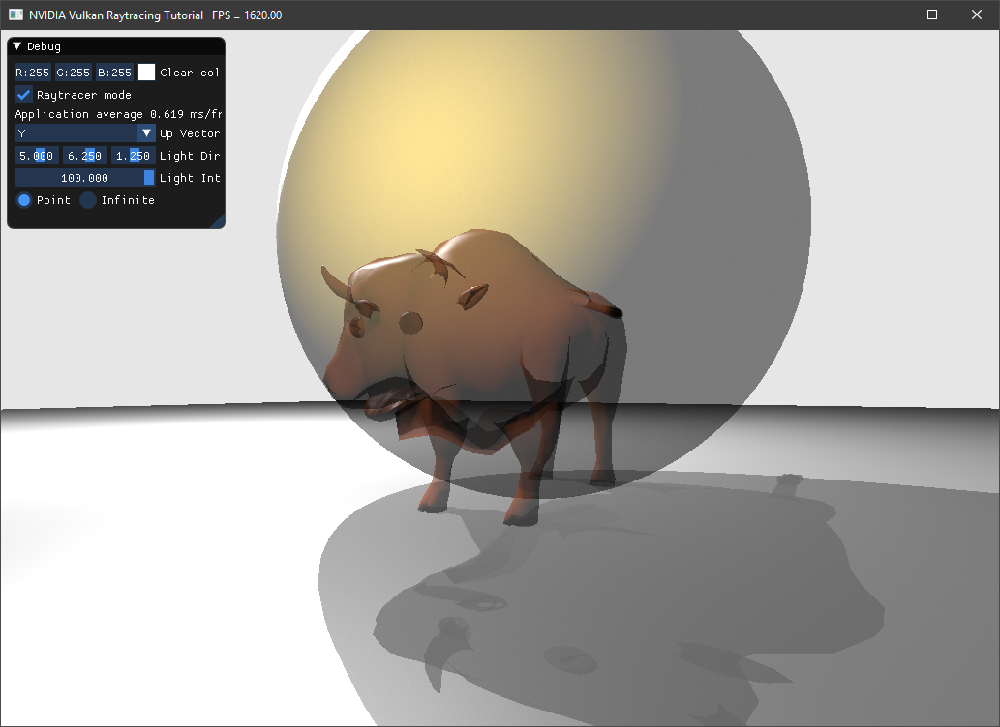
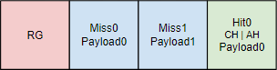
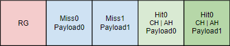

# Any Hit Shaders - Tutorial
<small>Authors: [Martin-Karl Lefrançois](https://devblogs.nvidia.com/author/mlefrancois/), Neil Bickford </small>

## Tutorial ([Setup](../docs/setup.md))

This is an extension of the Vulkan ray tracing [tutorial](https://nvpro-samples.github.io/vk_raytracing_tutorial_KHR/vkrt_tutorial.md.html).

Like closest hit shaders, any hit shaders operate on intersections between rays and geometry. However, the any hit
shader will be executed for all hits along the ray. The closest hit shader will then be invoked on the closest accepted
intersection.

The any hit shader can be useful for discarding intersections, such as for alpha cutouts for example, but can also be
used for simple transparency. In this example we will show what is needed to do to add this shader type and to create a
transparency effect.

 **Note:**
    This example is based on many elements from the [Antialiasing Tutorial](../ray_tracing_jitter_cam/README.md).

## Any Hit Shader

Create a new shader file `raytrace.rahit` and rerun CMake to have it added to the solution.

This shader starts like `raytrace.chit`, but uses less information.
~~~~ C++
#version 460
#extension GL_EXT_ray_tracing : require
#extension GL_EXT_scalar_block_layout : enable
#extension GL_GOOGLE_include_directive : enable

#extension GL_EXT_shader_explicit_arithmetic_types_int64 : require
#extension GL_EXT_buffer_reference2 : require

#include "random.glsl"
#include "raycommon.glsl"
#include "wavefront.glsl"

// clang-format off
layout(location = 0) rayPayloadInEXT hitPayload prd;
layout(buffer_reference, scalar) buffer Vertices {Vertex v[]; }; // Positions of an object
layout(buffer_reference, scalar) buffer Indices {uint i[]; }; // Triangle indices
layout(buffer_reference, scalar) buffer Materials {WaveFrontMaterial m[]; }; // Array of all materials on an object
layout(buffer_reference, scalar) buffer MatIndices {int i[]; }; // Material ID for each triangle
layout(set = 1, binding = eObjDescs, scalar) buffer ObjDesc_ { ObjDesc i[]; } objDesc;
// clang-format on
~~~~ 

 **:warning: Note:**
    You can find the source of `random.glsl` in the Antialiasing Tutorial [here](../ray_tracing_jitter_cam/README.md#toc1.1).

For the any hit shader, we need to know which material we hit, and whether that material supports transparency. If it is
opaque, we simply return, which means that the hit will be accepted.

~~~~ C++
void main()
{
  // Object data
  ObjDesc    objResource = objDesc.i[gl_InstanceCustomIndexEXT];
  MatIndices matIndices  = MatIndices(objResource.materialIndexAddress);
  Materials  materials   = Materials(objResource.materialAddress);

  // Material of the object
  int               matIdx = matIndices.i[gl_PrimitiveID];
  WaveFrontMaterial mat    = materials.m[matIdx];

  if (mat.illum != 4)
    return;
~~~~

Now we will apply transparency:

~~~~ C++
  if (mat.dissolve == 0.0)
      ignoreIntersectionEXT();
  else if(rnd(prd.seed) > mat.dissolve)
     ignoreIntersectionEXT();
}
~~~~

As you can see, we are using a random number generator to determine if the ray hits or ignores the object. If we
accumulate enough rays, the final result will converge to what we want.

## Payload 

The random `seed` also needs to be passed in the ray payload.

In `raycommon.glsl`, add the seed:

~~~~ C++
struct hitPayload
{
  vec3 hitValue;
  uint seed;
};
~~~~

## Adding Any Hit to RT Pipeline

The any hit shader will be part of the hit shader group. Currently, the hit shader group only contains the closest hit shader.

In `createRtPipeline()`, after loading `raytrace.rchit.spv`, load `raytrace.rahit.spv`

~~~~ C++
  enum StageIndices
  {
    ...
    eAnyHit,
    eShaderGroupCount
  };

  // Hit Group - Any Hit
  stage.module = nvvk::createShaderModule(m_device, nvh::loadFile("spv/raytrace.rahit.spv", true, defaultSearchPaths, true));
  stage.stage     = VK_SHADER_STAGE_ANY_HIT_BIT_KHR;
  stages[eAnyHit] = stage;
~~~~

The Any Hit goes in the same Hit group as the Closest Hit, so we need to
add the Any Hit stage index and push back the shader module to the stages.

~~~~ C++
  // closest hit shader
  // Payload 0
  group.type             = VK_RAY_TRACING_SHADER_GROUP_TYPE_TRIANGLES_HIT_GROUP_KHR;
  group.generalShader    = VK_SHADER_UNUSED_KHR;
  group.closestHitShader = eClosestHit;
  group.anyHitShader     = eAnyHit;
  m_rtShaderGroups.push_back(group);
~~~~

## Give access of the buffers to the Any Hit shader

In `createDescriptorSetLayout()`, we need to allow the Any Hit shader to access the scene description buffer

~~~~ C++
  // Obj descriptions
  m_descSetLayoutBind.addBinding(eObjDescs, VK_DESCRIPTOR_TYPE_STORAGE_BUFFER, 1,
                                 VK_SHADER_STAGE_VERTEX_BIT | VK_SHADER_STAGE_FRAGMENT_BIT
                                     | VK_SHADER_STAGE_CLOSEST_HIT_BIT_KHR | VK_SHADER_STAGE_ANY_HIT_BIT_KHR);
~~~~

## Opaque Flag

In the example, when creating `VkAccelerationStructureGeometryKHR` objects, we set their flags to `VK_GEOMETRY_OPAQUE_BIT_KHR`. However, this avoided invoking the any hit shader.

We could remove all of the flags, but another issue could happen: the any hit shader could be called multiple times for the same triangle. To have the any hit shader process only one hit per triangle, set the `VK_GEOMETRY_NO_DUPLICATE_ANY_HIT_INVOCATION_BIT_KHR` flag:

~~~~ C++
asGeom.flags = VK_GEOMETRY_NO_DUPLICATE_ANY_HIT_INVOCATION_BIT_KHR;  // Avoid double hits;
~~~~

## Ray Generation Shader

If you have done the previous [Jitter Camera/Antialiasing](../ray_tracing_jitter_cam) tutorial,
you will need just a few changes.

First, `seed` will need to be available in the any hit shader, which is the reason we have added it to the hitPayload structure.

Change the local `seed` to `prd.seed` everywhere.

~~~~ C++
prd.seed = tea(gl_LaunchIDEXT.y * gl_LaunchSizeEXT.x + gl_LaunchIDEXT.x, pushC.frame);
~~~~

For optimization, the `TraceRayEXT` call was using the `gl_RayFlagsOpaqueEXT` flag. But
this will skip the any hit shader, so change it to

~~~~ C++
uint  rayFlags = gl_RayFlagsNoneEXT;
~~~~

## Closest Hit Shader

Similarly, in the closest hit shader, change the flag to `gl_RayFlagsSkipClosestHitShaderEXT`, as we want to enable the any hit and miss shaders, but we still don't care
about the closest hit shader for shadow rays. This will enable transparent shadows.

~~~~ C++
uint  flags = gl_RayFlagsSkipClosestHitShaderEXT;
~~~~

## Scene and Model

For a more interesting scene, you can replace the `helloVk.loadModel` calls in `main()` with the following scene:

~~~~ C++
  helloVk.loadModel(nvh::findFile("media/scenes/wuson.obj", defaultSearchPaths, true));
  helloVk.loadModel(nvh::findFile("media/scenes/sphere.obj", defaultSearchPaths, true),
                    glm::scale(glm::mat4(1.f),glm::vec3(1.5f))
                        * glm::translate(glm::mat4(1),glm::vec3(0.0f, 1.0f, 0.0f)));
  helloVk.loadModel(nvh::findFile("media/scenes/plane.obj", defaultSearchPaths, true));
~~~~

## OBJ Materials

By default, all objects are opaque, you will need to change the material description.

Edit the first few lines of `media/scenes/wuson.mtl` and `media/scenes/sphere.mtl` to use a new illumination model (4) with a dissolve value of 0.5:

~~~~ C++
newmtl  default
illum 4
d 0.5
...
~~~~

## Accumulation

As mentioned earlier, for the effect to work, we need to accumulate frames over time. Please implement the following from [Jitter Camera/Antialiasing](https://github.com/nvpro-samples/vk_raytracing_tutorial_KHR/tree/master/ray_tracing_jitter_cam):

* [Frame Number](https://github.com/nvpro-samples/vk_raytracing_tutorial_KHR/tree/master/ray_tracing_jitter_cam#frame-number)
* [Storing or Updating](https://github.com/nvpro-samples/vk_raytracing_tutorial_KHR/tree/master/ray_tracing_jitter_cam#storing-or-updating)
* [Application Frame Update](https://github.com/nvpro-samples/vk_raytracing_tutorial_KHR/tree/master/ray_tracing_jitter_cam#application-frame-update)

## Fixing The Pipeline

The above code works, but might not work in the future. The reason is, the shadow ray `traceRayEXT` call in the Closest Hit shader, uses payload 1 
and when intersecting the object, the any hit shader will be executed using payload 0. In the time of writing those lines, the driver add
padding and there are no side effect, but this is not how thing should be done.

Each `traceRayEXT` invocation should have as many Hit Groups as there are trace calls with different payload. For the other examples, it is still fine,
because we are using the `gl_RayFlagsSkipClosestHitShaderNV` flag and the closest hit shader (payload 0) will not be called and there were not 
any hit or intersection shaders in the Hit Group. But in this example, the closest hit will be skiped, but not the any hit.

**To fix this**, we need to add another hit group. 

This is how the current SBT looks like.

And we need to add the following to the ray tracing pipeline, a copy of the previous Hit Group, with a new AnyHit using the proper payload.

### New shaders 

Create two new files `raytrace_0.ahit` and `raytrace_1.ahit`, and rename `raytrace.ahit` to `raytrace_ahit.glsl`

 **Note:** 
    Cmake need to be re-run to add the new files to the project.

In `raytrace_0.ahit` add the following code 

~~~~ C 
#version 460
#extension GL_GOOGLE_include_directive : enable

#define PAYLOAD_0
#include "raytrace_rahit.glsl"
~~~~ 

and in `raytrace_1.ahit`, replace `PAYLOAD_0` by `PAYLOAD_1`

Then in `raytrace_ahit.glsl` remove the `#version 460`  and add the following code, so that we have the right layout.

~~~~ C 
#ifdef PAYLOAD_0
layout(location = 0) rayPayloadInNV hitPayload prd;
#elif defined(PAYLOAD_1)
layout(location = 1) rayPayloadInNV shadowPayload prd;
#endif
~~~~ 
  
### New Payload 

We cannot simply have a bool for our shadow ray payload. We also need the `seed` for the random function. 

In the `raycommon.glsl` file, add the following structure

~~~~ C
struct shadowPayload
{
  bool isHit;
  uint seed;
};
~~~~

The usage of the shadow payload is done in the closest hit and shadow miss shader. First, let's modify `raytraceShadow.rmiss` to look like this

~~~~ C
#version 460
#extension GL_NV_ray_tracing : require
#extension GL_GOOGLE_include_directive : enable

#include "raycommon.glsl"

layout(location = 1) rayPayloadInNV shadowPayload prd;

void main()
{
  prd.isHit = false;
}
~~~~ 

The the change in the closest hit shader `raytrace.rchit`, need to change the usage of the payload, but also the call to `traceRayEXT`

Replace the payload to 

~~~~ C 
layout(location = 1) rayPayloadNV shadowPayload prdShadow;
~~~~ 

Then just before the call to `traceRayEXT`, initialize the values to 

~~~~ C 
prdShadow.isHit = true;
prdShadow.seed  = prd.seed;
~~~~

and after the trace, set the seed value back to the main payload 

~~~~ C
prd.seed = prdShadow.seed; 
~~~~ 

And check if the trace shadow hit an object of not 

~~~~ C 
if(prdShadow.isHit) 
~~~~ 

### traceRayEXT 

When we call `traceRayEXT`, since we are using the payload 1 (last argument), we also 
need the trace to hit the alternative hit group, the one using the payload 1. 
To do this, we need to set the sbtRecordOffset to 1 

~~~~ C 
traceRayEXT(topLevelAS,  // acceleration structure
  flags,       // rayFlags
  0xFF,        // cullMask
  1,           // sbtRecordOffset
  0,           // sbtRecordStride
  1,           // missIndex
  origin,      // ray origin
  tMin,        // ray min range
  rayDir,      // ray direction
  tMax,        // ray max range
  1            // payload (location = 1)
  );
~~~~

### Ray tracing Pipeline

The final step is to add the new Hit Group. This is a change in `HelloVulkan::createRtPipeline()`. 
We need to load the new any hit shader and create a new Hit Group.

Replace the `"shaders/raytrace.rahit.spv"` for `"shaders/raytrace_0.rahit.spv"`

Load the new shader module.

~~~~ C
  enum StageIndices
  {
    eRaygen,
    eMiss,
    eMiss2,
    eClosestHit,
    eAnyHit,
    eAnyHit2,
    eShaderGroupCount
  };

  // Hit Group - Any Hit
  stage.module = nvvk::createShaderModule(m_device, nvh::loadFile("spv/raytrace_0.rahit.spv", true, defaultSearchPaths, true));
  stage.stage     = VK_SHADER_STAGE_ANY_HIT_BIT_KHR;
  stages[eAnyHit] = stage;
  //
  stage.module = nvvk::createShaderModule(m_device, nvh::loadFile("spv/raytrace_1.rahit.spv", true, defaultSearchPaths, true));
  stage.stage     = VK_SHADER_STAGE_ANY_HIT_BIT_KHR;
  stages[eAnyHit2] = stage;
~~~~

Then, after the creating of the first Hit Group, create a new one, where only the any hit using payload 1 
is added. We are skipping the closest hit shader in the trace call, so we can ignore it in the Hit Group.

~~~~ C 
  // Payload 1
  group.type             = VK_RAY_TRACING_SHADER_GROUP_TYPE_TRIANGLES_HIT_GROUP_KHR;
  group.generalShader    = VK_SHADER_UNUSED_KHR;
  group.closestHitShader = VK_SHADER_UNUSED_KHR;
  group.anyHitShader     = eAnyHit2;
  m_rtShaderGroups.push_back(group);
~~~~ 

 **:warning: Note:** Re-Run
    Everything should work as before, but now it does it right.

