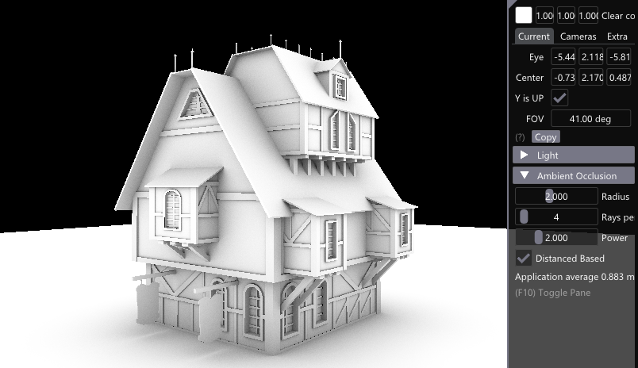
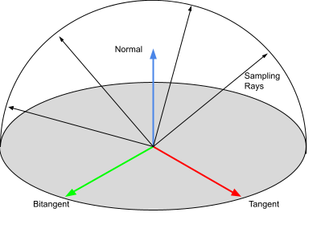
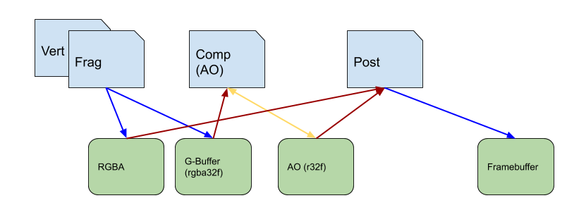
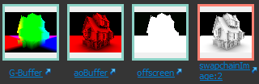

# G-Buffer and Ambient Occlusion - Tutorial



## Tutorial ([Setup](../docs/setup.md))

This is an extension of the Vulkan ray tracing [tutorial](https://nvpro-samples.github.io/vk_raytracing_tutorial_KHR).

This extension to the tutorial is showing how G-Buffers from the fragment shader, can be used in a compute shader to cast ambient occlusion rays using
ray queries [(GLSL_EXT_ray_query)](https://github.com/KhronosGroup/GLSL/blob/master/extensions/ext/GLSL_EXT_ray_query.txt).

We are using some previous extensions of the tutorial to create this one.

* The usage of `ray query` is from [ray_tracing_rayquery](../ray_tracing_rayquery)
* The notion of accumulated frames, is comming from [ray_tracing_jitter_cam](../ray_tracing_jitter_cam)
* The creation and dispatch of compute shader was inspired from [ray_tracing_animation](../ray_tracing_animation)

## Workflow

The fragment shader no longer just writes to an RGBA buffer for the colored image, but also writes to a G-buffer the position and normal for each fragment.
Then a compute shader takes the G-buffer and sends random ambient occlusion rays into the hemisphere formed by position and normal.



The compute shader reads and stores into the AO buffer. It reads the previous information to cumulate it over time and store the accumulated value. Finally, the post shader is slightly modified to include the AO buffer and multiply its value by the RGBA color frame before tonemapping and writing to the frame buffer.



The following are the buffers are they can be seen in [NSight Graphics](https://developer.nvidia.com/nsight-graphics).



## G-Buffer

The framework was already writing to G-Buffers, but was writing to a single `VK_FORMAT_R32G32B32A32_SFLOAT` buffer. In the function `HelloVulkan::createOffscreenRender()`, we will add the creation of two new buffers. One `VK_FORMAT_R32G32B32A32_SFLOAT` to store the position and normal and one `VK_FORMAT_R32_SFLOAT` for the ambient occlusion.

~~~~ C++
  // The G-Buffer (rgba32f) - position(xyz) / normal(w-compressed)
  {
    auto colorCreateInfo = nvvk::makeImage2DCreateInfo(m_size, VK_FORMAT_R32G32B32A32_SFLOAT,
                                                       VK_IMAGE_USAGE_COLOR_ATTACHMENT_BIT | VK_IMAGE_USAGE_SAMPLED_BIT
                                                           | VK_IMAGE_USAGE_STORAGE_BIT);


    nvvk::Image           image      = m_alloc.createImage(colorCreateInfo);
    VkImageViewCreateInfo ivInfo     = nvvk::makeImageViewCreateInfo(image.image, colorCreateInfo);
    m_gBuffer                        = m_alloc.createTexture(image, ivInfo, sampler);
    m_gBuffer.descriptor.imageLayout = VK_IMAGE_LAYOUT_GENERAL;
    m_debug.setObjectName(m_gBuffer.image, "G-Buffer");
  }

  // The ambient occlusion result (r32)
  {
    auto colorCreateInfo = nvvk::makeImage2DCreateInfo(m_size, VK_FORMAT_R32_SFLOAT,
                                                       VK_IMAGE_USAGE_COLOR_ATTACHMENT_BIT | VK_IMAGE_USAGE_SAMPLED_BIT
                                                           | VK_IMAGE_USAGE_STORAGE_BIT);


    nvvk::Image           image       = m_alloc.createImage(colorCreateInfo);
    VkImageViewCreateInfo ivInfo      = nvvk::makeImageViewCreateInfo(image.image, colorCreateInfo);
    m_aoBuffer                        = m_alloc.createTexture(image, ivInfo, sampler);
    m_aoBuffer.descriptor.imageLayout = VK_IMAGE_LAYOUT_GENERAL;
    m_debug.setObjectName(m_aoBuffer.image, "aoBuffer");
  }
~~~~

Add the `nvvk::Texture` members for `m_gBuffer` and `m_aoBuffer` to the class and to the destructor function, and don't forget to set the right image layout.

The render pass for the fragment shader will need two color buffers, therefore we need to modify the offscreen framebuffer attachments.

```
  // Creating the frame buffer for offscreen
  std::vector<VkImageView> attachments = {m_offscreenColor.descriptor.imageView,
                                          m_gBuffer.descriptor.imageView,
                                          m_offscreenDepth.descriptor.imageView};
```

### Renderpass

This means that the renderpass in `main()` will have to be modified as well. The clear color will need to have 3 entries (2 color + 1 depth)

```
      std::array<VkClearValue, 3> clearValues{};
```

Since the clear value will be re-used by the offscreen (3 attachments) and the post/UI (2 attachments), we will set the clear values in each section.

```
      // Offscreen render pass
      {
        clearValues[1].color        = {{0, 0, 0, 0}};
        clearValues[2].depthStencil = {1.0f, 0};
```

```
     // 2nd rendering pass: tone mapper, UI
      {
        clearValues[1].depthStencil = {1.0f, 0};
```

### Fragment shader

The fragment shader can now write into two different textures.

We are omitting the code to compress and decompress the XYZ normal to and from a single unsigned integer, but you can find the code in [raycommon.glsl](shaders/raycommon.glsl)

```
// Outgoing
layout(location = 0) out vec4 o_color;
layout(location = 1) out vec4 o_gbuffer;
...

 o_gbuffer.rgba = vec4(worldPos, uintBitsToFloat(CompressUnitVec(N)));
```

## Ray Tracing

As for the [ray_tracing_rayquery](../ray_tracing_rayquery) sample, we use the VK_KHR_acceleration_structure extension to generate the ray tracing acceleration structure, while the ray tracing itself is carried out in a compute shader. This section remains unchanged compared to the rayquery example.

## Compute Shader

The compute shader will take the G-Buffer containing the position and normal and will randomly shot rays in the hemisphere defined by the normal.

### Descriptor

The shader takes two inputs, the G-Buffer and the TLAS, and has one output, the AO buffer:

~~~ C++
//--------------------------------------------------------------------------------------------------
// Compute shader descriptor
//
void HelloVulkan::createCompDescriptors()
{
  m_compDescSetLayoutBind.addBinding(0, VK_DESCRIPTOR_TYPE_STORAGE_IMAGE, 1, VK_SHADER_STAGE_COMPUTE_BIT);  // [in] G-Buffer
  m_compDescSetLayoutBind.addBinding(1, VK_DESCRIPTOR_TYPE_STORAGE_IMAGE, 1, VK_SHADER_STAGE_COMPUTE_BIT);  // [out] AO
  m_compDescSetLayoutBind.addBinding(2, VK_DESCRIPTOR_TYPE_ACCELERATION_STRUCTURE_KHR, 1, VK_SHADER_STAGE_COMPUTE_BIT);  // [in] TLAS

  m_compDescSetLayout = m_compDescSetLayoutBind.createLayout(m_device);
  m_compDescPool      = m_compDescSetLayoutBind.createPool(m_device, 1);
  m_compDescSet       = nvvk::allocateDescriptorSet(m_device, m_compDescPool, m_compDescSetLayout);
}
~~~

### Descriptor Update

The function `updateCompDescriptors()` is done separately from the descriptor, because it can happen that some resources
are re-created, therefore their address isn't valid and we need to set those values back to the decriptors. For example,
when resizing the window and the G-Buffer and AO buffer are resized.

~~~ C++
//--------------------------------------------------------------------------------------------------
// Setting up the values to the descriptors
//
void HelloVulkan::updateCompDescriptors()
{
  std::vector<VkWriteDescriptorSet> writes;
  writes.emplace_back(m_compDescSetLayoutBind.makeWrite(m_compDescSet, 0, &m_gBuffer.descriptor));
  writes.emplace_back(m_compDescSetLayoutBind.makeWrite(m_compDescSet, 1, &m_aoBuffer.descriptor));

  VkAccelerationStructureKHR                   tlas = m_rtBuilder.getAccelerationStructure();
  VkWriteDescriptorSetAccelerationStructureKHR descASInfo{VK_STRUCTURE_TYPE_WRITE_DESCRIPTOR_SET_ACCELERATION_STRUCTURE_KHR};
  descASInfo.accelerationStructureCount = 1;
  descASInfo.pAccelerationStructures    = &tlas;
  writes.emplace_back(m_compDescSetLayoutBind.makeWrite(m_compDescSet, 2, &descASInfo));

  vkUpdateDescriptorSets(m_device, static_cast<uint32_t>(writes.size()), writes.data(), 0, nullptr);
}
~~~~

### Pipeline

The creation of the pipeline is identical to the animation tutorial, but we will push a structure to the pushConstant
instead of a single float.

The information we will push, will allow us to play with the AO algorithm.

~~~~ C++
struct AoControl
{
  float rtao_radius{2.0f};       // Length of the ray
  int   rtao_samples{4};         // Nb samples at each iteration
  float rtao_power{2.0f};        // Darkness is stronger for more hits
  int   rtao_distance_based{1};  // Attenuate based on distance
  int   frame{0};                // Current frame
};
~~~~

### Dispatch Compute

The first thing we are doing in the `runCompute` is to call `updateFrame()` (see [jitter cam](../ray_tracing_jitter_cam)).
This sets the current frame index, which allows us to accumulate AO samples over time.

Next, we are adding a `VkImageMemoryBarrier` to be sure the G-Buffer image is ready to be read from the compute shader.

~~~~ C++
  // Adding a barrier to be sure the fragment has finished writing to the G-Buffer
  // before the compute shader is using the buffer
  VkImageSubresourceRange range{VK_IMAGE_ASPECT_COLOR_BIT, 0, 1, 0, 1};
  VkImageMemoryBarrier    imgMemBarrier{VK_STRUCTURE_TYPE_IMAGE_MEMORY_BARRIER};
  imgMemBarrier.srcAccessMask    = VK_ACCESS_COLOR_ATTACHMENT_WRITE_BIT;
  imgMemBarrier.dstAccessMask    = VK_ACCESS_SHADER_READ_BIT;
  imgMemBarrier.image            = m_gBuffer.image;
  imgMemBarrier.oldLayout        = VK_IMAGE_LAYOUT_GENERAL;
  imgMemBarrier.newLayout        = VK_IMAGE_LAYOUT_GENERAL;
  imgMemBarrier.subresourceRange = range;

  vkCmdPipelineBarrier(cmdBuf, VK_PIPELINE_STAGE_COLOR_ATTACHMENT_OUTPUT_BIT, VK_PIPELINE_STAGE_COMPUTE_SHADER_BIT,
                       VK_DEPENDENCY_DEVICE_GROUP_BIT, 0, nullptr, 0, nullptr, 1, &imgMemBarrier);
~~~~

Folowing is the call to dispatch the compute shader

~~~~ C++
  // Preparing for the compute shader
  vkCmdBindPipeline(cmdBuf, VK_PIPELINE_BIND_POINT_COMPUTE, m_compPipeline);
  vkCmdBindDescriptorSets(cmdBuf, VK_PIPELINE_BIND_POINT_COMPUTE, m_compPipelineLayout, 0, 1, &m_compDescSet, 0, nullptr);


  // Sending the push constant information
  aoControl.frame = m_frame;
  vkCmdPushConstants(cmdBuf, m_compPipelineLayout, VK_SHADER_STAGE_COMPUTE_BIT, 0, sizeof(AoControl), &aoControl);

  // Dispatching the shader
  vkCmdDispatch(cmdBuf, (m_size.width + (GROUP_SIZE - 1)) / GROUP_SIZE, (m_size.height + (GROUP_SIZE - 1)) / GROUP_SIZE, 1);
~~~~

Then we are adding a final barrier to make sure the compute shader is done
writing the AO so that the fragment shader (post) can use it.

~~~~ C++
  // Adding a barrier to be sure the compute shader has finished
  // writing to the AO buffer before the post shader is using it
  imgMemBarrier.srcAccessMask = VK_ACCESS_SHADER_WRITE_BIT;
  imgMemBarrier.dstAccessMask = VK_ACCESS_SHADER_READ_BIT;
  imgMemBarrier.image = m_aoBuffer.image;
  vkCmdPipelineBarrier(cmdBuf, VK_PIPELINE_STAGE_COMPUTE_SHADER_BIT, VK_PIPELINE_STAGE_FRAGMENT_SHADER_BIT,
                       VK_DEPENDENCY_DEVICE_GROUP_BIT, 0, nullptr, 0, nullptr, 1, &imgMemBarrier);
~~~~

## Update Frame

The following functions were added to tell which frame we are rendering.
The function `updateFrame()` is called only once per frame, and we are doing this in runCompute()/

And the `resetFrame()` should be called whenever the image is changed, like in `onResize()` or
after modifying the GUI related to the AO.

~~~~ C++
//--------------------------------------------------------------------------------------------------
// If the camera matrix has changed, resets the frame otherwise, increments frame.
//
void HelloVulkan::updateFrame()
{
  static nvmath::mat4f refCamMatrix;
  static float         fov = 0;

  auto& m = CameraManip.getMatrix();
  auto  f = CameraManip.getFov();
  if(memcmp(&refCamMatrix.a00, &m.a00, sizeof(nvmath::mat4f)) != 0 || f != fov)
  {
    resetFrame();
    refCamMatrix = m;
    fov          = f;
  }

  m_frame++;
}

void HelloVulkan::resetFrame()
{
  m_frame = -1;
}
~~~~

## Compute Shader (code)

The compute shader, which can be found under [ao.comp](shaders/ao.comp) is using the [ray query](https://github.com/KhronosGroup/GLSL/blob/master/extensions/ext/GLSL_EXT_ray_query.txt) extension.

The first thing in `main()` is to check if the invocation is not exceeding the size of the image.

~~~~C
void main()
{
  float occlusion = 0.0;

  ivec2 size = imageSize(inImage);
  // Check if not outside boundaries
  if(gl_GlobalInvocationID.x >= size.x || gl_GlobalInvocationID.y >= size.y)
    return;
~~~~

The seed of the random number sequence is initialized using the TEA algorithm, while the random number themselves will be generated using PCG.
This is a fine when many random numbers are generated from this seed, but tea isn't a random
number generator and if you use only one sample per pixel, you will see correlation and the AO will not look fine because it won't
sample uniformly the entire hemisphere. This could be resolved if the seed was kept over frame, but for this example, we will use
this simple technique.

~~~~C
  // Initialize the random number
  uint seed = tea(size.x * gl_GlobalInvocationID.y + gl_GlobalInvocationID.x, frame_number);
~~~~

Secondly, we are retrieving the position and normal stored in the fragment shader.

~~~~C
  // Retrieving position and normal
  vec4 gBuffer = imageLoad(inImage, ivec2(gl_GlobalInvocationID.xy));
~~~~

The G-Buffer was cleared and we will sample the hemisphere only if a fragment was rendered. In `w`
we stored the compressed normal, which is nonzero only if a normal was actually stored into the pixel.
Note that while this compression introduces some level of quantization, it does not result in visible artifacts in this example.

The `OffsetRay` can be found in [raycommon.glsl](shaders/raycommon.glsl), and was taken from [Ray Tracing Gems, Ch. 6](http://www.realtimerendering.com/raytracinggems/unofficial_RayTracingGems_v1.7.pdf). This is a convenient way to avoid finding manually the appropriate minimum offset.

~~~~C
  // Shooting rays only if a fragment was rendered
  if(gBuffer != vec4(0))
  {
    vec3 origin = gBuffer.xyz;
    vec3 normal = decompress_unit_vec(floatBitsToUint(gBuffer.w));
    vec3 direction;

    // Move origin slightly away from the surface to avoid self-occlusion
    origin = OffsetRay(origin, normal);
~~~~

From the normal, we generate the basis (tangent and bitangent) which will be used for sampling.
The function `compute_default_basis` is also in [raycommon.glsl](shaders/raycommon.glsl)

~~~~C
    // Finding the basis (tangent and bitangent) from the normal
    vec3 n, tangent, bitangent;
    compute_default_basis(normal, tangent, bitangent);
~~~~

Then we are sampling the hemisphere `rtao_samples` time, using a [cosine weighted sampling](https://people.cs.kuleuven.be/~philip.dutre/GI/)

~~~~C
    // Sampling hemiphere n-time
    for(int i = 0; i < rtao_samples; i++)
    {
      // Cosine sampling
      float r1        = rnd(seed);
      float r2        = rnd(seed);
      float sq        = sqrt(1.0 - r2);
      float phi       = 2 * M_PI * r1;
      vec3  direction = vec3(cos(phi) * sq, sin(phi) * sq, sqrt(r2));
      direction       = direction.x * tangent + direction.y * bitangent + direction.z * normal;
      // Initializes a ray query object but does not start traversal
      rayQueryEXT rayQuery;

      occlusion += TraceRay(rayQuery, origin, direction);
    }
~~~~

The function `TraceRay` is a very simple way to send a shadow ray using ray query.
For any type of shadow, we don't care which object we hit as long as the ray hit something
before maximum length. For this, we can set the flag to `gl_RayFlagsTerminateOnFirstHitEXT`.
But there is a case where we may want to know the distance of the hit from the closest hit, in this case
the flag is set to `gl_RayFlagsNoneEXT`.

The function returns 0 if it didn't hit anything or a value between 0 and 1, depending on how close the
hit was. It will return 1 if `rtao_distance_based == 0`

~~~~C
//----------------------------------------------------------------------------
// Tracing a ray and returning the weight based on the distance of the hit
//
float TraceRay(in rayQueryEXT rayQuery, in vec3 origin, in vec3 direction)
{
  uint flags = gl_RayFlagsNoneEXT;
  if(rtao_distance_based == 0)
    flags = gl_RayFlagsTerminateOnFirstHitEXT;

  rayQueryInitializeEXT(rayQuery, topLevelAS, flags, 0xFF, origin, 0.0f, direction, rtao_radius);

  // Start traversal: return false if traversal is complete
  while(rayQueryProceedEXT(rayQuery))
  {
  }

  // Returns type of committed (true) intersection
  if(rayQueryGetIntersectionTypeEXT(rayQuery, true) != gl_RayQueryCommittedIntersectionNoneEXT)
  {
    // Got an intersection == Shadow
    if(rtao_distance_based == 0)
      return 1;
    float length = 1 - (rayQueryGetIntersectionTEXT(rayQuery, true) / rtao_radius);
    return length;  // * length;
  }

  return 0;
}
~~~~

Similar to the camera jitter example, the result is stored at frame 0 and accumulate over time.

~~~~C
  // Writting out the AO
  if(frame_number == 0)
  {
    imageStore(outImage, ivec2(gl_GlobalInvocationID.xy), vec4(occlusion));
  }
  else
  {
    // Accumulating over time
    float old_ao     = imageLoad(outImage, ivec2(gl_GlobalInvocationID.xy)).x;
    float new_result = mix(old_ao, occlusion, 1.0f / float(frame_number));
    imageStore(outImage, ivec2(gl_GlobalInvocationID.xy), vec4(new_result));
  }
}


## IMGUI addition

In `main()`, we have added some controls to modify the behavior of how the AO is computed. Immediately after the call to `renderUI`,
the following code as added.

~~~~ C++
ImGui::SetNextTreeNodeOpen(true, ImGuiCond_Once);
if(ImGui::CollapsingHeader("Ambient Occlusion"))
{
  bool changed{false};
  changed |= ImGui::SliderFloat("Radius", &aoControl.rtao_radius, 0, 5);
  changed |= ImGui::SliderInt("Rays per Pixel", &aoControl.rtao_samples, 1, 64);
  changed |= ImGui::SliderFloat("Power", &aoControl.rtao_power, 1, 5);
  changed |= ImGui::Checkbox("Distanced Based", (bool*)&aoControl.rtao_distance_based);
  if(changed)
    helloVk.resetFrame();
}
~~~~

We have also have added `AoControl aoControl;` somwhere in main() and passing the information to the execution of the compute shader.

~~~~C
// Rendering Scene
{
  vkCmdBeginRenderPass(cmdBuf, &offscreenRenderPassBeginInfo, VK_SUBPASS_CONTENTS_INLINE);
  helloVk.rasterize(cmdBuf);
  vkCmdEndRenderPass(cmdBuf);
  helloVk.runCompute(cmdBuf, aoControl);
}
~~~~

## Post shader

The post shader will combine the result of the fragment (color) and the result of the compute shader (ao).
In `createPostDescriptor` we will need to add the descriptor

~~~~C
m_postDescSetLayoutBind.addBinding(1, VK_DESCRIPTOR_TYPE_COMBINED_IMAGE_SAMPLER, 1, VK_SHADER_STAGE_FRAGMENT_BIT);
~~~~

And the equivalent in `updatePostDescriptorSet()`

~~~~C
writes.push_back(m_postDescSetLayoutBind.makeWrite(m_postDescSet, 1, &m_aoBuffer.descriptor));
~~~~

### Post.frag

Then in the fragment shader of the post process, we need to add the layout for the AO image

~~~~C
layout(set = 0, binding = 1) uniform sampler2D aoTxt;
~~~~

And the image will now be returned as the following

~~~~C
  vec4  color = texture(noisyTxt, uv);
  float ao    = texture(aoTxt, uv).x;

  fragColor = pow(color * ao, vec4(gamma));
~~~~
