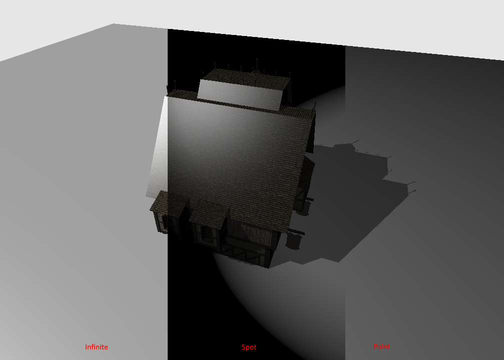
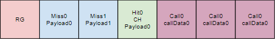

# Callable Shaders - Tutorial

<small>Author: [Martin-Karl Lefrançois](https://devblogs.nvidia.com/author/mlefrancois/)</small>

## Tutorial ([Setup](../docs/setup.md))

This is an extension of the Vulkan ray tracing [tutorial](https://nvpro-samples.github.io/vk_raytracing_tutorial_KHR/vkrt_tutorial.md.html).

Ray tracing allow to use [callable shaders](https://www.khronos.org/registry/vulkan/specs/1.1-extensions/html/chap8.html#shaders-callable)
in ray-generation, closest-hit, miss or another callable shader stage. 
It is similar to an indirect function call, whitout having to link those shaders with the executable program. 

(insert setup.md.html here)

## Data Storage

Data can only access data passed in to the callable from parent stage. There will be only one structure pass at a time and should be declared like for payload.

In the parent stage, using the `callableDataEXT` storage qualifier, it could be declared like:

~~~~ C++
layout(location = 0) callableDataEXT rayLight cLight;
~~~~

where `rayLight` struct is defined in a shared file.

~~~~ C++
struct rayLight
{
  vec3  inHitPosition;
  float outLightDistance;
  vec3  outLightDir;
  float outIntensity;
};
~~~~

And in the incoming callable shader, you must use the `callableDataInEXT` storage qualifier.

~~~~ C++
layout(location = 0) callableDataInEXT rayLight cLight;
~~~~

## Execution

To execute one of the callable shader, the parent stage need to call `executeCallableEXT`.

The first parameter is the SBT record index, the second one correspond to the 'location' index.

Example of how it is called.

~~~~ C++
executeCallableEXT(pushC.lightType, 0);
~~~~

## Adding Callable Shaders to the SBT

### Create Shader Modules

In `HelloVulkan::createRtPipeline()`, immediately after adding the closest-hit shader, we will add
3 callable shaders, for each type of light. 

First create the shader modules
~~~~ C++
  enum StageIndices
  {
    eRaygen,
    eMiss,
    eMiss2,
    eClosestHit,
    eCall0,
    eCall1,
    eCall2,
    eShaderGroupCount
  };

  ...
  // Call0
  stage.module = nvvk::createShaderModule(m_device, nvh::loadFile("spv/light_point.rcall.spv", true, defaultSearchPaths, true));
  stage.stage    = VK_SHADER_STAGE_CALLABLE_BIT_KHR;
  stages[eCall0] = stage;
  // Call1
  stage.module = nvvk::createShaderModule(m_device, nvh::loadFile("spv/light_spot.rcall.spv", true, defaultSearchPaths, true));
  stage.stage    = VK_SHADER_STAGE_CALLABLE_BIT_KHR;
  stages[eCall1] = stage;
  // Call2
  stage.module = nvvk::createShaderModule(m_device, nvh::loadFile("spv/light_inf.rcall.spv", true, defaultSearchPaths, true));
  stage.stage    = VK_SHADER_STAGE_CALLABLE_BIT_KHR;
  stages[eCall2] = stage;
~~~~ 

Then 3 groups of callable shaders and the stages that goes with it.

~~~~ C++
  // Callable shaders
  group.type             = VK_RAY_TRACING_SHADER_GROUP_TYPE_GENERAL_KHR;
  group.closestHitShader = VK_SHADER_UNUSED_KHR;
  group.generalShader    = eCall0;
  m_rtShaderGroups.push_back(group);
  group.generalShader = eCall1;
  m_rtShaderGroups.push_back(group);
  group.generalShader = eCall2;
  m_rtShaderGroups.push_back(group);
~~~~

#### Shaders 

Here are the source of all shaders

* [light_point.rcall](shaders/light_point.rcall)
* [light_spot.rcall](shaders/light_spot.rcall)
* [light_inf.rcall](shaders/light_inf.rcall)

### Shading Binding Table

In this example, we will use the `nvvk::SBTWrapper`. It is using the information to create the ray tracing pipeline, to 
create the buffers for the shading binding table. 

In the `hello_vulkan.h` header, include the wrapper and add a new member.

~~~~C 
#include "nvvk/sbtwrapper_vk.hpp"
...
nvvk::SBTWrapper m_sbtWrapper;
~~~~

In `HelloVulkan::initRayTracing()`, initialize it the following way.

~~~~C 
m_sbtWrapper.setup(m_device, m_graphicsQueueIndex, &m_alloc, m_rtProperties);
~~~~ 

In `HelloVulkan::createRtPipeline()`, immediately after creating the pipeline call to `vkCreateRayTracingPipelinesKHR()`, 
create the SBT with the following command.

~~~~C
  m_sbtWrapper.create(m_rtPipeline, rayPipelineInfo);
~~~~ 

In `HelloVulkan::raytrace()`, we have to tell where the callable shader starts. Since they were added after the hit shader, we have in the SBT the following.

The SBT wrapper class give back the information we need. So instead of computing the various offsets, we can get directly the 
`VkStridedDeviceAddressRegionKHR` for each group type. 

~~~~ C++
  auto& regions = m_sbtWrapper.getRegions();
  vkCmdTraceRaysKHR(cmdBuf, &regions[0], &regions[1], &regions[2], &regions[3], m_size.width, m_size.height, 1);
~~~~

## Calling the Callable Shaders

In the closest-hit shader, instead of having a if-else case, we can now call directly the right shader base on the type of light.

~~~~ C++
cLight.inHitPosition = worldPos;
//#define DONT_USE_CALLABLE
#if defined(DONT_USE_CALLABLE)
  // Point light
  if(pushC.lightType == 0)
  {
    vec3  lDir              = pushC.lightPosition - cLight.inHitPosition;
    float lightDistance     = length(lDir);
    cLight.outIntensity     = pushC.lightIntensity / (lightDistance * lightDistance);
    cLight.outLightDir      = normalize(lDir);
    cLight.outLightDistance = lightDistance;
  }
  else if(pushC.lightType == 1)
  {
    vec3 lDir               = pushC.lightPosition - cLight.inHitPosition;
    cLight.outLightDistance = length(lDir);
    cLight.outIntensity =
        pushC.lightIntensity / (cLight.outLightDistance * cLight.outLightDistance);
    cLight.outLightDir  = normalize(lDir);
    float theta         = dot(cLight.outLightDir, normalize(-pushC.lightDirection));
    float epsilon       = pushC.lightSpotCutoff - pushC.lightSpotOuterCutoff;
    float spotIntensity = clamp((theta - pushC.lightSpotOuterCutoff) / epsilon, 0.0, 1.0);
    cLight.outIntensity *= spotIntensity;
  }
  else  // Directional light
  {
    cLight.outLightDir      = normalize(-pushC.lightDirection);
    cLight.outIntensity     = 1.0;
    cLight.outLightDistance = 10000000;
  }
#else
  executeCallableEXT(pushC.lightType, 0);
#endif
~~~~
