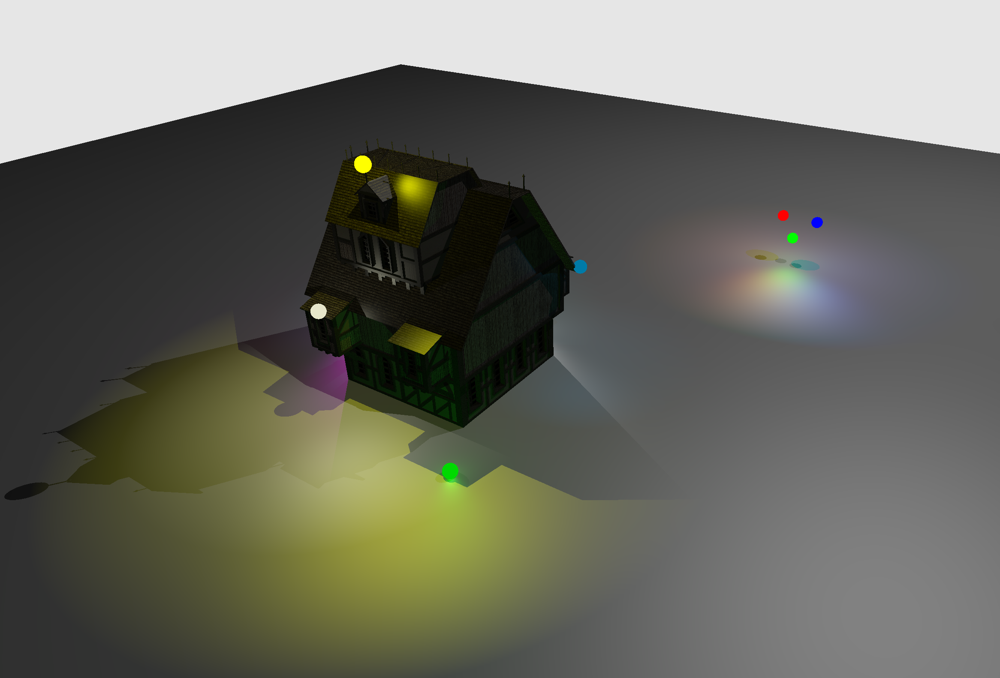

# NVIDIA Vulkan Trace Rays Indirect Tutorial
This is an extension of the [Vulkan ray tracing tutorial](https://nvpro-samples.github.io/vk_raytracing_tutorial_KHR/vkrt_tutorial.md.html).

We will discuss the `vkCmdTraceRaysIndirectKHR` command, which allows the
`width`, `height`, and `depth` of a trace ray command to be specifed by a
buffer on the device, rather than directly by the host. As a demonstration,
this example will add colorful lanterns to the scene that add their own light
and shadows, with a finite radius of effect. A compute shader will calculate
scissor rectangles for each lantern, and an indirect trace rays command will
dispatch rays for lanterns only within those scissor rectangles.

[<h1>LINK TO FULL TUTORIAL</h1>](https://nvpro-samples.github.io/vk_raytracing_tutorial_KHR/vkrt_tuto_indirect_scissor.md.html)

