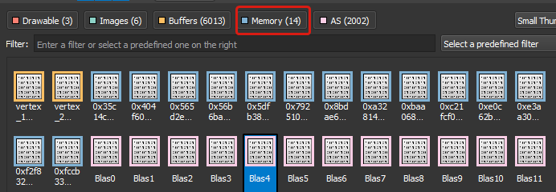

# NVIDIA Vulkan Ray Tracing Tutorial

## Tutorial ([Setup](../docs/setup.md))

This is an extension of the Vulkan ray tracing [tutorial](https://nvpro-samples.github.io/vk_raytracing_tutorial_KHR/vkrt_tutorial.md.html).

Ray tracing can easily handle having many object instances at once. For instance, a top level acceleration structure can
have many different instances of a bottom level acceleration structure. However, when we have many different objects, we
can run into problems with memory allocation. Many Vulkan implementations support no more than 4096 allocations, while
our current application creates 4 allocations per object (Vertex, Index, and Material), then one for the BLAS. That
means we are hitting the limit with just above 1000 objects.

(insert setup.md.html here)

## Many Instances

First, let's look how the scene would look like when we have just a few objects, with many instances.

In `main.cpp`, add the following includes:

~~~~ C++
#include <random>
~~~~

Then replace the calls to `helloVk.loadModel` in `main()` by following, which will create instances of cube and cube_multi.

~~~~ C++
  // Creation of the example
  helloVk.loadModel(nvh::findFile("media/scenes/cube.obj", defaultSearchPaths, true));
  helloVk.loadModel(nvh::findFile("media/scenes/cube_multi.obj", defaultSearchPaths, true));
  helloVk.loadModel(nvh::findFile("media/scenes/plane.obj", defaultSearchPaths, true));

  std::random_device              rd;  // Will be used to obtain a seed for the random number engine
  std::mt19937                    gen(rd());  // Standard mersenne_twister_engine seeded with rd()
  std::normal_distribution<float> dis(1.0f, 1.0f);
  std::normal_distribution<float> disn(0.05f, 0.05f);

  for(uint32_t n = 0; n < 2000; ++n)
  {
    float         scale = fabsf(disn(gen));
    glm::mat4 mat =
        glm::translate(glm::mat4(1),glm::vec3{dis(gen), 2.0f + dis(gen), dis(gen)});
    mat              = mat * glm::rotation_mat4_x(dis(gen));
    mat              = mat * glm::scale(glm::mat4(1.f),glm::vec3(scale));
    helloVk.m_instances.push_back({mat, n % 2});
  }
~~~~

 **Note:**
    This will create 3 models (OBJ) and their instances, and then add 2000 instances 
    distributed between green cubes and cubes with one color per face.

## Many Objects

Instead of creating many instances, create many objects.

Remove the previous code and replace it with the following

~~~~ C++
  // Creation of the example
  std::random_device              rd;  //Will be used to obtain a seed for the random number engine
  std::mt19937                    gen(rd());  //Standard mersenne_twister_engine seeded with rd()
  std::normal_distribution<float> dis(1.0f, 1.0f);
  std::normal_distribution<float> disn(0.05f, 0.05f);
  for(int n = 0; n < 2000; ++n)
  {
    float         scale = fabsf(disn(gen));
    glm::mat4 mat   = glm::translate(glm::mat4(1),glm::vec3{dis(gen), 2.0f + dis(gen), dis(gen)});
    mat                 = mat * glm::rotation_mat4_x(dis(gen));
    mat                 = mat * glm::scale(glm::mat4(1.f),glm::vec3(scale));

    helloVk.loadModel(nvh::findFile("media/scenes/cube_multi.obj", defaultSearchPaths, true), mat);
  }

  helloVk.loadModel(nvh::findFile("media/scenes/plane.obj", defaultSearchPaths, true));
~~~~

The example might still work, but the console will print the following error after loading 1363 objects. All other objects allocated after the 1363rd will fail to be displayed.

Error | Error: VUID_Undefined Number of currently valid memory objects is not less than the maximum allowed (4096).
-|-
Note |   This is the best case; the application can run out of memory and crash if substantially more objects are created (e.g. 20,000)

## Device Memory Allocator (DMA)

It is possible to use a memory allocator to fix this issue.

### `hello_vulkan.h`

In `hello_vulkan.h`, add the following defines at the top of the file to indicate which allocator to use

~~~~ C++
// #VKRay
// Choosing the allocator to use
#define ALLOC_DMA
//#define ALLOC_DEDICATED
//#define ALLOC_VMA
~~~~

Replace the definition of buffers and textures and include the right allocator.

~~~~ C++
#if defined(ALLOC_DMA)
#include <nvvk/memallocator_dma_vk.hpp>
using Allocator = nvvk::ResourceAllocatorDma;
#elif defined(ALLOC_VMA)
#include <nvvk/memallocator_vma_vk.hpp>
using Allocator = nvvk::ResourceAllocatorVma;
#else
using Allocator = nvvk::ResourceAllocatorDedicated;
#endif
~~~~

And replace the  `ResourceAllocatorDedicatednvvk::` by the generic allocator type

~~~~ C++
Allocator m_alloc;
~~~~

### `hello_vulkan.cpp`

In the source file there is nothing to change, as all allocators are using 
the same API.

## Result

Instead of thousands of allocations, our example will have only 14 allocations. Note that some of these allocations are allocated by Dear ImGui, and not by DMA. These are the 14 objects with blue borders below:

Finally, here is the Vulkan Device Memory view from Nsight Graphics:

## VMA: Vulkan Memory Allocator

We can also use the  [Vulkan Memory Allocator](https://github.com/GPUOpen-LibrariesAndSDKs/VulkanMemoryAllocator)(VMA) from AMD.

VMA is a submodule under `nvpro_core/third_party` folder.

VMA is using dedicated memory, so you need to add the following extension to the 
creation of the context in `main.cpp`.

~~~~ C++
  contextInfo.addDeviceExtension(VK_KHR_BIND_MEMORY_2_EXTENSION_NAME);
~~~~  

### hello_vulkan.h

Enable the VMA define 

~~~~ C++
#define ALLOC_VMA
~~~~ 

### hello_vulkan.cpp

VMA requires the implementation of the functions and the following should only be defined once in the entire program, and it should be defined before `#include "hello_vulkan.h"`:

~~~~ C++
#define VMA_IMPLEMENTATION
~~~~

To see if you are using the VMA allocator, put a break point in `VMAMemoryAllocator::allocMemory()`.