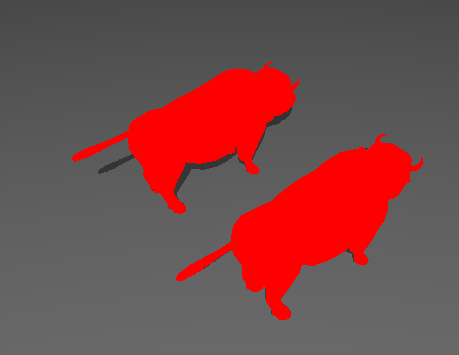
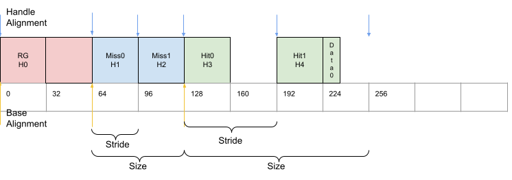
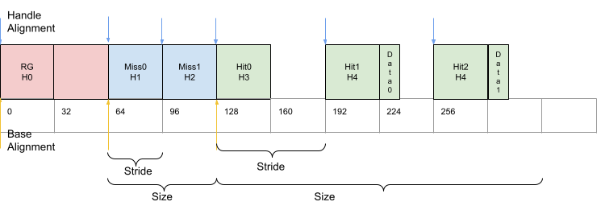

# Multiple Closest Hit Shaders - Tutorial


## Tutorial ([Setup](../docs/setup.md))

This is an extension of the Vulkan ray tracing [tutorial](https://nvpro-samples.github.io/vk_raytracing_tutorial_KHR/vkrt_tutorial.md.html).

The ray tracing tutorial only uses one closest hit shader, but it is also possible to have multiple closest hit shaders.
For example, this could be used to give different models different shaders, or to use a less complex shader when tracing
reflections.

## Setting up the Scene

For this example, we will load the `wuson` model and create another translated instance of it.

Then you can change the `helloVk.loadModel` calls to the following:

~~~~ C++
  // Creation of the example
  helloVk.loadModel(nvh::findFile("media/scenes/wuson.obj", defaultSearchPaths, true),
                    glm::translate(glm::mat4(1),glm::vec3(-1, 0, 0)));

  helloVk.m_instances.push_back({glm::translate(glm::mat4(1),glm::vec3(1, 0, 0)), 0}); // Adding an instance of the Wuson

  helloVk.loadModel(nvh::findFile("media/scenes/plane.obj", defaultSearchPaths, true));
~~~~

## Adding a new Closest Hit Shader

We will need to create a new closest hit shader (CHIT), to add it to the raytracing pipeline, and to indicate which instance will use this shader.

### `raytrace2.rchit`

We can make a very simple shader to differentiate this closest hit shader from the other one.
As an example, create a new file called `raytrace2.rchit`, and add it to Visual Studio's `shaders` filter with the other shaders.

~~~~ C++
#version 460
#extension GL_EXT_ray_tracing : require
#extension GL_GOOGLE_include_directive : enable

#include "raycommon.glsl"

layout(location = 0) rayPayloadInEXT hitPayload prd;

void main()
{
  prd.hitValue = vec3(1,0,0);
}
~~~~

### `createRtPipeline`

This new shader needs to be added to the raytracing pipeline. So, in `createRtPipeline` in `hello_vulkan.cpp`, load the new closest hit shader immediately after loading the first one.

~~~~ C++
  enum StageIndices
  {
    eRaygen,
    eMiss,
    eMiss2,
    eClosestHit,
    eClosestHit2,
    eShaderGroupCount
  };

  // ...

  stage.module = nvvk::createShaderModule(m_device, nvh::loadFile("spv/raytrace2.rchit.spv", true, defaultSearchPaths, true));
  stage.stage         = VK_SHADER_STAGE_CLOSEST_HIT_BIT_KHR;
  stages[eClosestHit2] = stage;
~~~~

Then add a new hit group group immediately after adding the first hit group:

~~~~ C++
  // Hit 2
  group.type             = VK_RAY_TRACING_SHADER_GROUP_TYPE_TRIANGLES_HIT_GROUP_KHR;
  group.generalShader    = VK_SHADER_UNUSED_KHR;
  group.closestHitShader = eClosestHit2;
  m_rtShaderGroups.push_back(group);
~~~~

### `raytrace.rgen`

As a test, you can try changing the `sbtRecordOffset` parameter of the `traceRayEXT` call in `raytrace.rgen`.
If you set the offset to `1`, then all ray hits will use the new CHIT, and the raytraced output should look like the image below:


**:warning:** After testing this out, make sure to revert this change in `raytrace.rgen` before continuing.

### `hello_vulkan.h`

In the `ObjInstance` structure, we will add a new member `hitgroup` variable that specifies which hit shader the instance will use:

~~~~ C++
  struct ObjInstance
  {
    glm::mat4 transform;    // Matrix of the instance
    uint32_t      objIndex{0};  // Model index reference
    int           hitgroup{0};  // Hit group of the instance
  };
~~~~

### `hello_vulkan.cpp`

Finally, we need to tell the top-level acceleration structure which hit group to use for each instance. In `createTopLevelAS()`
in `hello_vulkan.cpp`, we will offset the record of the shading binding table (SBT) with the hit group.

~~~~ C++
rayInst.instanceShaderBindingTableRecordOffset = inst.hitgroup;  // Using the hit group set in main
~~~~

### Choosing the Hit shader

Back in `main.cpp`, after loading the scene's models, we can now have both `wuson` models use the new CHIT by adding the following:

~~~~ C++
  helloVk.m_instances[0].hitgroup = 1;
  helloVk.m_instances[1].hitgroup = 1;
~~~~



## Shader Record Data `shaderRecordKHR`

When creating the [Shader Binding Table](https://www.khronos.org/registry/vulkan/specs/1.1-extensions/html/chap33.html#shader-binding-table), see previous, each entry in the table consists of a handle referring to the shader that it invokes. We have packed all data to the size of `shaderGroupHandleSize`, but each entry could be made larger, to store data that can later be referenced by a `shaderRecordKHR` block in the shader.

This information can be used to pass extra information to a shader, for each entry in the SBT.

 **:warning: Note:**
    Since each entry in an SBT group must have the same size, each entry of the group has to have enough space to accommodate the largest element in the entire group.

The following diagram represents our current SBT, with some data added to `HitGroup1`. As mentioned in the **note**, even though `HitGroup0` has no shader record data, it still needs to be the same size as `HitGroup1`, the largest of the hit group and aligned to the Handle alignment.




## `hello_vulkan.h`

In the HelloVulkan class, we will add a structure to hold the hit group data.

~~~~ C++
  struct HitRecordBuffer
  {
    glm::vec4 color;
  };
  std::vector<HitRecordBuffer> m_hitShaderRecord;
~~~~

### `raytrace2.rchit`

In the closest hit shader, we can retrieve the shader record using the `layout(shaderRecordEXT)` descriptor

~~~~ C++
layout(shaderRecordEXT) buffer sr_ { vec4 shaderRec; };
~~~~

and use this information to return the color:

~~~~ C++
void main()
{
  prd.hitValue = shaderRec.rgb;
}
~~~~

 **:warning: Note:**
    Adding a new shader requires to rerun CMake to added to the project compilation system.

### `main.cpp`

In `main`, after we set which hit group an instance will use, we can add the data we want to set through the shader record.

~~~~ C++
  helloVk.m_hitShaderRecord.resize(1);
  helloVk.m_hitShaderRecord[0].color = glm::vec4(1, 1, 0, 0);  // Yellow
~~~~

### `HelloVulkan::createRtShaderBindingTable`

**:star:NEW:star:**

The creation of the shading binding table as it was done, was using hardcoded offsets and potentially could lead to errors.
Instead, the new code uses the `nvvk::SBTWraper` that uses the ray tracing pipeline and the `VkRayTracingPipelineCreateInfoKHR` to
create the SBT information.

The wrapper will find the handles for each group and will add the
data `m_hitShaderRecord` to the Hit group.  

```` C
  // Find handle indices and add data
  m_sbtWrapper.addIndices(rayPipelineInfo);
  m_sbtWrapper.addData(SBTWrapper::eHit, 1, m_hitShaderRecord[0]);
  m_sbtWrapper.create(m_rtPipeline);
````

The wrapper will make sure the stride covers the largest data and is aligned
based on the GPU properties.

**OLD - for reference**

~~Since we are no longer compacting all handles in a continuous buffer, we need to fill the SBT as described above.~~

~~~~ C++
  m_hitRegion.stride  = nvh::align_up(handleSize + sizeof(HitRecordBuffer), m_rtProperties.shaderGroupHandleAlignment);
~~~~

~~Then write the new SBT like this, where only Hit 1 has extra data.~~

~~~~ C++
  // Hit
  pData = pSBTBuffer + m_rgenRegion.size + m_missRegion.size;
  memcpy(pData, getHandle(handleIdx++), handleSize);

  // hit 1
  pData = pSBTBuffer + m_rgenRegion.size + m_missRegion.size + m_hitRegion.stride;
  memcpy(pData, getHandle(handleIdx++), handleSize);
  pData += handleSize;
  memcpy(pData, &m_hitShaderRecord[0], sizeof(HitRecordBuffer));  // Hit 1 data
~~~~

## Ray Trace

The result should now show both `wuson` models with a yellow color.~~


## Extending Hit

The SBT can be larger than the number of shading models, which could then be used to have one shader per instance with its own data. For some applications, instead of retrieving the material information as in the main tutorial using a storage buffer and indexing into it using the `gl_InstanceCustomIndexEXT`, it is possible to set all of the material information in the SBT.

The following modification will add another entry to the SBT with a different color per instance. The new SBT hit group (2) will use the same CHIT handle (4) as hit group 1.




### `main.cpp`

In the description of the scene in `main`, we will tell the `wuson` models to use hit groups 1 and 2 respectively, and to have different colors.

~~~~ C++
  // Hit shader record info
  helloVk.m_hitShaderRecord.resize(2);
  helloVk.m_hitShaderRecord[0].color = glm::vec4(0, 1, 0, 0);  // Green
  helloVk.m_hitShaderRecord[1].color = glm::vec4(0, 1, 1, 0);  // Cyan
  helloVk.m_instances[0].hitgroup    = 1;                          // wuson 0
  helloVk.m_instances[1].hitgroup    = 2;                          // wuson 1
~~~~

### `createRtShaderBindingTable`

**:star:NEW:star:** 

If you are using the SBT wrapper, make sure to add the data to the third Hit (2).

~~~~ C
  // Find handle indices and add data
  m_sbtWrapper.addIndices(rayPipelineInfo);
  m_sbtWrapper.addData(nvvk::SBTWrapper::eHit, 1, m_hitShaderRecord[0]);
  m_sbtWrapper.addData(nvvk::SBTWrapper::eHit, 2, m_hitShaderRecord[1]);
  m_sbtWrapper.create(m_rtPipeline);
~~~~

**OLD**

~~~~ C++
  // hit 2
  pData = pSBTBuffer + m_rgenRegion.size + m_missRegion.size + (2 * m_hitRegion.stride);
  memcpy(pData, getHandle(handleIdx++), handleSize);
  pData += handleSize;
  memcpy(pData, &m_hitShaderRecord[1], sizeof(HitRecordBuffer));  // Hit 2 data
~~~~

~~**Note:**
    Adding entries like this can be error-prone and inconvenient for decent
    scene sizes. Instead, it is recommended to wrap the storage of handles, data,
    and size per group in a SBT utility to handle this automatically.~~
