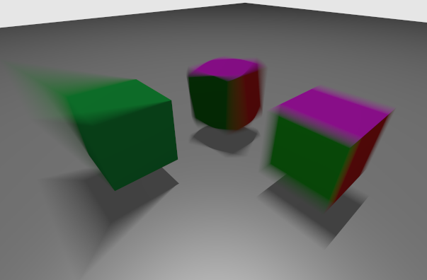
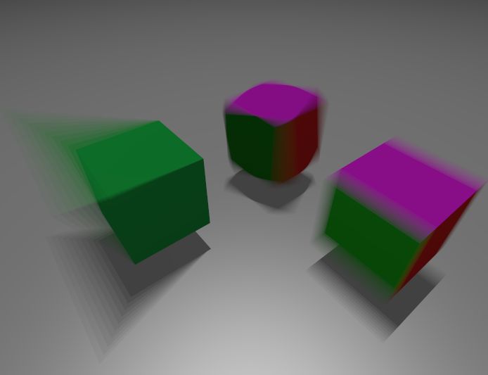

# Motion Blur



This is an extension of the Vulkan ray tracing [tutorial](https://nvpro-samples.github.io/vk_raytracing_tutorial_KHR/vkrt_tutorial.md.html).

If you haven't compiled it before, here is the [setup](../docs/setup.md).

## Beta Feature

:warning: This feature is in beta and the following are needed:

* Vulkan Beta Driver: [472.02](https://developer.nvidia.com/vulkan-driver)
* Vulkan SDK: [1.2.189.0](https://vulkan.lunarg.com/sdk/home)

:warning: This new feature is not fully supported by the validation layer and produces (harmless) error messages.

## VK_NV_ray_tracing_motion_blur

This sample shows the usage of the [motion blur extension](https://www.khronos.org/registry/vulkan/specs/1.2-extensions/man/html/VK_NV_ray_tracing_motion_blur.html).

The following changes were made to the [original sample](../ray_tracing__simple):

* Use trace call with a time parameter.
* Using the various flags to enable motion support in an acceleration structure.
* Support for time-varying vertex positions in a geometry.
* Add motion over time to instances, including scaling, shearing, rotation, and translation (SRT) and matrix motion, while keeping some static.

The definition of an animation consists in defining the state of the scene at a start time, T0, and at an end time, T1. For example, T0 can be the beginning of a frame and T1 the end of a frame, then rays can be drawn at any intermediate time, for example at t=0.5, in the middle of the frame, and motion blur can be achieved through sampling, using a random t for each ray.

## Enabling Motion Blur

### Extensions

In main.cpp, we add the device extension `VK_NV_ray_tracing_motion_blur` and enable all features.

```` C
  // #NV_Motion_blur
  VkPhysicalDeviceRayTracingMotionBlurFeaturesNV rtMotionBlurFeatures{VK_STRUCTURE_TYPE_PHYSICAL_DEVICE_RAY_TRACING_MOTION_BLUR_FEATURES_NV};
  contextInfo.addDeviceExtension(VK_NV_RAY_TRACING_MOTION_BLUR_EXTENSION_NAME, false, &rtMotionBlurFeatures);  // Required for motion blur
````

### Pipeline

When creating the ray tracing pipeline, the `flag` member of `VkRayTracingPipelineCreateInfoKHR` must include `VK_PIPELINE_CREATE_RAY_TRACING_ALLOW_MOTION_BIT_NV`.

```` C
  rayPipelineInfo.flags = VK_PIPELINE_CREATE_RAY_TRACING_ALLOW_MOTION_BIT_NV;
````  

### Scene Objects

We will use the following four models. The later sections will add matrix animation to two instances of the cube_multi.obj model,
and the plane.obj model will remain static. The third and fourth models are the keyframes for a vertex animation. The cube.obj file represents the
cube at time 0 (T0), and cube_modif.obj is the cube at time 1 (T1).

```` C
  // Creation of the example
  helloVk.loadModel(nvh::findFile("media/scenes/cube_multi.obj", defaultSearchPaths, true));
  helloVk.loadModel(nvh::findFile("media/scenes/plane.obj", defaultSearchPaths, true));
  helloVk.loadModel(nvh::findFile("media/scenes/cube.obj", defaultSearchPaths, true));
  helloVk.loadModel(nvh::findFile("media/scenes/cube_modif.obj", defaultSearchPaths, true));
````

## Vertex Varying Motion

As shown in the image, the positions of the vertices of the left green cube change over time.
We specify this by giving two geometries to the BLAS builder. Setting the geometry at T0
is done the same way as before. To add the destination keyframe at T1, we make the
`VkAccelerationStructureGeometryTrianglesDataKHR` structure's `pNext` field point to a
`VkAccelerationStructureGeometryMotionTrianglesDataNV` structure. Additionally, we must add
`VK_BUILD_ACCELERATION_STRUCTURE_MOTION_BIT_NV` to the BLAS build info flags.

At first we are adding the cube_multi and plane. The geometry of cube_multi is not animated
by itself, but the transformation matrix of its instance is, so we will set its animation
in the TLAS in the Instance Motion section.

````C
void HelloVulkan::createBottomLevelAS()
{
  // Static geometries
  std::vector<nvvk::RaytracingBuilderKHR::BlasInput> allBlas;
  allBlas.emplace_back(objectToVkGeometryKHR(m_objModel[0]));
  allBlas.emplace_back(objectToVkGeometryKHR(m_objModel[1]));
````

We then add the cube along with its motion information, which contains a reference to the geometry at time T1 and the motion type flag. This flag indicates the vertices of the geometry are animated.

````C
  // Animated geometry
  allBlas.emplace_back(objectToVkGeometryKHR(m_objModel[2]));
  // Adding the m_objModel[3] as the destination of m_objModel[2]
  VkAccelerationStructureGeometryMotionTrianglesDataNV motionTriangles{
      VK_STRUCTURE_TYPE_ACCELERATION_STRUCTURE_GEOMETRY_MOTION_TRIANGLES_DATA_NV};
  motionTriangles.vertexData.deviceAddress = nvvk::getBufferDeviceAddress(m_device, m_objModel[3].vertexBuffer.buffer);
  allBlas[2].asGeometry[0].geometry.triangles.pNext = &motionTriangles;
  // Telling that this geometry has motion
  allBlas[2].flags = VK_BUILD_ACCELERATION_STRUCTURE_MOTION_BIT_NV;
````

Building all the BLAS remains the same.

````C

  m_rtBuilder.buildBlas(allBlas, VK_BUILD_ACCELERATION_STRUCTURE_PREFER_FAST_TRACE_BIT_KHR);
}
````

## Instance Motion

Instance motion describes motion in the TLAS, where objects move as a whole. There are 3 types:

* Static
* Matrix motion
* SRT motion

The instance array uses [`VkAccelerationStructureMotionInstanceNV`](https://www.khronos.org/registry/vulkan/specs/1.2-extensions/man/html/VkAccelerationStructureMotionInstanceNV.html) instead of `VkAccelerationStructureInstanceKHR`, but since we have a packed structure array, and the stride of the motion structure [must be 160 bytes](https://www.khronos.org/registry/vulkan/specs/1.2-extensions/man/html/VkAccelerationStructureGeometryInstancesDataKHR.html), we create a new structure and derive from `VkAccelerationStructureMotionInstanceNV` and add the missing 8 padding bytes.

```` C
  // VkAccelerationStructureMotionInstanceNV must have a stride of 160 bytes.
  // See https://www.khronos.org/registry/vulkan/specs/1.2-extensions/man/html/VkAccelerationStructureGeometryInstancesDataKHR.html
  struct VkAccelerationStructureMotionInstanceNVPad : VkAccelerationStructureMotionInstanceNV
  {
    uint64_t _pad{0};
  };
  static_assert((sizeof(VkAccelerationStructureMotionInstanceNVPad) == 160));
````  

All instances will be stored in the vector of `VkAccelerationStructureMotionInstanceNVPad`. The `ObjId` will be the index of the object this instance refers to.

````C
  uint32_t                                                objId;
  std::vector<VkAccelerationStructureMotionInstanceNVPad> tlas;
````

### Matrix Motion

The motion matrix must fill the structure [`VkAccelerationStructureMatrixMotionInstanceNV`](https://www.khronos.org/registry/vulkan/specs/1.2-extensions/man/html/VkAccelerationStructureMatrixMotionInstanceNV.html). We use the transformation matrix stored in the instance for *time 0* and we set the *time 1* with a translation of 0.3 on the X axis.

```` C
  // Cube (moving/matrix translation)
  objId = 0;
  {
    // Position of the instance at T0 and T1
    glm::mat4 matT0 = m_instances[0].transform;
    glm::mat4 matT1 = glm::translate(glm::mat4(1),glm::vec3(0.30f, 0.0f, 0.0f)) * matT0;

    VkAccelerationStructureMatrixMotionInstanceNV data;
    data.transformT0                            = nvvk::toTransformMatrixKHR(matT0);
    data.transformT1                            = nvvk::toTransformMatrixKHR(matT1);
    data.instanceCustomIndex                    = objId;  // gl_InstanceCustomIndexEXT
    data.accelerationStructureReference         = m_rtBuilder.getBlasDeviceAddress(m_instances[objId].objIndex);
    data.instanceShaderBindingTableRecordOffset = 0;  // We will use the same hit group for all objects
    data.flags                                  = VK_GEOMETRY_INSTANCE_TRIANGLE_FACING_CULL_DISABLE_BIT_KHR;
    data.mask                                   = 0xFF;
    VkAccelerationStructureMotionInstanceNVPad rayInst;
    rayInst.type                      = VK_ACCELERATION_STRUCTURE_MOTION_INSTANCE_TYPE_MATRIX_MOTION_NV;
    rayInst.data.matrixMotionInstance = data;
    tlas.emplace_back(rayInst);
  }
````

### SRT Motion

The SRT motion uses the structure [`VkAccelerationStructureSRTMotionInstanceNV`](https://www.khronos.org/registry/vulkan/specs/1.2-extensions/man/html/VkAccelerationStructureSRTMotionInstanceNV.html)
where it interpolates between two structures [`VkSRTDataNV`](https://www.khronos.org/registry/vulkan/specs/1.2-extensions/man/html/VkSRTDataNV.html). In this case, we start with the object translated to [2, 0, 0] and apply a rotation for *time 1*.

````C
// Cube (moving/SRT rotation)
  objId = 0;
  {
    glm::quatf rot;
    rot.from_euler_xyz({0, 0, 0});
    // Position of the instance at T0 and T1
    VkSRTDataNV matT0{};  // Translated to 0,0,2
    matT0.sx          = 1.0f;
    matT0.sy          = 1.0f;
    matT0.sz          = 1.0f;
    matT0.tz          = 2.0f;
    matT0.qx          = rot.x;
    matT0.qy          = rot.y;
    matT0.qz          = rot.z;
    matT0.qw          = rot.w;
    VkSRTDataNV matT1 = matT0;  // Setting a rotation
    rot.from_euler_xyz({glm::radians(10.0f), glm::radians(30.0f), 0.0f});
    matT1.qx = rot.x;
    matT1.qy = rot.y;
    matT1.qz = rot.z;
    matT1.qw = rot.w;

    VkAccelerationStructureSRTMotionInstanceNV data{};
    data.transformT0                            = matT0;
    data.transformT1                            = matT1;
    data.instanceCustomIndex                    = objId;  // gl_InstanceCustomIndexEXT
    data.accelerationStructureReference         = m_rtBuilder.getBlasDeviceAddress(m_objInstance[objId].objIndex);
    data.instanceShaderBindingTableRecordOffset = 0;  // We will use the same hit group for all objects
    data.flags                                  = VK_GEOMETRY_INSTANCE_TRIANGLE_FACING_CULL_DISABLE_BIT_KHR;
    data.mask                                   = 0xFF;
    VkAccelerationStructureMotionInstanceNVPad rayInst;
    rayInst.type                   = VK_ACCELERATION_STRUCTURE_MOTION_INSTANCE_TYPE_SRT_MOTION_NV;
    rayInst.data.srtMotionInstance = data;
    tlas.emplace_back(rayInst);
  }
````

### Static

Static instances use the same structure as we normally use with static scenes, `VkAccelerationStructureInstanceKHR`. Static objects are not moving, but they can be deformed, as it is with the cube.

First the plane is not moving at all

```` C
  // Plane (static)
  objId = 1;
  {
    glm::mat4 matT0 = m_instances[1].transform;

    VkAccelerationStructureInstanceKHR data{};
    data.transform                              = nvvk::toTransformMatrixKHR(matT0);  // Position of the instance
    data.instanceCustomIndex                    = objId;                              // gl_InstanceCustomIndexEXT
    data.accelerationStructureReference         = m_rtBuilder.getBlasDeviceAddress(m_instances[objId].objIndex);
    data.instanceShaderBindingTableRecordOffset = 0;  // We will use the same hit group for all objects
    data.flags                                  = VK_GEOMETRY_INSTANCE_TRIANGLE_FACING_CULL_DISABLE_BIT_KHR;
    data.mask                                   = 0xFF;
    VkAccelerationStructureMotionInstanceNVPad rayInst;
    rayInst.type                = VK_ACCELERATION_STRUCTURE_MOTION_INSTANCE_TYPE_STATIC_NV;
    rayInst.data.staticInstance = data;
    tlas.emplace_back(rayInst);
  }
  ````

Second the deformed cube is not moving, only its geometry. This was done when setting the BLAS.

```` C
  // Cube+Cubemodif (static)
  objId = 2;
  {
    glm::mat4 matT0 = m_instances[2].transform;

    VkAccelerationStructureInstanceKHR data{};
    data.transform                              = nvvk::toTransformMatrixKHR(matT0);  // Position of the instance
    data.instanceCustomIndex                    = objId;                              // gl_InstanceCustomIndexEXT
    data.accelerationStructureReference         = m_rtBuilder.getBlasDeviceAddress(m_instances[objId].objIndex);
    data.instanceShaderBindingTableRecordOffset = 0;  // We will use the same hit group for all objects
    data.flags                                  = VK_GEOMETRY_INSTANCE_TRIANGLE_FACING_CULL_DISABLE_BIT_KHR;
    data.mask                                   = 0xFF;
    VkAccelerationStructureMotionInstanceNVPad rayInst;
    rayInst.type                = VK_ACCELERATION_STRUCTURE_MOTION_INSTANCE_TYPE_STATIC_NV;
    rayInst.data.staticInstance = data;
    tlas.emplace_back(rayInst);
  }
````

### Building

  The building call for the TLAS is similar, only the flag for motion is changing to true.

  ````C
  m_rtBuilder.buildTlas(tlas, VK_BUILD_ACCELERATION_STRUCTURE_MOTION_BIT_NV, false, true);
  ````

## Shader

In the shader, we enable the `GL_NV_ray_tracing_motion_blur` extension.

```` C
#extension GL_NV_ray_tracing_motion_blur : require
````

Then we call `traceRayMotionNV` instead of `traceRayEXT`. The `time` argument must vary between 0 and 1 for each call.

````C
    traceRayMotionNV(topLevelAS,     // acceleration structure
                     rayFlags,       // rayFlags
                     0xFF,           // cullMask
                     0,              // sbtRecordOffset
                     0,              // sbtRecordStride
                     0,              // missIndex
                     origin.xyz,     // ray origin
                     tMin,           // ray min range
                     direction.xyz,  // ray direction
                     tMax,           // ray max range
                     time,           // time
                     0               // payload (location = 0)
    );
````

We have used some technique from the [jitter cam](../ray_tracing_jitter_cam) to sampling time randomly.
Using random time value for each pixel at each frame gives a nicer look when accumulated over time than using a single time per frame.

If we were using constant time instead, the image would have a [stuttered motion](https://en.wikipedia.org/wiki/Rotary_disc_shutter) look, like this:



:warning: Using motion blur pipeline with all instances static will be slower than using the static pipeline. The performance hit is minor, but optimized applications should use motion blur only where necessary.

:warning: Calling `traceRayEXT` from `raytrace.rchit` works, and we get motion-blurred shadows without having to call `traceRayMotionNV` in the closest-hit shader. This works only if `traceRayEXT` is called within the execution of a motion trace call.
