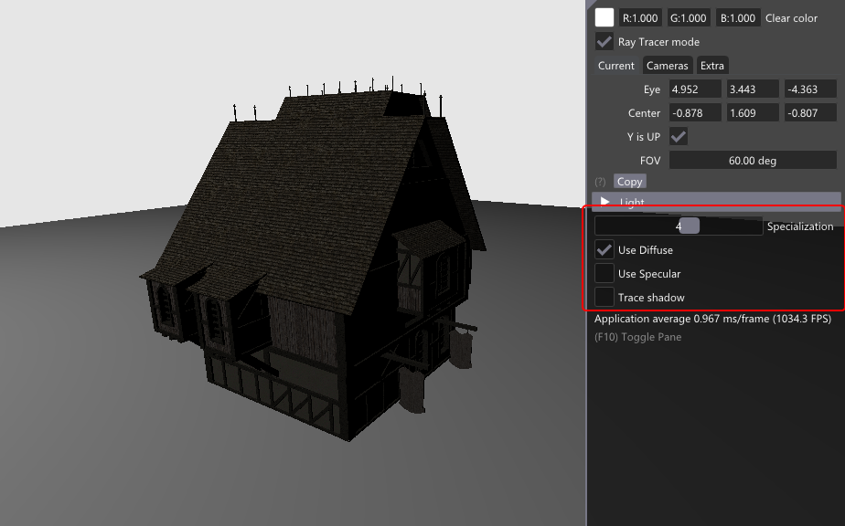

# Specialization Constants

In Vulkans, shaders are compiled to Spir-V, but the driver completes optimization during pipeline creation. 
Having specialization constants in a shader, is like having #defines that can be changed when pipeline creation is submitted. 

In this example, we will add three specialization constants with all possible permutations.

* USE_DIFFUSE: to add or not the diffuse contribution
* USE_SPECULAR: to add or not the specular  contribution
* TRACE_SHADOW: to trace or not a shadow ray

## Shader

In the closest hit shader (`raytrace.chit`), we will add the three constants. Note that we are using `int` only because the tiny helper class later is made for `int` values. 

~~~~ C
layout(constant_id = 0) const int USE_DIFFUSE = 1;
layout(constant_id = 1) const int USE_SPECULAR = 1;
layout(constant_id = 2) const int TRACE_SHADOW = 1;
~~~~

And later in the code, we branch based on the values. The modification of the shader will look like this.

~~~~ C
  // Diffuse
  vec3 diffuse = vec3(0);
  if(USE_DIFFUSE == 1)
  {
    diffuse = computeDiffuse(mat, L, normal);
    if(mat.textureId >= 0)
    {
      uint txtId    = mat.textureId + scnDesc.i[gl_InstanceCustomIndexEXT].txtOffset;
      vec2 texCoord = v0.texCoord * barycentrics.x + v1.texCoord * barycentrics.y
                      + v2.texCoord * barycentrics.z;
      diffuse *= texture(textureSamplers[nonuniformEXT(txtId)], texCoord).xyz;
    }
  }

  vec3  specular    = vec3(0);
  float attenuation = 1;

  // Tracing shadow ray only if the light is visible from the surface
  if(dot(normal, L) > 0)
  {
    if(TRACE_SHADOW == 1)
    {
      float tMin   = 0.001;
      float tMax   = lightDistance;
      vec3  origin = gl_WorldRayOriginEXT + gl_WorldRayDirectionEXT * gl_HitTEXT;
      vec3  rayDir = L;
      uint  flags  = gl_RayFlagsTerminateOnFirstHitEXT | gl_RayFlagsOpaqueEXT
                   | gl_RayFlagsSkipClosestHitShaderEXT;
      isShadowed = true;
      traceRayEXT(topLevelAS,  // acceleration structure
                  flags,       // rayFlags
                  0xFF,        // cullMask
                  0,           // sbtRecordOffset
                  0,           // sbtRecordStride
                  1,           // missIndex
                  origin,      // ray origin
                  tMin,        // ray min range
                  rayDir,      // ray direction
                  tMax,        // ray max range
                  1            // payload (location = 1)
      );
    }
    else
      isShadowed = false;

    if(isShadowed)
    {
      attenuation = 0.3;
    }
    else
    {
      // Specular
      if(USE_SPECULAR == 1)
      {
        specular = computeSpecular(mat, gl_WorldRayDirectionEXT, L, normal);
      }
    }
  }
  ~~~~

Running the example will not change anything, since by default it will do everything as it usually does.

## Pipeline

The specialization constants must be attached to their stages described by `VkPipelineShaderStageCreateInfo` structs.
See [specialization contants reference](https://www.khronos.org/registry/vulkan/specs/1.1-khr-extensions/html/chap10.html#pipelines-specialization-constants)

In our example, we will have only integers for constant data. There are various ways to do this, but here is the helper class we will be using to add as many constant IDs and values as we want. We will add specialization constants by calling this class's add function with a constant ID and a value, or with a vector of pairs of IDs and values.

~~~~ C
//////////////////////////////////////////////////////////////////////////
/// Helper to generate specialization info
class Specialization
{
public:
  void add(uint32_t constantID, int32_t value)
  {
    spec_values.push_back(value);
    vk::SpecializationMapEntry entry;
    entry.constantID = constantID;
    entry.size       = sizeof(int32_t);
    entry.offset     = static_cast<uint32_t>(spec_entries.size() * sizeof(int32_t));
    spec_entries.emplace_back(entry);
  }

  void add(const std::vector<std::pair<uint32_t, int32_t>>& const_values)
  {
    for(const auto& v : const_values)
      add(v.first, v.second);
  }

  vk::SpecializationInfo* getSpecialization()
  {
    spec_info.setData<int32_t>(spec_values);
    spec_info.setMapEntries(spec_entries);
    return &spec_info;
  }

private:
  std::vector<int32_t>                    spec_values;
  std::vector<vk::SpecializationMapEntry> spec_entries;
  vk::SpecializationInfo                  spec_info;
};
~~~~ 

In `HelloVulkan::createRtPipeline()`, 
first move the Closest Hit shader module creation up in the function next to the other one, as follow ... 

~~~~ C
vk::ShaderModule raygenSM = nvvk::createShaderModule(
      m_device, nvh::loadFile("spv/raytrace.rgen.spv", true, defaultSearchPaths, true));
  vk::ShaderModule missSM = nvvk::createShaderModule(
      m_device, nvh::loadFile("spv/raytrace.rmiss.spv", true, defaultSearchPaths, true));

  // The second miss shader is invoked when a shadow ray misses the geometry. It
  // simply indicates that no occlusion has been found
  vk::ShaderModule shadowmissSM = nvvk::createShaderModule(
      m_device, nvh::loadFile("spv/raytraceShadow.rmiss.spv", true, defaultSearchPaths, true));

  vk::ShaderModule chitSM = nvvk::createShaderModule(
      m_device, nvh::loadFile("spv/raytrace.rchit.spv", true, defaultSearchPaths, true));
~~~~ 

Thenjust after creating the shader modules, create a `Specialization` for each of the 8 on/off permutations of the 3 constants.

~~~~ C
  // Specialization
  std::vector<Specialization> specializations(8);
  for(int i = 0; i < 8; i++)
  {
    int a = ((i >> 2) % 2) == 1;
    int b = ((i >> 1) % 2) == 1;
    int c = ((i >> 0) % 2) == 1;
    specializations[i].add({{0, a}, {1, b}, {2, c}});
  }
~~~~ 

Then we will create as many HIT shader groups as we have specializations. This will give us the ability later to choose which 'specialization' we want to use.

~~~~ C
  // Hit Group - Closest Hit + AnyHit
  for(size_t i = 0; i < specializations.size(); i++)
  {
    vk::RayTracingShaderGroupCreateInfoKHR hg{vk::RayTracingShaderGroupTypeKHR::eTrianglesHitGroup,
                                              VK_SHADER_UNUSED_KHR, VK_SHADER_UNUSED_KHR,
                                              VK_SHADER_UNUSED_KHR, VK_SHADER_UNUSED_KHR};
    hg.setClosestHitShader(static_cast<uint32_t>(stages.size()));
    vk::PipelineShaderStageCreateInfo stage;
    stage.stage               = vk::ShaderStageFlagBits::eClosestHitKHR;
    stage.module              = chitSM;
    stage.pName               = "main";
    stage.pSpecializationInfo = specializations[i].getSpecialization();
    stages.push_back(stage);
    m_rtShaderGroups.push_back(hg);
  }
~~~~

**Note**, it is important that the data and structures are not created on the stack inside the loop,
because we are passing the data address and specialization information, so all this would become 
invalid when the pipeline is created.

# Using Specialization

If you would run the sample, nothing would have changed. This is because each TLAS's  `hitGroupId` is set to `0`.
A quick test would be to change the value to `4`, corresponding to only using diffuse. 

~~~~ C
rayInst.hitGroupId       = 4;  // We will use the same hit group for all objects
~~~~ 

Knowing the type of material each object is using, it would be possible to choose the appropriate
specialization for each object.

## Interactive Change

In our example, we will allow to choose globally the specialization for all objects. To do this, we will add 
a new entry to the push constants structure, for both `ObjPushConstant` and `RtPushConstant`.

At the end of both structures, add

~~~~ C
int           specialization{7}; // All in use
~~~~ 

In `raytrace.rgen`, we will use this new value to offset the hit group. Instead of always taking the hit group 0, it will
use the one we choose.

Add the `specialization` to the push constant layout.

~~~~ C
layout(push_constant) uniform Constants
{
  vec4  clearColor;
  vec3  lightPosition;
  float lightIntensity;
  int   lightType;
  int   specialization;
}
pushC;
~~~~ 

Then where we trace, we will use the specialization value to change the SBT offset.

~~~~ C
  traceRayEXT(topLevelAS,            // acceleration structure
              rayFlags,              // rayFlags
              0xFF,                  // cullMask
              pushC.specialization,  // sbtRecordOffset
              0,                     // sbtRecordStride
              0,                     // missIndex
              origin.xyz,            // ray origin
              tMin,                  // ray min range
              direction.xyz,         // ray direction
              tMax,                  // ray max range
              0                      // payload (location = 0)
  );
~~~~

Now we only need UI to change interactively the value.

In main.cpp `renderUI()`, add the following code.

~~~~ C
  // Specialization
  ImGui::SliderInt("Specialization", &helloVk.m_pushConstant.specialization, 0, 7);
  int s = helloVk.m_pushConstant.specialization;
  int a = ((s >> 2) % 2) == 1;
  int b = ((s >> 1) % 2) == 1;
  int c = ((s >> 0) % 2) == 1;
  ImGui::Checkbox("Use Diffuse", (bool*)&a);
  ImGui::Checkbox("Use Specular", (bool*)&b);
  ImGui::Checkbox("Trace shadow", (bool*)&c);
  helloVk.m_pushConstant.specialization = (a << 2) + (b << 1) + c;
~~~~ 

## References

* Pipelines [Specialization Constants](https://www.khronos.org/registry/vulkan/specs/1.1-khr-extensions/html/chap10.html#pipelines-specialization-constants)
* [VkSpecializationInfo](https://www.khronos.org/registry/vulkan/specs/1.2-extensions/man/html/VkSpecializationInfo.html)
* [VkSpecializationMapEntry](https://www.khronos.org/registry/vulkan/specs/1.2-extensions/man/html/VkSpecializationMapEntry.html)

