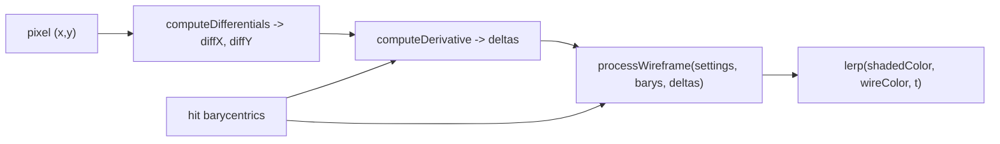

# 20 Wireframe - Tutorial


This tutorial draws an **anti-aliased wireframe directly inside a ray-tracing pipeline**, without a second render pass, a line-topology BLAS, or any extra geometry. It reuses the ray-differentials idea from [sample 19](../19_ray_differentials/README.md), but because the wireframe is only needed on **primary-ray hits**, the per-pixel differentials are reconstructed locally in the closest-hit shader instead of being carried in the payload — so `HitPayload` stays the same size as in `02_basic`.

**Learning objective:** see how `fwidth(barys)` — the screen-space barycentric derivatives a rasterizer gets for free — is reconstructed inside a ray tracer using `DispatchRaysIndex()`, `DispatchRaysDimensions()`, and the scene's inverse view/projection matrices. The reconstruction is encapsulated in two helpers, `computeDifferentials` and `computeDerivative`, that this sample inlines so you can read them next to the closest-hit shader.

## Key Changes from 02_basic.cpp

### 1. Shader Changes - Two RT helpers inlined locally

**New: `shaders/wireframe_helpers.h.slang`**

A tutorial-local copy of [`nvpro_core2/nvshaders/wireframe.h.slang`](../../../nvpro_core2/nvshaders/wireframe.h.slang). It contains the two RT-technique functions this sample is really about, plus the unchanged wireframe-styling helpers (`processWireframe`, `getLineWidth`, `edgePosition`, `stipple`, `edgeThickness`) — inlined for self-containment, not because anything needed to change.

- `computeDifferentials(pixelPos, imageSize, viewInv, projInv) -> (diffX, diffY)` — given a pixel coordinate and the scene's inverse matrices, returns two world-space direction vectors that point from the camera toward the centres of the right and bottom neighbouring pixels. The ray-tracing equivalent of a rasterizer's 2x2 quad neighbourhood, available in **any** closest-hit invocation.
- `computeDerivative(worldToObject, worldRayOrigin, objectRayOrigin, triVerts, diffX, diffY, hitBary) -> deltas` — the RT analogue of `fwidth(barys)`. Re-intersects the same triangle in object space with each differential ray and returns `abs(baryX - hitBary) + abs(baryY - hitBary)` — the per-axis barycentric spread across one screen pixel.

### 2. Shader Changes - Closest-hit reconstructs deltas locally

**Modified: `shaders/rtwireframe.slang` (`rchitMain`)**

The payload is unchanged from `02_basic` (`color` + `depth`). All the new work happens in the closest-hit shader: reconstruct the per-pixel differentials, project them onto the hit triangle, ask the wireframe processor for edge coverage, and blend.

```hlsl
// 1. Per-pixel ray differentials, recomputed locally - no payload growth.
float3 diffX, diffY;
computeDifferentials(DispatchRaysIndex().xy, DispatchRaysDimensions().xy,
                     sceneInfo.viewInvMatrix, sceneInfo.projInvMatrix,
                     diffX, diffY);

// 2. Barycentric "fwidth" at the hit.
float3 triVerts[3] = { pos0, pos1, pos2 };
float3 deltas      = computeDerivative(WorldToObject4x3(),
                                       WorldRayOrigin(), ObjectRayOrigin(),
                                       triVerts, diffX, diffY, barycentrics);

// 3. Edge coverage in [0..1], then blend against the shaded surface colour.
float t       = processWireframe(unpackWireframeSettings(pushConst.wf), barycentrics, deltas);
payload.color = lerp(shadedColor, pushConst.wireframeColor, t);
```

`deltas` is the only new quantity here. Everything else is the same pattern as `02_basic` — fetch triangle attributes, shade, write to the payload.

### 3. Data Structure Changes - Wireframe push-constant fields

**Modified: `shaders/shaderio.h`**

Two new fields on the push constant: a wireframe colour and a mirror of `WireframeSettings` with `bool` packed as `int`. The mirror is needed because Slang's `bool` cannot be portably round-tripped through a push constant from C++ (see *Technical Details*). The shader-side helper `unpackWireframeSettings` converts the mirror back into the library's `bool`-using struct.

```cpp
// shaderio.h - only the new fields shown.
struct TutoPushConstant
{
  // ... base-class managed fields ...
  float3              wireframeColor;
  WireframeSettingsIO wf;        // mirror of WireframeSettings, bool -> int
};
```

### 4. C++ Application Changes - Triangle-dense scene

**Modified: `20_wireframe.cpp` (`createScene`)**

Wireframe rendering only looks interesting on a model with lots of small triangles, so the sample loads `plane.gltf` (floor) and `teapot.gltf` (the subject) into the same TLAS. All texture, mip-chain, and custom-sampler plumbing from sample 19 is gone — none of it is needed for a wireframe overlay.

### 5. UI Changes - Preset selector + manual overrides

**Modified: `20_wireframe.cpp` (`onUIRender`)**

A combo box selects from a preset table (`kWireframePresets`) that mirrors `WIREFRAME_PRESETS` from `wireframe.h.slang`. Individual sliders below the combo allow live tuning of `thickness`, `smoothing`, `thicknessVar`, and the `stipple` parameters. The background colour is reused from `sceneInfo.backgroundColor`, which the base-class lighting panel already exposes.

## How It Works

### From per-pixel differentials to barycentric deltas

In a rasterizer, the wireframe machinery gets `ddx(barys)` and `ddy(barys)` for free from the 2x2 quad. A ray tracer has no neighbourhood, so the equivalent information has to be reconstructed:

1. **`computeDifferentials`** — given a pixel position, the viewport size, and the inverse view/projection matrices, build two world-space direction vectors pointing from the camera to the centres of the neighbouring pixels along screen X and Y. These are the ray-tracing analogue of the 2x2 quad's neighbours.
2. **`computeDerivative`** — push those two directions through the same intersection that produced the current hit (in object space, since the triangle is already there) and take the absolute difference of the resulting barycentrics against the actual hit's barycentrics. The output is a 3-vector of per-axis barycentric spread — the analogue of `fwidth(barys)`.



### The wireframe processor

`processWireframe` is a thin wrapper around a `smoothstep` against `deltas`. Conceptually:

```text
edgeProximity = min(barys.x, barys.y, barys.z)              // 0 on edge, 1/3 at centre
t             = 1 - smoothstep(thickness, thickness + smoothing, edgeProximity / deltas)
```

It returns `0` well inside the triangle (no wire) and ramps to `1` as the hit approaches any edge. Anti-aliasing is free because the ramp width is anchored to `deltas`, which already encodes one screen pixel of barycentric movement. Adding `stipple` modulates `t` along the edge, and `thicknessVar` modulates the line width along the edge.

## Benefits

- **Single pass.** No second draw call, no line-topology BLAS, no separate wireframe geometry. Every closest-hit shader that opts in renders its wireframe in place.
- **Anti-aliased.** `deltas` is built from real screen-space differentials, so edges are properly filtered at any distance and any surface orientation.
- **Zero payload growth.** The differentials never enter the payload — `HitPayload` is the same size as in `02_basic`. Good for register pressure and occupancy on register-tight platforms.
- **Per-instance look.** All wireframe parameters are push-constant fields, so different instances or hit groups can override them by binding a different closest-hit shader.
- **Composable with shading.** The wireframe blend is the last step before writing to the payload; combining it with PBR shading is a one-line change (`lerp(shadedColor, wireColor, t)` instead of `lerp(bg, wireColor, t)`), as this sample already does.

## Technical Details

### When to move the differentials *back* into the payload

This sample reconstructs the differentials in `rchitMain` because every hit is a **primary-ray hit**. As soon as the wireframe is wanted on a **reflected or refracted hit**, the secondary ray no longer corresponds to a single screen pixel — its footprint depends on the path it took, and the parent's differentials must be inherited and transformed at every bounce. That's the payload-carried pattern shown in *Going Further* of [sample 19's README](../19_ray_differentials/README.md). Rule of thumb:

- Primary hits, ambient occlusion from primary hits, light visibility from primary hits -> **local reconstruction is fine**.
- Reflections, refractions, glossy bounces -> **carry the differentials in the payload**.

### Why local reconstruction is enough

`computeDifferentials` is a function of pixel coordinates and inverse matrices only — no ray state, no neighbouring rays, no payload. Both inputs are available in every closest-hit invocation: pixel coordinates via `DispatchRaysIndex()`, inverse matrices via the same `pushConst.sceneInfoAddress` the rest of the shader already reads. There is no rgen-side state to seed and no payload field to allocate.

### Local helpers vs. the upstream library

`shaders/wireframe_helpers.h.slang` is a tutorial-local copy of [`nvpro_core2/nvshaders/wireframe.h.slang`](../../../nvpro_core2/nvshaders/wireframe.h.slang). Two adjustments versus the upstream source:

- **Float-only** `intersectRayTriangle` and `determinant`. The upstream versions are generic over `__BuiltinFloatingPointType` so a `computeDerivativeHighp` (double-precision) variant can share the math; this sample doesn't need highp, so the templates are dropped for readability.
- **Same styling logic.** `processWireframe` and its helpers (`getLineWidth`, `edgePosition`, `stipple`, `edgeThickness`) are byte-identical to the library version; they are inlined so the sample is self-contained, not because anything needed to change.

For production code, include `nvshaders/wireframe.h.slang` directly and skip the local copy.

### `bool` ABI between C++ and Slang

`wireframe.h.slang::WireframeSettings` uses `bool` for `stipple`. Slang lays `bool` out as 32-bit in push-constant blocks, but C++ `bool` is 1 byte — feeding the C++ struct directly to Vulkan is a portability foot-gun. The mirror struct `WireframeSettingsIO` (in `shaderio.h`) uses `int` for that field, and the shader-side `unpackWireframeSettings` does the `!= 0` conversion. Keeping the conversion inside `rtwireframe.slang` means `wireframe.h.slang` itself stays untouched and reusable from any other sample.

### Numerical precision

For scenes with extreme scale differences (e.g. a 0.001-unit micro-detail next to a 10000-unit terrain), the single-precision intersection inside `computeDerivative` can wobble enough to make thin lines flicker. `wireframe.h.slang` ships a `computeDerivativeHighp` variant that runs the same math in `double3` — drop it in as a one-name swap if you see this.

## Usage

| Parameter        | Range       | Effect                                                                                  |
|------------------|-------------|-----------------------------------------------------------------------------------------|
| Preset           | enum        | One-click style. Selecting a preset overwrites all sliders below.                       |
| Wireframe Color  | RGB         | Colour blended in on edges.                                                             |
| Thickness        | 0..5 px     | Half-width of the line in screen pixels. `0` disables the wireframe.                    |
| Smoothing        | 0..5        | Anti-aliasing ramp width as a multiple of `thickness`. `0` = hard edge.                 |
| Thickness Var    | (min, max)  | Varies thickness along each edge (creates star / flake shapes).                         |
| Stipple          | bool        | Enables dashed-line pattern; unlocks the two sliders below.                             |
| Stipple Length   | 0..1        | Fraction of each repeat that is filled in.                                              |
| Stipple Repeats  | 1..30       | Number of dashes per triangle edge.                                                     |

## Going Further: anisotropic texture LOD

The two differential rays this sample builds are exactly the screen-space ray differentials of Igehy 1999 — the same input a rasterizer feeds to `SampleGrad` for **anisotropic** texture filtering. [Sample 19](../19_ray_differentials/README.md) explicitly leaves anisotropy on the table: its ray-cone formulation gives an isotropic gradient (equal `ddx` and `ddy`), which over-blurs grazing surfaces along the long axis. Sample 20's helpers already have everything needed to do better — on primary hits.

The change is one extra projection step. Keep the per-axis barycentric differences from `computeDerivative` *separate* instead of summing them, then dot each against the triangle's UVs:

```hlsl
// (baryX, baryY) are the same intermediates computeDerivative already produces;
// see wireframe_helpers.h.slang. Skip the final 'baryX + baryY' and return both.
float2 ddx_uv = baryX.x * uv0 + baryX.y * uv1 + baryX.z * uv2;
float2 ddy_uv = baryY.x * uv0 + baryY.y * uv1 + baryY.z * uv2;

albedo *= textures[baseColorIndex].SampleGrad(uv, ddx_uv, ddy_uv).xyz;
```

This is real, surface-correct anisotropic filtering — no `1/|N.V|` worst-case fudge, no second cone — and it costs the same two ray-triangle intersections this sample already performs. The catch is the same as for the wireframe: it only works on **primary-ray hits**, because the differentials are reconstructed from `DispatchRaysIndex()`. For reflected or refracted hits, the parent's `(dPdx, dPdy, dDdx, dDdy)` must travel in the payload (the bounce-aware variant referenced in sample 19), or you have to fall back to the isotropic ray-cone form.

## References

- [`nvpro_core2/nvshaders/wireframe.h.slang`](../../../nvpro_core2/nvshaders/wireframe.h.slang) — the maintained source of truth for the helpers used here.
- [Sample 19 - Ray Differentials](../19_ray_differentials/README.md) — the bounce-aware, payload-carried form of the same machinery; also covers the isotropic ray-cone alternative.
- Igehy. *[Tracing Ray Differentials](https://graphics.stanford.edu/papers/trd/trd.pdf).* SIGGRAPH 1999 — the original anisotropic formulation that the projection above is a primary-hit-only specialisation of.
