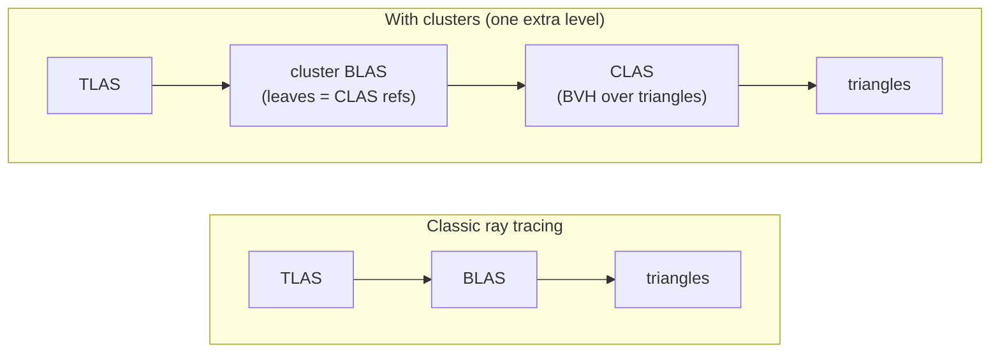
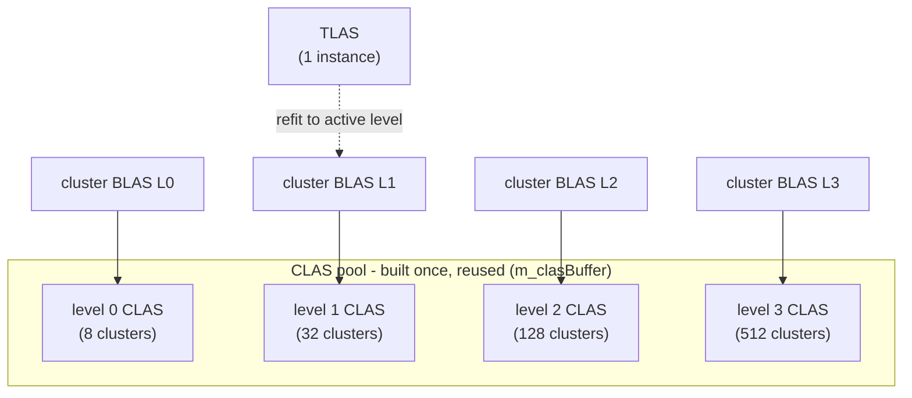

# 21 Clusters (CLAS) - Tutorial


This chapter introduces **Cluster Acceleration Structures (CLAS)**, exposed by the
`VK_NV_cluster_acceleration_structure` extension, and uses them to drive a simple
cluster-based **level of detail (LOD)**. CLAS are the building block behind
*mega-geometry* and LOD-cluster ray tracing; here we strip the idea down to the
essentials so the mechanics are easy to follow.

Unlike the earlier chapters, this sample does not load a glTF scene. It generates a
unit sphere procedurally at four levels of detail, splits each level into small triangle
patches (the **clusters**), builds all of them into CLAS once, and then swaps the level
the camera sees by refitting a single-instance top-level AS.

> **Key Takeaway:** A CLAS is a small BVH over one cluster's triangles. You build the
> expensive triangle data **once**, then cheaply assemble a bottom-level AS from any
> subset of the already-built CLAS. That "build once, recompose cheaply" pattern is why
> CLAS exist, and it is what makes per-frame LOD and streaming affordable.

## What the sample does

At startup:

1. Build **all** clusters of **all** levels into **CLAS**
   (`op = BUILD_TRIANGLE_CLUSTER`) — one time — assigning each a `clusterID`.
2. Build **one cluster bottom-level AS per level**
   (`op = BUILD_CLUSTERS_BOTTOM_LEVEL`), each referencing that level's CLAS.

Every frame it picks a level from the camera distance (or a manual override in the UI),
points a regular **top-level AS** at that level's cluster BLAS, and ray traces. On a hit,
the closest-hit shader reads the per-hit **cluster ID** and colorizes the surface, so the
cluster decomposition is directly visible.

Move closer and the level rises, so more, finer clusters appear (8 → 32 → 128 → 512 for
the four levels here):

| Level 0 — 8 clusters | Level 1 — 32 clusters | Level 2 — 128 clusters | Level 3 — 512 clusters |
|:---:|:---:|:---:|:---:|
|  |  |  |  |

## The idea: one extra level of indirection

Classic ray tracing traverses `TLAS → BLAS → triangles`. Clusters add **one** level in
between: a cluster BLAS whose leaves are references to CLAS, and each CLAS is itself a BVH
over a cluster's triangles.



There are **two** acceleration structures below the TLAS, not one:

- A **CLAS** is a complete little BVH **over the triangles** of one cluster
  (`BUILD_TRIANGLE_CLUSTER`). This is where the triangle-level acceleration data lives.
  Each CLAS has its own device address.
- A **cluster BLAS** is a *real* BLAS with its own storage and device address (the one the
  TLAS instance references), **but its leaves are references to CLAS**, not triangles
  (`BUILD_CLUSTERS_BOTTOM_LEVEL`, input = a list of CLAS addresses).

The cluster BLAS is **not** "the CLAS concatenated together" — it is a separate, thin
structure that *indexes* them (a table of contents that says "this object is made of
CLAS #A, #B, #C…"). A TLAS instance can only reference a *BLAS*, so this BLAS is also the
adapter that makes a bag of CLAS look like one object the TLAS can point at.

**Why split it this way:** CLAS are built **once** (the expensive triangle-BVH work), and
the cluster BLAS is **cheap to (re)build** because it only gathers pointers. That is what
makes per-frame LOD / streaming affordable — you re-assemble a BLAS from a chosen subset of
the already-built CLAS without ever touching triangles. In classic RT, changing a BLAS
means reprocessing all its triangles.

## Decomposing the mesh into clusters

A cluster is just a small, self-contained chunk of a mesh. Here we take the sphere's
latitude-longitude grid and cut it into `4 × 4`-cell patches; each patch becomes one
cluster with its own **local** vertices and **8-bit** triangle indices.


Because a cluster carries local, 8-bit indices, it must stay within the per-cluster limits
reported by `VkPhysicalDeviceClusterAccelerationStructurePropertiesNV`
(`maxVerticesPerCluster`, `maxTrianglesPerCluster`). The generator tracks the largest cluster it
produces and checks it against those limits at runtime; if a device reports smaller limits, the
sample disables the cluster path instead of building invalid CLAS.

**`Modified: 21_clusters.cpp` — `appendSphereLevel()`**

```cpp
// Each 4x4-cell patch becomes one cluster with its own local vertices and 8-bit indices.
ClusterInfo cluster{
    .vertexByteOffset = uint32_t(m_vertices.size() * sizeof(glm::vec3)),
    .indexByteOffset  = uint32_t(m_indices.size()),
    .vertexCount      = uint32_t(localVerts.size()),
    .triangleCount    = uint32_t(localIndices.size() / 3),
};
m_clusters.push_back(cluster);
m_maxClusterVertices  = std::max(m_maxClusterVertices, cluster.vertexCount);
m_maxClusterTriangles = std::max(m_maxClusterTriangles, cluster.triangleCount);
```

All levels are concatenated into a single vertex buffer and a single 8-bit index buffer;
each `ClusterInfo` records where its slice begins.

## Building the acceleration structures

Both builds are issued with the same command,
`vkCmdBuildClusterAccelerationStructureIndirectNV`, and both use the
`IMPLICIT_DESTINATIONS` op mode: the driver sub-allocates each output AS out of one storage
blob and writes the resulting device addresses into an array we supply. The CLAS addresses
produced by pass 1 feed straight into pass 2, entirely on the GPU.


### Pass 1 — building the CLAS

Each cluster gets one `VkClusterAccelerationStructureBuildTriangleClusterInfoNV`. The
load-bearing field is `clusterID`: this is the value the closest-hit shader reads back on a
hit.

**`Modified: 21_clusters.cpp` — `buildClusterAccelerationStructures()`**

```cpp
VkClusterAccelerationStructureBuildTriangleClusterInfoNV info{};
info.clusterID          = i;  // <-- surfaced to the shader on a hit
info.triangleCount      = c.triangleCount;
info.vertexCount        = c.vertexCount;
info.indexType          = VK_CLUSTER_ACCELERATION_STRUCTURE_INDEX_FORMAT_8BIT_NV;
info.indexBufferStride  = 1;
info.vertexBufferStride = uint16_t(sizeof(glm::vec3));
info.baseGeometryIndexAndGeometryFlags.geometryFlags = VK_CLUSTER_ACCELERATION_STRUCTURE_GEOMETRY_OPAQUE_BIT_NV;
info.indexBuffer        = m_indexBuffer.address  + c.indexByteOffset;
info.vertexBuffer       = m_vertexBuffer.address + c.vertexByteOffset;
```

The build itself records into a command buffer; sizes come from
`vkGetClusterAccelerationStructureBuildSizesNV`:

```cpp
VkClusterAccelerationStructureInputInfoNV clasInput{
    .maxAccelerationStructureCount = numClusters,
    .flags   = VK_BUILD_ACCELERATION_STRUCTURE_PREFER_FAST_TRACE_BIT_KHR,
    .opType  = VK_CLUSTER_ACCELERATION_STRUCTURE_OP_TYPE_BUILD_TRIANGLE_CLUSTER_NV,
    .opMode  = VK_CLUSTER_ACCELERATION_STRUCTURE_OP_MODE_IMPLICIT_DESTINATIONS_NV,
    .opInput = {.pTriangleClusters = &triangleInput}};
// ... fill clasCmd with dstImplicitData = m_clasBuffer, dstAddressesArray = m_clasAddressBuffer ...
vkCmdBuildClusterAccelerationStructureIndirectNV(cmd, &clasCmd);
```

### Pass 2 — the cluster BLAS

The second build takes **CLAS addresses**, not vertices. Each level's cluster BLAS
references a contiguous slice of the shared CLAS-address pool:

```cpp
blasInfos[l].clusterReferencesCount  = m_lods[l].clusterCount;
blasInfos[l].clusterReferencesStride = sizeof(uint64_t);
blasInfos[l].clusterReferences       = m_clasAddressBuffer.address + m_lods[l].clasOffset * sizeof(uint64_t);
```

An acceleration-structure barrier separates the two builds — pass 2 reads what pass 1
wrote:

```cpp
vkCmdBuildClusterAccelerationStructureIndirectNV(cmd, &clasCmd);   // pass 1: CLAS
nvvk::accelerationStructureBarrier(cmd, VK_ACCESS_ACCELERATION_STRUCTURE_WRITE_BIT_KHR,
                                        VK_ACCESS_ACCELERATION_STRUCTURE_READ_BIT_KHR);
vkCmdBuildClusterAccelerationStructureIndirectNV(cmd, &blasCmd);   // pass 2: cluster BLAS
```

## Driving the level of detail

The CLAS for every level are built once into a shared pool, and each level's cluster BLAS
references that level's slice of the pool. A single-instance TLAS is **refit** (updated in
place, not rebuilt) to point at whichever level is active:



The TLAS is built once with `ALLOW_UPDATE | PREFER_FAST_TRACE`. Switching detail only
rewrites the single instance to reference a different BLAS address and updates the TLAS in
place — the instance count never changes, so a cheap refit is enough (no destroy/rebuild).

**`Modified: 21_clusters.cpp` — `selectLod()` / `setLevel()`**

```cpp
int selectLod() const  // distance-based, or a manual UI override
{
  if(m_lodOverride >= 0) return std::min(m_lodOverride, kNumLevels - 1);
  const double d = m_cameraManip->getDistanceToCenter();
  if(d > 6.0) return 0;
  if(d > 4.0) return 1;
  if(d > 2.5) return 2;
  return 3;
}

void setLevel(int level)
{
  vkDeviceWaitIdle(m_app->getDevice());              // rare event: a full wait is fine here
  if(m_tlas.accel == VK_NULL_HANDLE) buildTlas(m_lods[level].blasAddress);  // first time
  else                              refitTlas(m_lods[level].blasAddress);   // afterwards
  m_currentLevel = level;
}
```

> The `vkDeviceWaitIdle` in `setLevel` keeps this minimal demo simple (LOD changes are rare
> and driven by the UI). A production renderer would double-buffer the instance data and
> refit on the frame's command buffer instead.

### Can one BLAS mix CLAS from different levels?

**Yes.** The `clusterReferences` list can point at any CLAS from the shared pool, in any
mix — e.g. fine (level 3) CLAS for the front patches and coarse (level 0) CLAS for the back.
That is exactly how production per-cluster LOD works: each frame, per cluster, pick a detail
level by screen-space error, collect those CLAS addresses, and **rebuild the (cheap) cluster
BLAS** from the mixed list (the CLAS never change). This sample only uses one level at a time
to stay minimal, but the mechanism is identical.

**The catch — cracks.** Putting a fine cluster next to a coarse one leaves mismatched edges
(T-junctions) → visible holes. In *this* sample mixing levels **would** crack, because each
level is an independent UV-sphere tessellation with no shared boundary vertices. Production
systems (Nanite; the `vk_lod_clusters` sample via meshoptimizer) avoid this by building a
**boundary-locked cluster LOD hierarchy (DAG)**: shared group edges are preserved across
levels and whole groups are switched together, so adjacent selected clusters always share
matching edges. That boundary-locked simplification is the genuinely hard part of a
cluster-LOD system, and it is what this minimal sample deliberately omits.

## Reading the cluster ID in the shader

Two things are required to read the per-hit cluster ID:

1. The ray tracing **pipeline** must opt in, or the built-in is invalid:

**`Modified: 21_clusters.cpp` — `createRayTracingPipeline()`**

```cpp
VkRayTracingPipelineClusterAccelerationStructureCreateInfoNV clusterPipeInfo{
    .sType = VK_STRUCTURE_TYPE_RAY_TRACING_PIPELINE_CLUSTER_ACCELERATION_STRUCTURE_CREATE_INFO_NV,
    .allowClusterAccelerationStructure = VK_TRUE};
rtPipelineInfo.pNext = &clusterPipeInfo;   // attach to VkRayTracingPipelineCreateInfoKHR
```

The closest-hit shader hashes that ID to a color (so each cluster is visibly distinct) and
adds a subtle per-triangle brightness from `PrimitiveIndex` (the triangle index *within* its
cluster), which reveals the individual triangles inside each cluster. Because the mesh is a
unit sphere centered at the origin, the surface normal is simply the normalized hit position
— no vertex/normal buffers are needed:

```hlsl
int    clusterID = GetClusterID();
float3 normal    = normalize(WorldRayOrigin() + RayTCurrent() * WorldRayDirection());
float3 base      = (pushConst.colorByCluster != 0) ? clusterColor(uint(clusterID)) : float3(0.8);
float  triVar    = 0.8 + 0.2 * frac(float(PrimitiveIndex()) * 0.6180339887);
float  diffuse   = max(dot(normal, normalize(pushConst.lightDir)), 0.0);
payload.color    = base * triVar * (0.15 + 0.85 * diffuse);
```

Toggle *Color by cluster* off to compare with plain shading:

| Color by cluster (level 2) | Plain shading (level 2) |
|:---:|:---:|
|  |  |

## Key points

- CLAS by itself is **not** LOD — it is the mechanism. The LOD here (select a level, swap
  which cluster BLAS the TLAS references) is a thin layer on top. The production-scale
  version of this idea is the `vk_lod_clusters` sample (streaming + screen-space error +
  per-frame BLAS rebuild).
- Both CLAS and cluster-BLAS builds use `IMPLICIT_DESTINATIONS`: the driver sub-allocates
  each output AS from one storage blob and writes the resulting device addresses into an
  array we provide, so the CLAS addresses feed straight into the BLAS build.
- Per-cluster vertices are local `vec3` lists with **8-bit** indices, so each cluster stays
  within the 256-vertex limit.
- The pipeline must be created with
  `VkRayTracingPipelineClusterAccelerationStructureCreateInfoNV{ allowClusterAccelerationStructure = VK_TRUE }`
  for the cluster-ID built-in to be valid.

## Technical details

- **Extension / feature:** `VK_NV_cluster_acceleration_structure` (requested at spec
  version 2), with the usual RT stack (`VK_KHR_acceleration_structure`,
  `VK_KHR_ray_tracing_pipeline`, `VK_KHR_deferred_host_operations`). The device is queried
  for `clusterAccelerationStructure` support; if absent, the sample still runs and reports
  it in the UI.
- **Alignments** come from `VkPhysicalDeviceClusterAccelerationStructurePropertiesNV`
  (`clusterScratchByteAlignment`, `clusterByteAlignment`,
  `clusterBottomLevelByteAlignment`) and are passed to the corresponding buffer allocations.
- **Framework fit:** this chapter derives from `RtBase` like the others, but overrides
  `createScene`, `createBottomLevelAS`, `createTopLevelAS`, `createRayTracingPipeline`, and
  `raytraceScene` to replace the glTF/triangle-BLAS path with the CLAS path. The G-buffer,
  tonemapper, camera, and headless screenshot support are all reused unchanged.

## Usage instructions

Run interactively and orbit the sphere: as the camera distance changes, the LOD (and the
number of colored clusters) changes with it. In the **Settings → Cluster Acceleration
Structures** panel:

- **LOD selection** — `Auto` (distance-based) or force `Level 0..3`.
- **Color by cluster** — toggle cluster coloring vs. plain shading.
- **Light direction** — orbit the diffuse light.

Command line (also used to generate the figures in this page):

```bash
21_clusters.exe --headless --lod 3 --colorByCluster 1
```

- `--lod <n>` forces a LOD level (`-1` = automatic).
- `--colorByCluster <0|1>` toggles cluster coloring.
- `--headless` renders one frame and writes a screenshot next to the executable.

## Summary

CLAS introduce a single extra level below the TLAS: `TLAS → cluster BLAS → CLAS →
triangles`. You build the CLAS (the expensive triangle work) once, then assemble cheap
cluster BLAS from any subset of that pool. This chapter uses the simplest possible policy —
one level at a time, selected by camera distance, applied by refitting a one-instance TLAS —
to show the API mechanics end to end: the two build passes, `IMPLICIT_DESTINATIONS`, the
pipeline opt-in, and reading `ClusterIDNV` in the hit shader.

## Next steps

- Explore the production-scale version — streaming, screen-space error, crack-free
  boundary-locked LOD, and per-frame BLAS rebuilds — in the **`vk_lod_clusters`** sample.
- Try mixing CLAS from different levels in a single cluster BLAS and observe the cracks this
  minimal (non-boundary-locked) mesh produces.
