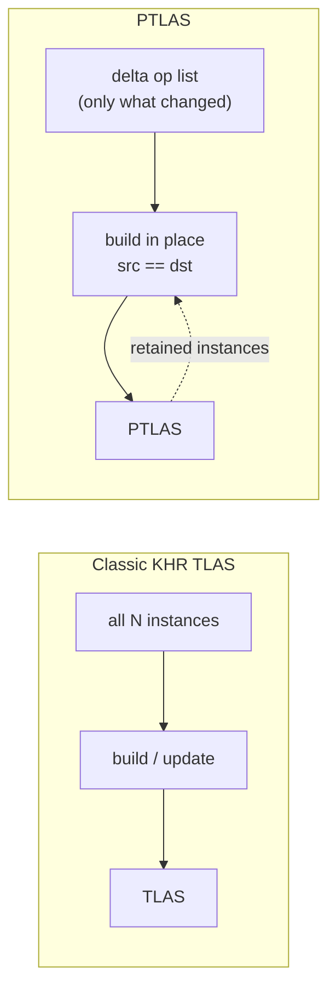

# 22 Partitioned TLAS (PTLAS) - Tutorial


## What is a PTLAS, and what is it for?

Ray tracing a dynamic scene means keeping a **top-level acceleration structure (TLAS)** in sync with
the instances every frame. With an ordinary `VK_KHR_acceleration_structure` TLAS that is an
all-or-nothing job: the TLAS is a flat array of instances, so to move *anything* you hand the driver
the **whole** instance array and (re)build. For a few hundred instances that is fine. For the scenes
this extension targets — cities, crowds, forests with **hundreds of thousands to millions** of
instances, most of which are not moving on any given frame — reprocessing everything every frame is
pure waste.

A **Partitioned TLAS (PTLAS)**, from `VK_NV_partitioned_acceleration_structure`, is built for exactly
that case. Two ideas make it work:

1. **Instances live in indexable, retained slots.** You build the structure once, then update it
   **in place** (`src == dst`) from a small list of operations. Crucially, an in-place build
   **keeps every instance you do not re-submit** — so a per-frame update contains *only what
   changed*. The cost scales with the size of your delta, not with the size of the scene.
2. **Instances are grouped into partitions.** A whole partition of instances can be moved with a
   **single** record (`WRITE_PARTITION_TRANSLATION`), and partitions give the driver a natural unit
   for streaming regions in and out.

> **Key Takeaway:** A PTLAS is one structure over many partitions, referenced by **device address**
> (not a `VkAccelerationStructureKHR` handle). You build it once, then rebuild it *in place* with a
> tiny op list that touches **only what changed**; everything else is retained for free. A classic
> TLAS has no equivalent — to move anything it reprocesses all of its instances.

## How this sample shows the advantage

To make "only pay for what changed" **visible**, the sample drives updates by **camera distance**.
A `32×32` grid of sphere instances is tiled into `8×8` spatial partitions (16 instances each), plus
a ground plane in the special **global partition**. Two radii around the camera carve the grid into
three zones, and each zone gets a *different* operation, a different cost, and a different **level of
detail** (LOD):


| Zone | Distance from camera | Operation each frame | LOD (BLAS) | What you see |
|------|----------------------|----------------------|------------|--------------|
| **NEAR** | inside the near radius | `WRITE_INSTANCE` **per instance** | high-poly sphere | each sphere ripples on its own |
| **MID**  | between the two radii   | `WRITE_PARTITION_TRANSLATION` **per partition** | medium sphere | the whole 16-sphere tile rocks as one |
| **FAR**  | beyond the mid radius   | *nothing* — retained | coarse sphere | sits perfectly still, at zero cost |

When a partition **crosses the MID↔FAR boundary** as the camera moves, its instances are re-pointed at
the new zone's BLAS with **`UPDATE_INSTANCE`** — a cheap swap of geometry with no transform change.
(Crossings into the NEAR zone need no separate op: those instances are re-specified by `WRITE_INSTANCE`
anyway, which already carries the BLAS.) So the sample exercises all three core PTLAS operations, each
tied to a zone.

Move the camera and the zones follow it. The **Settings** panel reports the exact op counts: a
typical frame submits roughly **~96 `WRITE_INSTANCE` + ~35 `WRITE_PARTITION_TRANSLATION`** records
(plus a burst of `UPDATE_INSTANCE` whenever a partition crosses the MID↔FAR boundary) — versus the
**1025 instances a TLAS would reprocess** to move anything at all. Everything in the FAR zone costs nothing,
because the `src == dst` build retains it.

The LOD makes the zones unmistakable — smooth spheres near, faceted ones far — and the shader adds a
gentle **fog of distance** (NEAR vivid, FAR muted) using the same test the update logic uses, so the
bright, detailed foreground is precisely the region paying the per-instance cost.


## The idea: build once, update with a delta

An ordinary TLAS is rebuilt from the full instance array; a PTLAS is rebuilt *in place* from a small
list of operations applied against the structure that already exists:



## Partitions and the global partition

Every instance is assigned to a **partition** through its `partitionIndex`. A partition is meant to
hold instances that move or stream together (here, one `4×4` tile of the grid), so the driver can
treat them as a unit — that is what lets a single translation record move all 16 at once. One special
bucket, the **global partition** (`VK_PARTITIONED_ACCELERATION_STRUCTURE_PARTITION_INDEX_GLOBAL_NV`),
holds instances that are not localized to a region; this sample puts the world-spanning **ground
plane** there. Capacity is declared up front, and `partitionCount` must not exceed the device's
`maxPartitionCount`.


## Building the PTLAS

Sizing is queried from a capacity descriptor (no instance data needed yet). The translation feature
is turned on by chaining a flags struct — without it, `WRITE_PARTITION_TRANSLATION` is not allowed:

**`Modified: 22_partition_tlas.cpp` — `allocatePtlasBuffers()`**

```cpp
m_input = VkPartitionedAccelerationStructureInstancesInputNV{
    .sType                             = VK_STRUCTURE_TYPE_PARTITIONED_ACCELERATION_STRUCTURE_INSTANCES_INPUT_NV,
    .pNext                             = &m_inputFlags,   // enablePartitionTranslation = VK_TRUE
    .flags                             = VK_BUILD_ACCELERATION_STRUCTURE_PREFER_FAST_TRACE_BIT_KHR,
    .instanceCount                     = kNumInstances,       // 1024 spheres + 1 plane
    .maxInstancePerPartitionCount      = kTile * kTile,       // 16
    .partitionCount                    = kPartitions,         // 64
    .maxInstanceInGlobalPartitionCount = 1,                   // the ground plane
};
vkGetPartitionedAccelerationStructuresBuildSizesNV(device, &m_input, &sizes);
```

Each instance is fully defined by a `WRITE_INSTANCE` record. Note it carries a stable `instanceIndex`
(the slot we re-specify on later updates) and a `partitionIndex`, and that we stash the partition into
`instanceID` so the shader can read it back to colorize:

**`Modified: 22_partition_tlas.cpp` — `makeInstance()`**

```cpp
VkPartitionedAccelerationStructureWriteInstanceDataNV w{};
w.transform             = nvvk::toTransformMatrixKHR(instanceTransform(i));  // grid cell (+ animated Y)
w.instanceID            = m_instancePartition[i];  // -> InstanceID() in the shader (color by partition)
w.instanceMask          = 0xFF;
w.instanceFlags         = VK_PARTITIONED_ACCELERATION_STRUCTURE_INSTANCE_FLAG_TRIANGLE_FACING_CULL_DISABLE_BIT_NV;
w.instanceIndex         = i;                        // stable slot, targeted by later WRITE_INSTANCE
w.partitionIndex        = partition;                // or ..._PARTITION_INDEX_GLOBAL_NV for the plane
w.accelerationStructure = m_asBuilder.blasSet[meshIndex].address;  // BLAS by device address
```

The build is command-list driven. `srcInfos` points at an array of operation *commands*, each of
which points at its own array of records; `srcInfosCount` gives the number of commands. The initial
build submits a single `WRITE_INSTANCE` command with `src == 0` (from scratch); every later frame
reuses the same call with `src == dst`:

**`Modified: 22_partition_tlas.cpp` — `recordBuild()`**

```cpp
VkBuildPartitionedAccelerationStructureInfoNV buildInfo{
    .sType                        = VK_STRUCTURE_TYPE_BUILD_PARTITIONED_ACCELERATION_STRUCTURE_INFO_NV,
    .input                        = m_input,
    .srcAccelerationStructureData = update ? m_ptlasAddr : 0,   // 0 = from scratch; else in place
    .dstAccelerationStructureData = m_ptlasAddr,
    .scratchData                  = fr.scratch.address,
    .srcInfos                     = fr.ops.address,             // array of operation commands
    .srcInfosCount                = fr.opsCount.address,        // how many commands
};
vkCmdBuildPartitionedAccelerationStructuresNV(cmd, &buildInfo);
```

### Binding the PTLAS

A PTLAS is **not** a `VkAccelerationStructureKHR` handle — the result lives in an app-owned buffer and
is referenced by **device address**. The simplest, most portable way to trace against it (and the way
the `vk_forest_ray_tracing` reference does it) is to pass that address to the shader and convert it to
an acceleration structure there:

**`Modified: 22_partition_tlas.cpp` — `raytraceScene()`**

```cpp
m_pushValues.tlasAddress = m_ptlasAddr;  // the PTLAS buffer's device address, into the push constant
```

In the shader the address is turned into an acceleration structure and traced like any other:

**`Modified: partition_tlas.slang`**

```hlsl
RaytracingAccelerationStructure topLevelAS = RaytracingAccelerationStructure(pushConst.tlasAddress);
TraceRay(topLevelAS, RAY_FLAG_NONE, 0xFF, 0, 0, 0, ray, payload);
```

> The extension also defines a descriptor type,
> `VK_DESCRIPTOR_TYPE_PARTITIONED_ACCELERATION_STRUCTURE_NV`, but a standard acceleration-structure
> shader variable compiles to `OpTypeAccelerationStructureKHR`, which the validation layers pair only
> with `VK_DESCRIPTOR_TYPE_ACCELERATION_STRUCTURE_KHR`. Binding by device address avoids that mismatch
> and traces a regular TLAS and a PTLAS with the exact same shader.

## The three zones in one frame (the payoff)

This is where the advantage becomes concrete. Each frame we classify every partition by its distance
to the camera and build a **delta** — nothing more. Both lists are tracked against the previous frame,
so a partition that crosses a zone boundary is settled exactly once, and a fully static frame emits
zero operations.


**NEAR → `WRITE_INSTANCE` per instance.** Inside the near radius, every sphere is re-specified with
its own animated transform, so it can move independently:

**`Modified: 22_partition_tlas.cpp` — `fillBuildOps()`**

```cpp
const int  p      = m_instancePartition[i];
const Zone zone   = zoneOf(p, camXZ);
const bool isNear = (zone == eNear);
if(m_initialBuilt && !isNear && m_wasNear[p] == 0)
  continue;                                           // retained -> no op
float yOff = 0.0f;
if(isNear)
{
  const float phase = 0.5f * float((i % kGridN) + (i / kGridN));  // per-instance -> a travelling ripple
  yOff              = m_instBob * std::sin(m_time * m_bobSpeed + phase);
}
const uint32_t mesh = lodMesh(zone);                  // high / medium / coarse BLAS for this zone
wi[numInst++]       = makeInstance(i, yOff, mesh);    // WRITE_INSTANCE record (transform + LOD BLAS)
```

**MID → `WRITE_PARTITION_TRANSLATION` per partition.** Between the two radii, each partition is
shifted rigidly by one record — 16 instances moved for the price of one:

```cpp
const float phase = 0.7f * float((p % kPartAxis) + (p / kPartAxis));
const float y     = (zoneOf(p, camXZ) == eMid) ? (m_partBob * std::sin(m_time * m_bobSpeed + phase)) : 0.0f;
if(!m_initialBuilt || std::fabs(y - m_prevPartY[p]) < 1e-4f)
  continue;                                           // first build, or unchanged -> no op
m_prevPartY[p]                       = y;
pt[numMoved].partitionIndex          = p;
pt[numMoved].partitionTranslation[1] = y;             // rigid Y offset for the whole partition
```

**FAR → nothing.** Partitions beyond the mid radius are never mentioned; the `src == dst` build keeps
them.

**Crossing a boundary → `UPDATE_INSTANCE`.** When the camera moves, a partition can slip from MID to
FAR (or back). Its transform is retained, but its **LOD** must change — so we re-point its 16 instances
at the new zone's BLAS with `UPDATE_INSTANCE`, which carries only the instance index and an
acceleration-structure address:

```cpp
const Zone zone           = zoneOf(p, camXZ);
const bool touchedByWrite = (zone == eNear) || (m_wasNear[p] != 0);
if(touchedByWrite || zone == m_prevZone[p])
  continue;                                                 // handled by WRITE_INSTANCE, or LOD unchanged
const VkDeviceAddress blas = m_asBuilder.blasSet[lodMesh(zone)].address;  // the new LOD
for(int local = 0; local < kTile * kTile; local++)          // the partition's 16 instances
{
  ui[numUpdate].instanceIndex         = partitionInstance(p, local);
  ui[numUpdate].accelerationStructure = blas;               // swap geometry, keep the transform
  numUpdate++;
}
```

(NEAR crossings need no separate op — the `WRITE_INSTANCE` path already sets each instance's BLAS; and
the UPDATE_INSTANCE pass is skipped entirely on the first build.) Whichever lists are non-empty are
packed into the ops buffer; if all are empty, no build is recorded at all.

## Reading the partition — and its zone — in the shader

Because we wrote the partition index into each instance's `instanceID`, the closest-hit shader reads
it back with `InstanceID()` and colorizes — the same "color by ID" idea as the clusters chapter (21),
here applied to partitions. Every grid instance is a sphere centered at its object origin, so the
**object-space hit position is the surface normal** — no vertex or normal buffers are needed:

**`Modified: partition_tlas.slang`**

```hlsl
uint id = InstanceID();                               // the partition we stored, or PT_GROUND_ID
if(id == PT_GROUND_ID) { normal = float3(0,1,0); base = float3(0.35, 0.35, 0.38); }   // flat ground plane
else {
  float3 objPos = ObjectRayOrigin() + RayTCurrent() * ObjectRayDirection();
  normal        = normalize(mul((float3x3)ObjectToWorld4x3(), objPos));   // sphere normal, no buffers
  base          = applyZone(partitionColor(id), id);   // partition hue, re-shaded by update zone
}
```

To make the three zones easy to tell apart, the shader also **shades each instance by its zone**. It
recomputes the partition's center and its distance to the camera — using the *same* radii the host
uses — and applies a "fog of distance": NEAR stays vivid and bright, MID is dimmer, FAR is dark and
desaturated. Because it is the identical test, the vivid foreground spheres are exactly the instances
being re-specified with `WRITE_INSTANCE` this frame:

**`Modified: partition_tlas.slang` — `applyZone()`**

```hlsl
// partition center (same formula as the host), then its distance to the camera:
float d = length(partitionCenterXZ - pushConst.cameraXZ);
float saturation, brightness;
if(d < pushConst.nearRadius)     { saturation = 1.50; brightness = 1.00; }  // NEAR — vivid
else if(d < pushConst.midRadius) { saturation = 0.50; brightness = 0.50; }  // MID  — dimmer
else                             { saturation = 0.15; brightness = 0.32; }  // FAR  — dark, desaturated
float lum = dot(base, float3(0.299, 0.587, 0.114));
return lerp(float3(lum), base, saturation) * brightness;
```

The camera position and the two radii travel to the shader in the push constant, refreshed every
frame, so the shaded zones track the camera exactly as the update zones do.

## Design note: where the op list comes from

This sample writes its op list on the **CPU** into host-mapped buffers, then the build (recorded on
the frame command buffer) reads them directly. That is the clearest way to *see* the op model — the
`fillBuildOps` loop maps one-to-one onto the API structs — but it is a deliberate teaching choice with
a trade-off worth understanding:

- **CPU-written, host-mapped (this sample).** No staging, no copy, no compute pass; trivial to read
  and debug; excellent on integrated/UMA GPUs. **But** the CPU touches instances every frame (it does
  not scale to millions), host-visible reads are slower for the GPU on discrete cards, and because the
  CPU writes what the GPU reads, the argument buffers must be **ring-buffered per frame-in-flight**.
- **GPU-driven, device-local (production).** A compute shader evaluates visibility/LOD/animation for
  the whole scene and writes the op list — and the op *count* — into device-local buffers; the CPU
  issues one indirect build and never iterates instances. The API takes `srcInfos` and `srcInfosCount`
  by **device address** precisely to allow this. More plumbing (a compute pass plus barriers), but it
  is the only thing that scales. This is what `vk_forest_ray_tracing` does.

In short: host-mapped is **simple, immediate, and CPU-bound**; GPU-driven is **more code but scales**.

## Technical details

- **Extension / feature:** `VK_NV_partitioned_acceleration_structure` on top of the usual RT stack.
  The device is queried for `partitionedAccelerationStructure`; if absent, the sample still runs and
  says so in the UI. `partitionCount` is enforced against `maxPartitionCount` at runtime.
- **Synchronization:** the update is recorded on the **frame** command buffer, wrapped in a full
  memory barrier before and after (acceleration-structure, shader, transfer, and indirect-command
  access) so the trace never reads a partially-built structure. The scratch and host-mapped argument
  buffers are ring-buffered by `getFrameCycleSize()`.
- **No RT-pipeline pNext** is required, and the ray tracing descriptor set holds only the output
  image — the PTLAS is passed by device address, not bound as a descriptor.
- **Framework fit:** derives from `RtBase` like the other chapters. `RtBase::createBottomLevelAS`
  builds the four BLAS (three sphere LODs + the plane); this chapter overrides `createTopLevelAS` (the
  PTLAS build), `onRender` (the per-frame delta), `createRaytraceDescriptorLayout`,
  `createRayTracingPipeline`, and `raytraceScene`. The G-buffer, tonemapper, camera, and headless
  screenshot are reused unchanged.

## Usage instructions

Orbit the grid and drive the demo from **Settings → Partitioned TLAS**:

- **Play** / the **time** slider — run the timeline, or pause and scrub it.
- **Near radius / Mid radius** — resize the two zones; watch the `WRITE_INSTANCE` and
  `WRITE_PARTITION_TRANSLATION` counts follow. **Orbit the camera** (mouse-drag) and the zones move
  with it — instances crossing a boundary swap LOD and spike the `UPDATE_INSTANCE` count.
- **Instance bob / Partition bob** — the per-instance (NEAR) and per-partition (MID) amplitudes.
- **Bob speed** — animation rate.
- **Light direction** — orbit the diffuse light.

Command line (also used to generate this page's figures):

```bash
22_partition_tlas.exe --headless --play 0 --orbit 1 --time 2.0
```
- `--time <sec>` sets the timeline position (deterministic capture).
- `--play <0|1>` advances the timeline automatically.
- `--azimuth <deg>` sets the initial camera orbit angle.
- `--orbit <0|1>` slowly orbits the camera (demonstrates the `UPDATE_INSTANCE` LOD swaps).
- `--frames <n>` number of frames to render in headless mode.
- `--headless` renders and writes a screenshot next to the executable.

## Summary

A PTLAS groups instances into partitions and is referenced by device address. You build it once with
`WRITE_INSTANCE`, then rebuild it **in place** (`src == dst`) with a small op list — `WRITE_INSTANCE`
to re-specify individual instances, `WRITE_PARTITION_TRANSLATION` to move whole partitions, and
`UPDATE_INSTANCE` to swap an instance's BLAS (here, its LOD) — while everything you don't mention is
**retained**. This chapter makes the payoff visible by keying all three operations to camera distance:
per-instance updates + high LOD NEAR, per-partition updates + medium LOD in the MID ring, and zero cost
+ coarse LOD FAR away, with `UPDATE_INSTANCE` swapping LOD as instances cross a boundary — so per-frame
work tracks what changed, not the size of the scene.

## Next steps

- See the production-scale use of PTLAS — spatial partitions driven by a zone system, **GPU-generated**
  op lists, streaming, and combined with cluster geometry — in the `vk_forest_ray_tracing` sample.
- Combine PTLAS with the clusters chapter (21): partitions of cluster-based instances for a large,
  dynamic, LOD'd world.
